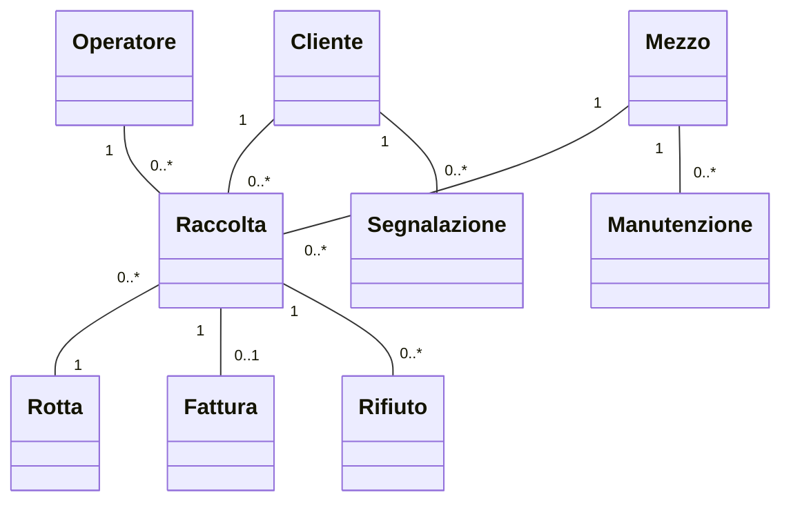
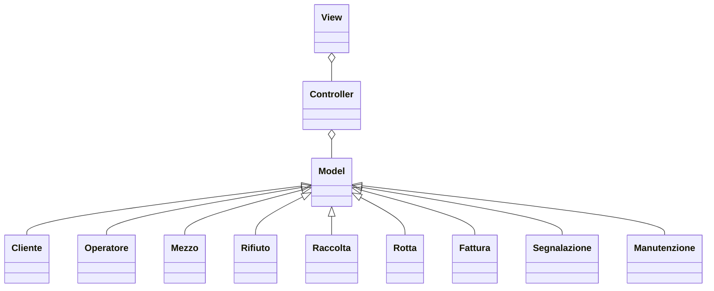
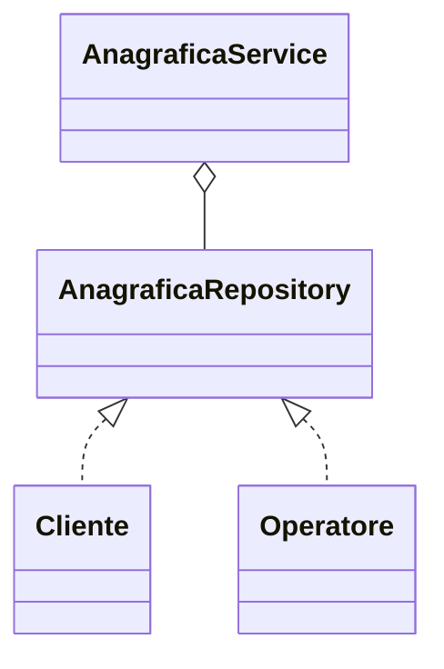
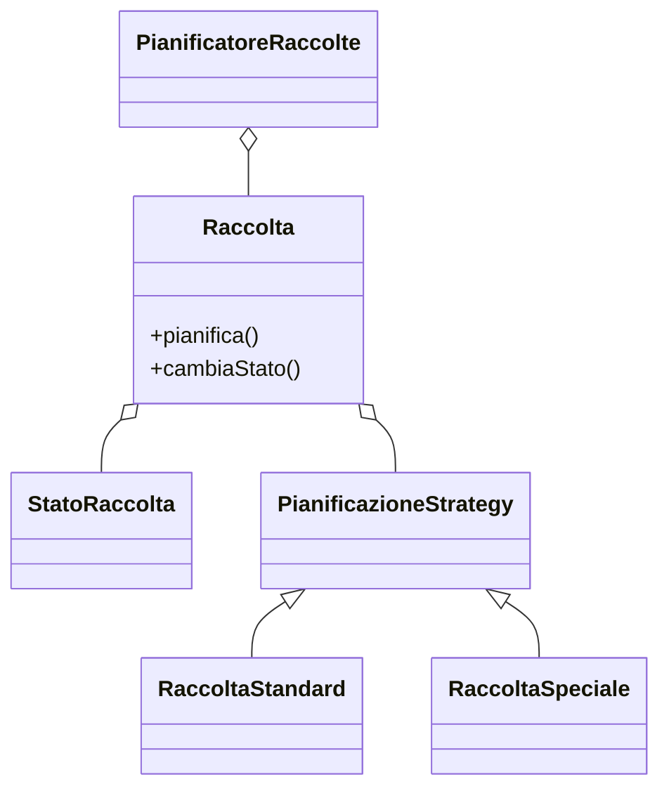
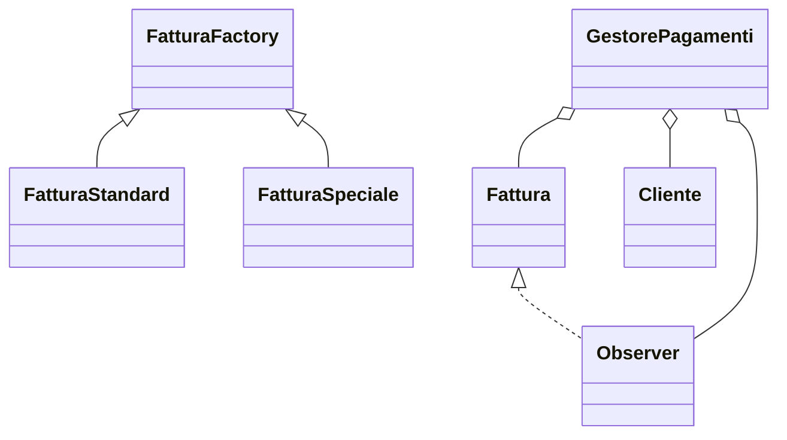
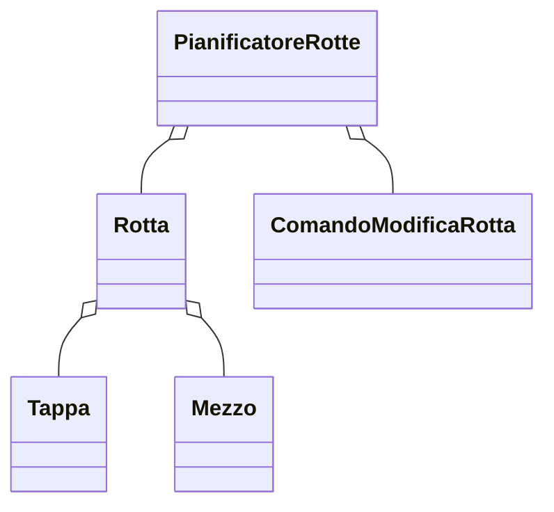
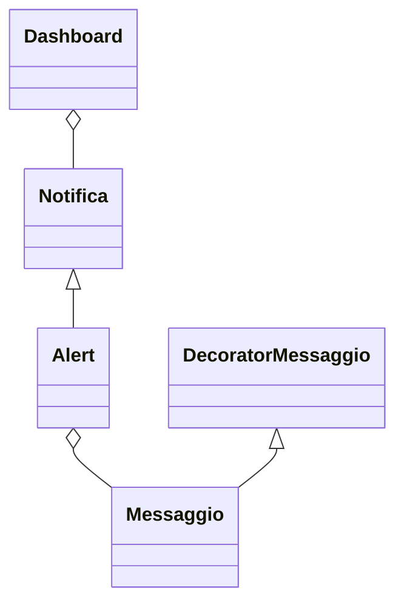
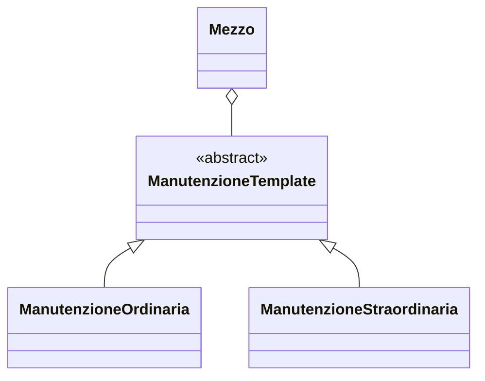

# Relazione di progetto

## Componenti del gruppo

- **Lorenzo Ferrari**: lorenzo.ferrari27@studio.unibo.it
- **Alex Cambrini**: alex.cambrini@studio.unibo.it
- **Manuel Ragazzini**: manuel.ragazzini3@studio.unibo.it

## Obiettivo del progetto

Realizzare un’applicazione per la gestione completa delle attività di un’azienda specializzata nello smaltimento dei rifiuti, con particolare attenzione all’efficienza operativa, alla sostenibilità e alla gestione sicura delle informazioni.

# Analisi

## Requisiti

L’applicazione deve consentire:

- Gestione delle anagrafiche di clienti e operatori, con dati dettagliati.
- Amministrazione delle risorse aziendali (mezzi e personale) con stato operativo aggiornato.
- Gestione dei rifiuti con classificazione, smaltimento e riciclaggio.
- Pianificazione delle raccolte programmate settimanali con possibilità di modifica.
- Gestione delle raccolte speciali o aggiuntive, con prenotazione e opzione di annullamento del ritiro settimanale con preavviso di almeno 2 giorni.
- Monitoraggio delle raccolte, con stato che può avanzare automaticamente a "Completata" o "Raccolta Fallita" in base alle segnalazioni degli operatori.
- Gestione della fatturazione e dei pagamenti.
- Pianificazione delle rotte per i camion con assegnazione manuale e possibilità di modifica in caso di imprevisti.

**Funzionalità opzionali:**
- Dashboard di monitoraggio con statistiche sulle raccolte e quantità di rifiuti.
- Notifiche e alert automatici.
- Gestione delle segnalazioni da parte dei clienti.
- Visualizzazione di un calendario integrato.
- Gestione della manutenzione dei mezzi.

## Analisi e modello del dominio

### Entità principali

- **Cliente**
- **Operatore**
- **Mezzo**
- **Rifiuto**
- **Raccolta**
- **Rotta**
- **Fattura**
- **Segnalazione**
- **Manutenzione**

### Relazioni

- Una raccolta coinvolge uno o più clienti, operatori e un mezzo.
- Ogni mezzo può essere coinvolto in più raccolte ed essere soggetto a manutenzione.
- Ogni raccolta può generare una fattura.
- I clienti possono inviare segnalazioni.
- Le rotte sono collegate alle raccolte e ai mezzi.

### Difficoltà principali

- Correlare dinamicamente richieste, disponibilità delle risorse e pianificazione.
- Gestione sicura dei dati sensibili.
- Flessibilità nella modifica delle rotte e raccolte.
- Automazione della fatturazione.



# Design

## Architettura

Il sistema adotta una struttura modulare, ispirata al pattern MVC (Model-View-Controller), dove:

- **Model:** rappresenta le entità e la logica di dominio (Clienti, Raccolte, Rifiuti, ecc).
- **View:** gestisce la visualizzazione dei dati e l’interazione con l’utente.
- **Controller:** coordina le operazioni tra modello e vista, gestendo le richieste dell’utente.

Le principali componenti architetturali sono:
- Gestione anagrafiche
- Pianificazione raccolte e rotte
- Monitoraggio operazioni
- Gestione fatturazione e pagamenti
- Dashboard e notifiche (opzionali)



# Design dettagliato

## Gestione anagrafiche (Responsabile: Ferrari)

**Problema:**  
Necessità di gestire in modo sicuro e aggiornabile tutte le anagrafiche di clienti e operatori, con notifiche automatiche al sistema in caso di modifiche.

**Soluzione:**  
Si adotta il pattern Repository per la gestione delle entità e il pattern Observer per notificare automaticamente modifiche alle altre componenti (es. aggiornamento dashboard o planner raccolte).



**Pattern usati:**  
- Repository per separare logica di accesso ai dati dal resto dell'applicazione.
- Observer per notificare aggiornamenti.

---

## Pianificazione raccolte (Responsabile: Cambrini)

**Problema:**  
Gestire in modo flessibile e dinamico la pianificazione delle raccolte, sia programmate che speciali, tenendo conto di richieste last-minute e disponibilità delle risorse.

**Soluzione:**  
Si adotta il pattern Strategy per la gestione delle politiche di pianificazione (es. raccolta standard vs speciale), e il pattern State per gestire lo stato della raccolta (es. pianificata, in corso, completata, fallita).



**Pattern usati:**  
- Strategy per permettere diverse modalità di pianificazione.
- State per gestire il ciclo di vita di una raccolta.

---

## Gestione fatturazione e pagamenti (Responsabile: Ragazzini)

**Problema:**  
Automatizzare la generazione delle fatture e il tracciamento dei pagamenti, integrando notifiche verso i clienti e gestione delle anomalie.

**Soluzione:**  
Pattern Factory Method per la creazione di fatture (standard o speciali), e Observer per notificare cambiamenti di stato nei pagamenti.



**Pattern usati:**  
- Factory Method per la creazione di fatture differenti.
- Observer per aggiornare il cliente all’avanzare dei pagamenti.

---

## Pianificazione rotte (Responsabile: Ragazzini)

**Problema:**  
Ottimizzare e aggiornare dinamicamente le rotte dei mezzi, considerando raccolte, traffico, manutenzioni e imprevisti.

**Soluzione:**  
Si adotta il pattern Command per gestire richieste di modifica rotta e Undo/Redo, e il pattern Iterator per scorrere le tappe di una rotta.



**Pattern usati:**  
- Command per gestire modifiche e annullamenti delle rotte.
- Iterator per gestire sequenze di tappe.

---

## Dashboard e notifiche (Responsabile: Cambrini, opzionale)

**Problema:**  
Fornire una panoramica aggiornata e interattiva delle attività aziendali e notificare tempestivamente anomalie o eventi rilevanti.

**Soluzione:**  
Pattern Observer per aggiornare automaticamente la dashboard e il sistema di notifiche, Decorator per arricchire i messaggi di alert con dati specifici (es. priorità, destinatario…).



**Pattern usati:**  
- Observer per propagare cambiamenti in tempo reale.
- Decorator per arricchire i messaggi con informazioni aggiuntive.

---

## Gestione manutenzione mezzi (Tutti, opzionale)

**Problema:**  
Pianificare e tracciare interventi di manutenzione sui mezzi senza interrompere le attività operative.

**Soluzione:**  
Pattern Template Method per definire la sequenza di operazioni standard di manutenzione, e Strategy per gestire tipi diversi di manutenzione (ordinaria, straordinaria).



**Pattern usati:**  
- Template Method per la sequenza di operazioni.
- Strategy per specializzare i tipi di manutenzione.

---

*(Ogni membro del gruppo può ampliare la propria sezione con dettagli sul proprio contributo, scelte di design, pattern e motivazioni.)*

# Sviluppo

## Testing automatizzato

Sono stati sviluppati test automatici per:
- Verifica della corretta creazione e modifica delle anagrafiche.
- Pianificazione e modifica delle raccolte.
- Generazione automatica delle fatture e verifica dei pagamenti.
- Integrazione tra pianificazione delle rotte e disponibilità dei mezzi.

Viene utilizzato un framework di test (ad esempio JUnit) e i test sono ripetibili e automatizzati.

# Note di sviluppo

## Lorenzo Ferrari

### 1. Uso degli Stream API per filtrare le anagrafiche
**Dove:** `src/main/java/wastemaster/anagrafica/AnagraficaService.java`
```java
public List<Cliente> ricercaClientiPerNome(String nome) {
    return clienti.stream()
        .filter(cliente -> cliente.getNome().equalsIgnoreCase(nome))
        .collect(Collectors.toList());
}
```
**Descrizione:**  
Utilizzo delle Stream API di Java per scrivere in modo compatto e funzionale la ricerca di clienti per nome, migliorando la leggibilità rispetto ai classici cicli for.

---

### 2. Validazione con annotazioni custom
**Dove:** `src/main/java/wastemaster/anagrafica/Cliente.java`
```java
@NotNull
@Email
private String email;
```
**Descrizione:**  
Implementazione di annotazioni custom per la validazione dei dati (richiede l’uso di Bean Validation o di una libreria custom), così da garantire la correttezza delle informazioni inserite.

---

### 3. Uso dei tipi generici nella gestione delle risorse
**Dove:** `src/main/java/wastemaster/resources/ResourceRepository.java`
```java
public class ResourceRepository<T extends Risorsa> {
    private List<T> risorse;
    // metodi generici per aggiunta, rimozione e ricerca
}
```
**Descrizione:**  
Utilizzo di classi generiche per riutilizzare il codice nella gestione di diversi tipi di risorse (mezzi, operatori, ecc.), migliorando l’estendibilità del sistema.

---

## Alex Cambrini

### 1. Algoritmo di pianificazione dinamica delle raccolte
**Dove:** `src/main/java/wastemaster/raccolta/PianificatoreRaccolte.java`
```java
public void pianificaRaccolte() {
    raccolte.sort(Comparator.comparing(Raccolta::getPriorita).reversed());
    // Assegna raccolte alle risorse disponibili in base a priorità e disponibilità
}
```
**Descrizione:**  
Uso di Comparator e sort per la pianificazione dinamica delle raccolte, con ordinamento automatico secondo priorità e gestione intelligente delle risorse.

---

### 2. Integrazione delle raccolte speciali nel calendario
**Dove:** `src/main/java/wastemaster/raccolta/RaccoltaSpeciale.java`
```java
public void aggiungiAlCalendario(Calendar calendario) {
    calendario.addEvento(this.getData(), "Raccolta Speciale: " + this.getDescrizione());
}
```
**Descrizione:**  
Estensione del sistema di calendario per integrare facilmente eventi di raccolta speciale, con evidenziazione e gestione separata dagli appuntamenti standard.

---

### 3. Observer pattern per il monitoraggio dello stato raccolta
**Dove:** `src/main/java/wastemaster/raccolta/Raccolta.java`
```java
private List<RaccoltaObserver> observers = new ArrayList<>();
public void notificaStato() {
    observers.forEach(o -> o.aggiorna(this));
}
```
**Descrizione:**  
Implementazione del pattern Observer per notificare in tempo reale eventuali cambiamenti di stato delle raccolte a dashboard e sistemi di alert.

---

## Manuel Ragazzini

### 1. Generazione e invio automatico delle fatture via email
**Dove:** `src/main/java/wastemaster/fatturazione/FatturazioneService.java`
```java
public void inviaFattura(Fattura fattura, String emailCliente) {
    EmailSender.send(emailCliente, "La tua fattura", fattura.toString());
}
```
**Descrizione:**  
Automazione dell’invio delle fatture tramite integrazione con un servizio email, riducendo il lavoro manuale e migliorando la tempestività nei confronti del cliente.

---

### 2. Calcolo dinamico delle rotte con gestione imprevisti
**Dove:** `src/main/java/wastemaster/rotte/PianificatoreRotte.java`
```java
public List<Tappa> pianificaRotta(Mezzo mezzo, List<Raccolta> raccolte) {
    // Algoritmo che ricalcola la rotta in caso di imprevisto
    return algoritmoOttimizzazione.calcola(mezzo, raccolte);
}
```
**Descrizione:**  
Uso di un algoritmo dedicato (ad esempio Dijkstra o altro) per ricalcolare rapidamente le rotte in caso di segnalazione di imprevisti, mantenendo efficiente il servizio.

---

### 3. Integrazione pagamenti e notifiche al cliente
**Dove:** `src/main/java/wastemaster/fatturazione/PagamentiService.java`
```java
public void registraPagamento(Fattura fattura) {
    fattura.setPagata(true);
    Notificatore.avvisaCliente(fattura.getCliente(), "Pagamento ricevuto. Grazie!");
}
```
**Descrizione:**  
Automazione delle notifiche verso il cliente al momento della ricezione di un pagamento, per una migliore comunicazione e trasparenza.

---

## Codice di terze parti o adattato

Alcuni frammenti di codice per l’invio email e la validazione dati sono stati adattati da esempi open source trovati su StackOverflow e dalla documentazione delle librerie JavaMail e Hibernate Validator, opportunamente rivisti per lo stile e le esigenze del progetto.


# Commenti finali

## Autovalutazione e lavori futuri

**Ferrari:**  
Mi sono occupato principalmente della gestione delle anagrafiche e delle risorse. Punto di forza: modularità e riusabilità del codice. Da migliorare la gestione delle eccezioni.

**Cambrini:**  
Ho curato la pianificazione delle raccolte e il monitoraggio. Ho migliorato la flessibilità del sistema, ma l’integrazione con le notifiche può essere approfondita.

**Ragazzini:**  
Ho lavorato su fatturazione, pagamenti e rotte. Sono soddisfatto dell’automazione raggiunta, ma il sistema di statistiche può essere potenziato.

## Difficoltà incontrate e commenti per i docenti

Abbiamo riscontrato complessità nella modellazione flessibile delle raccolte speciali e nella gestione degli imprevisti sulle rotte. Il progetto ci ha permesso di approfondire i principali pattern architetturali e migliorare la collaborazione in team.

# Guida utente

All’avvio, l’utente può autenticarsi come operatore o amministratore.  
Le funzioni principali sono accessibili da menu:  
- Anagrafiche: aggiungi/modifica/elimina clienti e operatori.
- Raccolte: pianifica nuove raccolte, visualizza e modifica quelle esistenti, gestisci raccolte speciali.
- Mezzi: visualizza disponibilità e manutenzione.
- Fatture: genera e consulta fatture, registra pagamenti.
- Rotte: visualizza e modifica le rotte assegnate.
- Dashboard: monitora statistiche operative (se attiva).

Il sistema guida l’utente attraverso form, notifiche e messaggi di conferma/errore per ogni operazione.

---
