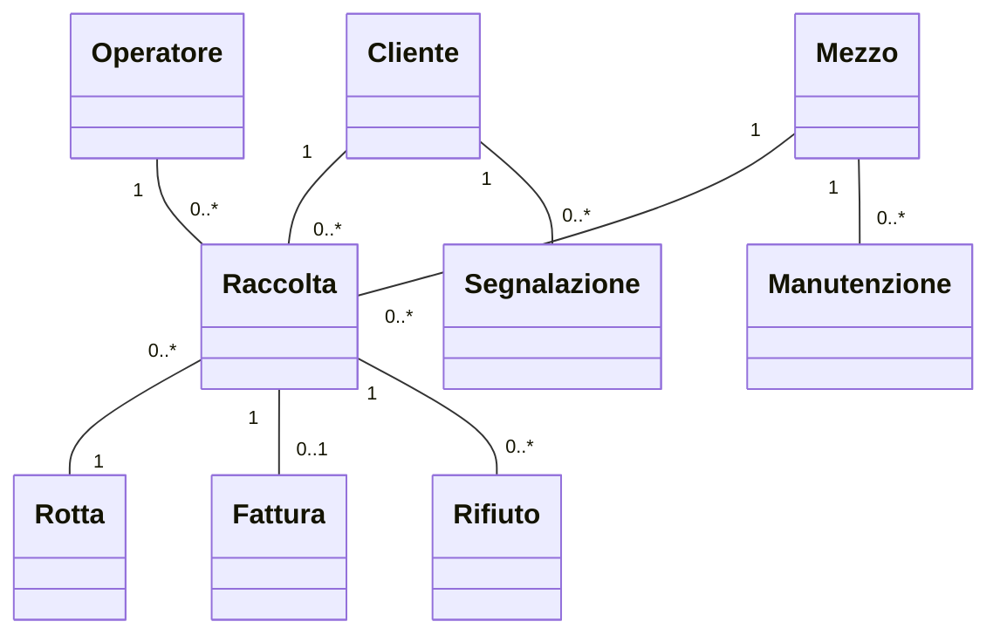
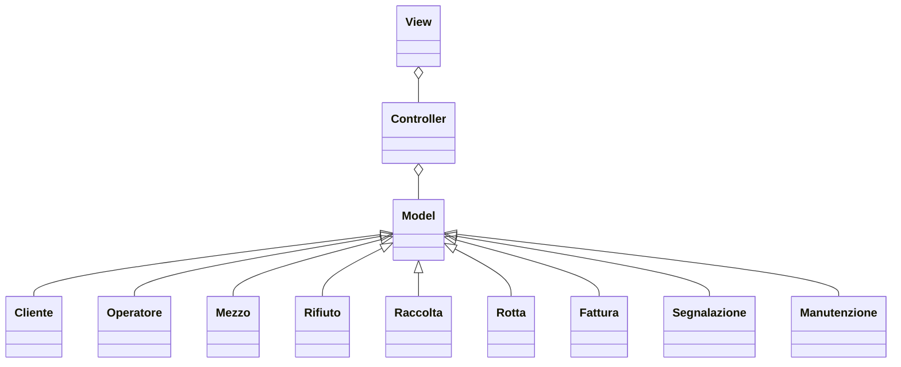
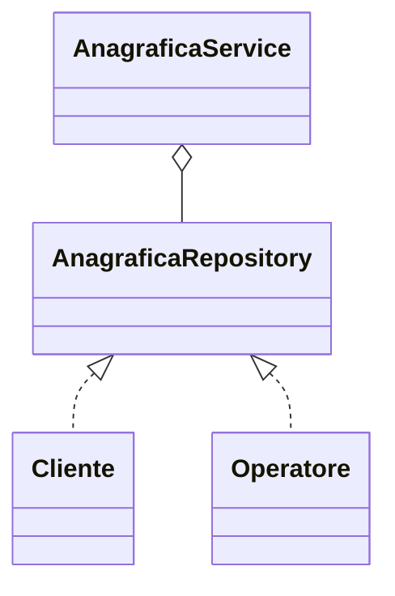

# Relazione di progetto

## Componenti del gruppo

- **Lorenzo Ferrari**: lorenzo.ferrari27@studio.unibo.it
- **Alex Cambrini**: alex.cambrini@studio.unibo.it
- **Manuel Ragazzini**: manuel.ragazzini3@studio.unibo.it

## Obiettivo del progetto

Realizzare un’applicazione per la gestione completa delle attività di un’azienda specializzata nello smaltimento dei rifiuti, con particolare attenzione all’efficienza operativa, alla sostenibilità e alla gestione sicura delle informazioni.

# Analisi

## Requisiti

L’applicazione deve consentire:

- Gestione delle anagrafiche di clienti e operatori, con dati dettagliati.
- Amministrazione delle risorse aziendali (mezzi e personale) con stato operativo aggiornato.
- Gestione dei rifiuti con classificazione, smaltimento e riciclaggio.
- Pianificazione delle raccolte programmate settimanali con possibilità di modifica.
- Gestione delle raccolte speciali o aggiuntive, con prenotazione e opzione di annullamento del ritiro settimanale con preavviso di almeno 2 giorni.
- Monitoraggio delle raccolte, con stato che può avanzare automaticamente a "Completata" o "Raccolta Fallita" in base alle segnalazioni degli operatori.
- Gestione della fatturazione e dei pagamenti.
- Pianificazione delle rotte per i camion con assegnazione manuale e possibilità di modifica in caso di imprevisti.

**Funzionalità opzionali:**
- Dashboard di monitoraggio con statistiche sulle raccolte e quantità di rifiuti.
- Notifiche e alert automatici.
- Gestione delle segnalazioni da parte dei clienti.
- Visualizzazione di un calendario integrato.
- Gestione della manutenzione dei mezzi.

## Analisi e modello del dominio

### Entità principali

- **Cliente**
- **Operatore**
- **Mezzo**
- **Rifiuto**
- **Raccolta**
- **Rotta**
- **Fattura**
- **Segnalazione**
- **Manutenzione**

### Relazioni

- Una raccolta coinvolge uno o più clienti, operatori e un mezzo.
- Ogni mezzo può essere coinvolto in più raccolte ed essere soggetto a manutenzione.
- Ogni raccolta può generare una fattura.
- I clienti possono inviare segnalazioni.
- Le rotte sono collegate alle raccolte e ai mezzi.

### Difficoltà principali

- Correlare dinamicamente richieste, disponibilità delle risorse e pianificazione.
- Gestione sicura dei dati sensibili.
- Flessibilità nella modifica delle rotte e raccolte.
- Automazione della fatturazione.

# Design

## Architettura

Il sistema adotta una struttura modulare, ispirata al pattern MVC (Model-View-Controller), dove:

- **Model:** rappresenta le entità e la logica di dominio (Clienti, Raccolte, Rifiuti, ecc).
- **View:** gestisce la visualizzazione dei dati e l’interazione con l’utente.
- **Controller:** coordina le operazioni tra modello e vista, gestendo le richieste dell’utente.

Le principali componenti architetturali sono:
- Gestione anagrafiche
- Pianificazione raccolte e rotte
- Monitoraggio operazioni
- Gestione fatturazione e pagamenti
- Dashboard e notifiche (opzionali)

## Design dettagliato

(Questa sezione va compilata da ogni membro. Esempio per uno dei componenti, da dettagliare per ciascun vostro ambito.)

### Gestione anagrafiche (Responsabile: Ferrari)

**Problema:** Necessità di gestire in modo sicuro, aggiornabile e consultabile tutte le anagrafiche di clienti e operatori.

**Soluzione:** Si adotta il pattern Repository per la gestione delle entità e il pattern Observer per notificare automaticamente modifiche alle altre componenti (es. aggiornamento dashboard o planner raccolte).

*(Ripetere per le altre aree: pianificazione raccolte, fatturazione, rotte, dashboard, etc. Esplicitando pattern, motivazioni e soluzioni.)*

# Sviluppo

## Testing automatizzato

Sono stati sviluppati test automatici per:
- Verifica della corretta creazione e modifica delle anagrafiche.
- Pianificazione e modifica delle raccolte.
- Generazione automatica delle fatture e verifica dei pagamenti.
- Integrazione tra pianificazione delle rotte e disponibilità dei mezzi.

Viene utilizzato un framework di test (ad esempio JUnit) e i test sono ripetibili e automatizzati.

## Note di sviluppo

**Ferrari:**  
- Uso avanzato di stream e lambda per la ricerca e il filtraggio delle anagrafiche.
- Implementazione di un sistema di validazione dati basato su annotazioni.
- Utilizzo di generics nella gestione delle risorse aziendali.

**Cambrini:**  
- Algoritmo di pianificazione dinamica delle raccolte.
- Integrazione delle raccolte speciali con il calendario.
- Pattern Observer per aggiornare lo stato delle raccolte.

**Ragazzini:**  
- Modulo per generazione e invio automatico delle fatture.
- Calcolo dinamico delle rotte con gestione degli imprevisti.
- Integrazione pagamenti e notifiche al cliente.

*(Per ogni punto: inserire file, snippet e descrizione come richiesto dal template, citando eventuali fonti esterne.)*

# Commenti finali

## Autovalutazione e lavori futuri

**Ferrari:**  
Mi sono occupato principalmente della gestione delle anagrafiche e delle risorse. Punto di forza: modularità e riusabilità del codice. Da migliorare la gestione delle eccezioni.

**Cambrini:**  
Ho curato la pianificazione delle raccolte e il monitoraggio. Ho migliorato la flessibilità del sistema, ma l’integrazione con le notifiche può essere approfondita.

**Ragazzini:**  
Ho lavorato su fatturazione, pagamenti e rotte. Sono soddisfatto dell’automazione raggiunta, ma il sistema di statistiche può essere potenziato.

## Difficoltà incontrate e commenti per i docenti

Abbiamo riscontrato complessità nella modellazione flessibile delle raccolte speciali e nella gestione degli imprevisti sulle rotte. Il progetto ci ha permesso di approfondire i principali pattern architetturali e migliorare la collaborazione in team.

# Guida utente

All’avvio, l’utente può autenticarsi come operatore o amministratore.  
Le funzioni principali sono accessibili da menu:  
- Anagrafiche: aggiungi/modifica/elimina clienti e operatori.
- Raccolte: pianifica nuove raccolte, visualizza e modifica quelle esistenti, gestisci raccolte speciali.
- Mezzi: visualizza disponibilità e manutenzione.
- Fatture: genera e consulta fatture, registra pagamenti.
- Rotte: visualizza e modifica le rotte assegnate.
- Dashboard: monitora statistiche operative (se attiva).

Il sistema guida l’utente attraverso form, notifiche e messaggi di conferma/errore per ogni operazione.

---
