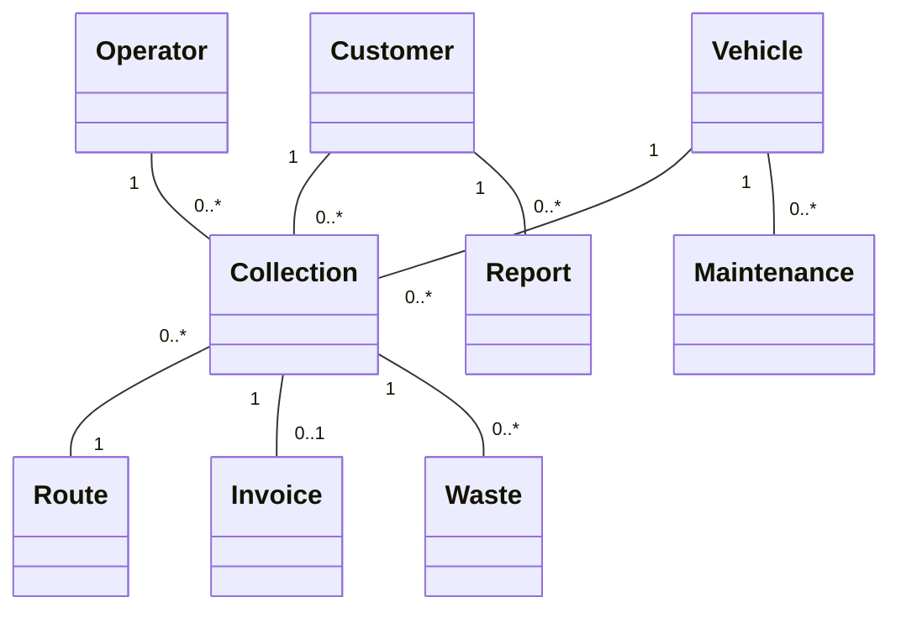
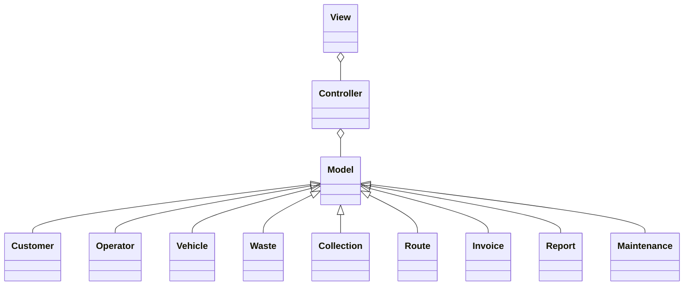
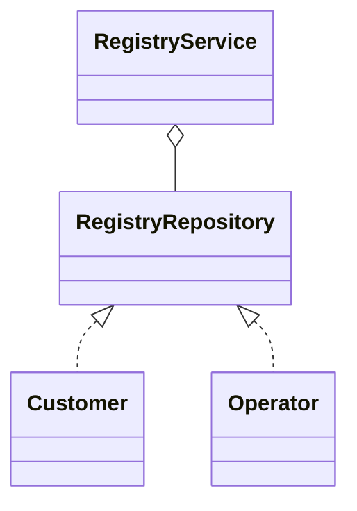
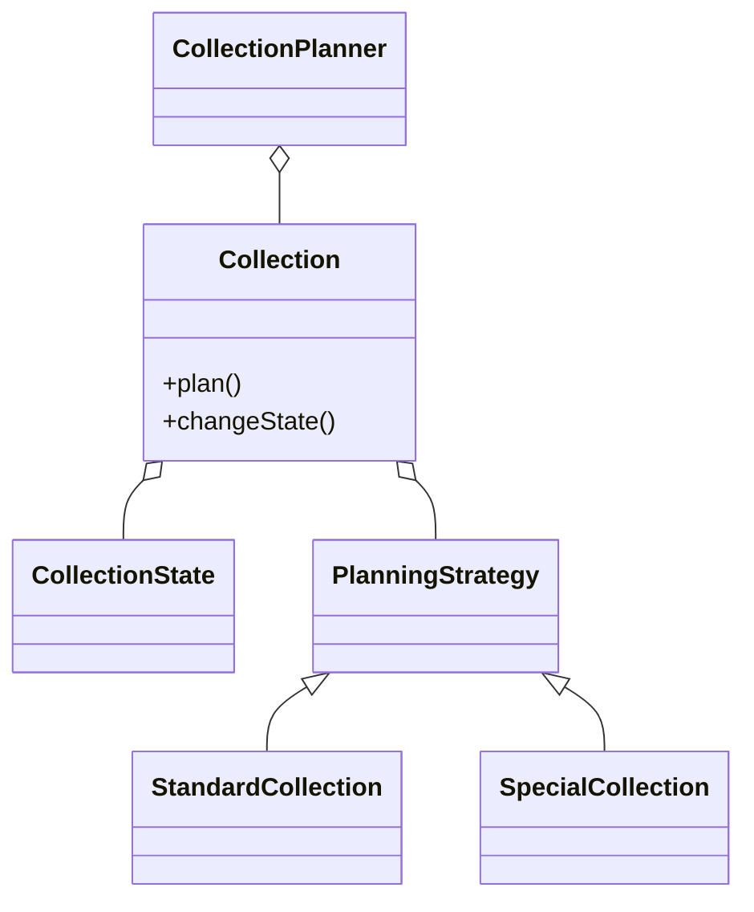
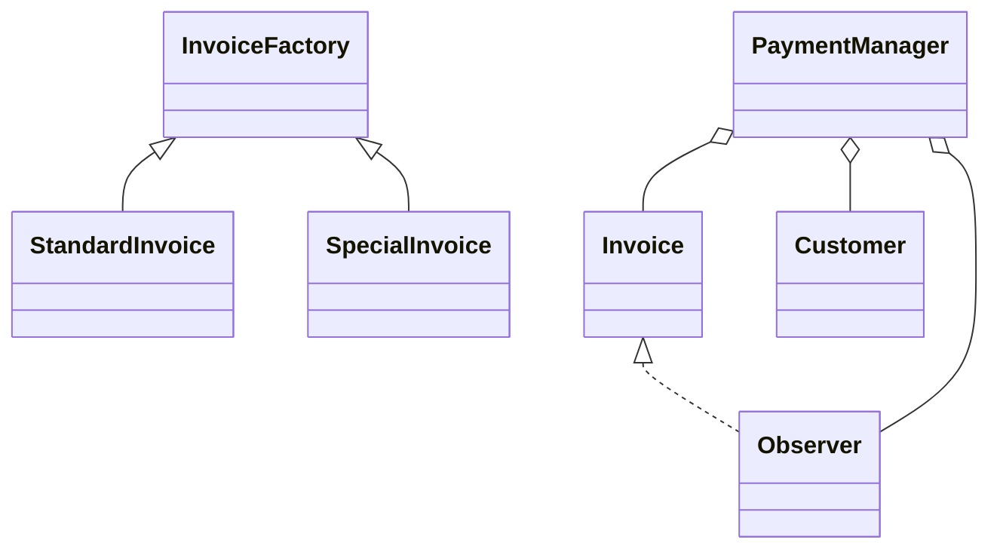
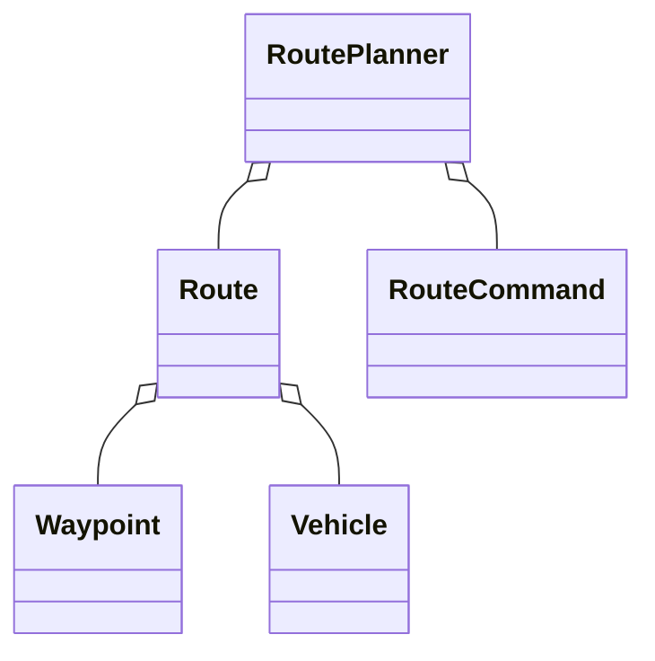
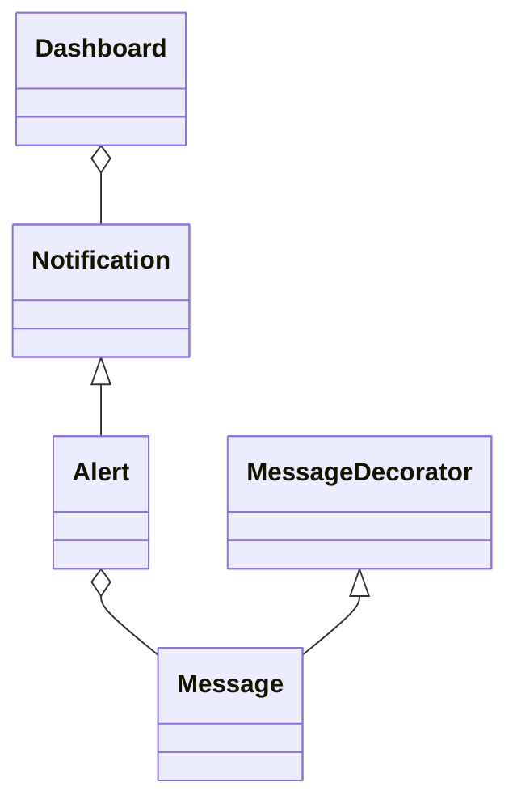
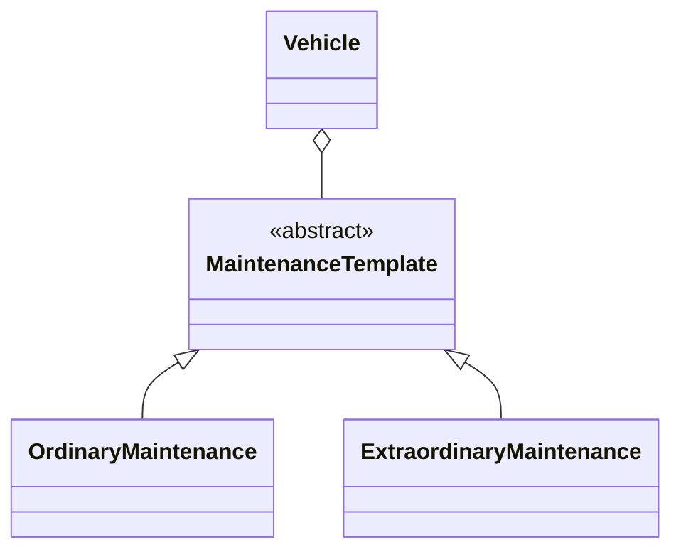

# Relazione di progetto

## Componenti del gruppo

- **Lorenzo Ferrari** — lorenzo.ferrari27@studio.unibo.it
- **Alex Cambrini** — alex.cambrini@studio.unibo.it
- **Manuel Ragazzini** — manuel.ragazzini3@studio.unibo.it

---

# Analisi

## Requisiti

L'applicazione gestisce le attività di un'azienda di smaltimento rifiuti, fornendo strumenti per pianificazione, monitoraggio e amministrazione dei servizi.

**Requisiti funzionali:**
- Gestione anagrafiche clienti e operatori (dati dettagliati, ruoli)
- Amministrazione risorse aziendali (mezzi/personale, stato operativo)
- Gestione rifiuti (classificazione, smaltimento, riciclaggio)
- Pianificazione raccolte programmate settimanali (modificabili)
- Gestione raccolte speciali/aggiuntive (prenotazione, annullamento con preavviso)
- Monitoraggio raccolte (stato: completata/fallita, segnalazioni operatori)
- Gestione fatturazione e pagamenti
- Pianificazione e modifica rotte per i camion

**Requisiti opzionali:**
- Dashboard monitoraggio/statistiche
- Notifiche e alert automatici
- Segnalazioni clienti su problemi
- Calendario visuale raccolte
- Gestione manutenzione mezzi

**Challenge principali:**
- Protezione dati sensibili/anagrafiche
- Pianificazione dinamica raccolte/rotte
- Automazione fatturazione
- Notifiche, dashboard, gestione segnalazioni
- Manutenzione preventiva mezzi

---

## Analisi e modello del dominio

**Entità principali:**
- Customer
- Operator
- Vehicle
- Waste
- Collection
- Route
- Invoice
- Report
- Maintenance

**Relazioni:**
- Collection ↔ Customer/Operator/Vehicle/Waste/Route/Invoice
- Vehicle ↔ Collection/Maintenance
- Customer ↔ Report
- Collection → genera Invoice

**Descrizione a parole:**  
Ogni collection rappresenta un servizio pianificato o speciale di ritiro rifiuti, coinvolge uno o più customer, operator e vehicle, e genera una invoice. I vehicle sono assegnati a route dinamiche e sono soggetti a maintenance. I customer possono inviare report legati al servizio.

**Schema UML del dominio:**



---

# Design

## Architettura

Il sistema adotta un'architettura modulare ispirata a MVC:

- **Model:** entità di dominio e logica (Customer, Vehicle, Collection, ecc.)
- **View:** interfaccia utente, dashboard, notifiche
- **Controller:** coordinamento richieste, flusso operazioni e orchestrazione

**Schema architetturale:**



---

## Design dettagliato

### Gestione anagrafiche

**Problema:** Gestire customers/operators in modo sicuro e aggiornabile, con notifica delle modifiche.

**Soluzione:**  
- **Pattern Repository:** separa logica di accesso ai dati e servizi.
- **Pattern Observer:** aggiorna componenti interessate a variazioni.



---

### Pianificazione raccolte

**Problema:** Gestire raccolte programmate/speciali, modificabili dinamicamente in base a richieste e disponibilità.

**Soluzione:**  
- **Pattern Strategy:** politiche di pianificazione (standard/special)
- **Pattern State:** gestione stato collection (planned, ongoing, completed, failed)



---

### Gestione fatturazione e pagamenti

**Problema:** Automatizzare generazione invoice e tracciamento pagamenti.

**Soluzione:**  
- **Pattern Factory Method:** creazione invoice standard/special
- **Pattern Observer:** notifica cambiamenti stato pagamento



---

### Pianificazione rotte

**Problema:** Ottimizzare e aggiornare dinamicamente le route dei vehicle.

**Soluzione:**  
- **Pattern Command:** gestione richieste modifica route e undo/redo
- **Pattern Iterator:** scorrimento tappe della route



---

### Dashboard e notifiche

**Problema:** Panoramica aggiornata attività e notifiche automatiche su anomalie.

**Soluzione:**  
- **Pattern Observer:** aggiornamento realtime dashboard/notifiche
- **Pattern Decorator:** messaggi alert arricchiti



---

### Gestione manutenzione mezzi

**Problema:** Pianificare e tracciare maintenance senza interrompere l’operatività.

**Soluzione:**  
- **Pattern Template Method:** sequenza fasi intervento
- **Pattern Strategy:** tipi diversi di maintenance (ordinary, extraordinary)



---

# Sviluppo e Testing automatizzato

Sono stati sviluppati test automatici per:

- Creazione e modifica delle anagrafiche
- Pianificazione e modifica raccolte e rotte
- Generazione invoice e verifica pagamenti
- Integrazione tra raccolte, rotte e disponibilità mezzi

Il testing utilizza JUnit (o equivalente), è automatico e ripetibile, con test di unità e integrazione per le funzionalità core.

---

# Note di sviluppo

## Gestione anagrafiche

- **Uso avanzato di Stream e Optional**  
  *File:* `src/main/java/wastemaster/registry/RegistryService.java`  
  ```java
  public Optional<Customer> findCustomerByEmail(String email) {
      return customers.stream()
          .filter(customer -> customer.getEmail().equalsIgnoreCase(email))
          .findFirst();
  }
  ```
  *Permette ricerca e gestione sicura (null-safe) dei risultati.*

- **Validazione con annotazioni custom**  
  *File:* `src/main/java/wastemaster/registry/Customer.java`  
  ```java
  @NotNull
  @Email
  private String email;
  ```
  *Garantisce correttezza dati in input grazie all’uso di Bean Validation.*

- **Uso di generics per repository risorse**  
  *File:* `src/main/java/wastemaster/resources/ResourceRepository.java`  
  ```java
  public class ResourceRepository<T extends Resource> { ... }
  ```
  *Permette riuso e tipizzazione sicura nella gestione di diversi tipi di risorse.*

---

## Pianificazione raccolte

- **Algoritmo pianificazione dinamica**  
  *File:* `src/main/java/wastemaster/collection/CollectionPlanner.java`  
  ```java
  collections.sort(Comparator.comparing(Collection::getPriority).reversed());
  ```
  *Ottimizza l’assegnazione delle risorse in base a priorità e disponibilità.*

- **Integrazione raccolte speciali con calendario**  
  *File:* `src/main/java/wastemaster/collection/SpecialCollection.java`  
  ```java
  calendar.addEvent(this.getDate(), "Special Collection: " + this.getDescription());
  ```
  *Gestione unificata eventi e raccolte straordinarie.*

- **Pattern Observer per monitoraggio raccolte**  
  *File:* `src/main/java/wastemaster/collection/Collection.java`  
  ```java
  private List<CollectionObserver> observers = new ArrayList<>();
  public void notifyState() {
      observers.forEach(o -> o.update(this));
  }
  ```
  *Notifica automatica di avanzamento stato a dashboard e operatori.*

---

## Fatturazione e rotte

- **Generazione e invio automatico invoice**  
  *File:* `src/main/java/wastemaster/invoice/InvoiceService.java`  
  ```java
  EmailSender.send(customerEmail, "Your invoice", invoice.toString());
  ```
  *Automatizza comunicazione con il customer.*

- **Algoritmo calcolo rotte con gestione imprevisti**  
  *File:* `src/main/java/wastemaster/routes/RoutePlanner.java`  
  ```java
  return optimizationAlgorithm.calculate(vehicle, collections);
  ```
  *Ricalcola percorso in tempo reale in risposta a eventi imprevisti.*

- **Integrazione pagamenti e notifiche customer**  
  *File:* `src/main/java/wastemaster/invoice/PaymentService.java`  
  ```java
  invoice.setPaid(true);
  Notifier.notifyCustomer(invoice.getCustomer(), "Payment received. Thank you!");
  ```
  *Aggiornamento stato pagamenti e comunicazione tempestiva.*

---

## Dashboard, manutenzione, notifiche

- **Dashboard aggiornata via Observer**  
  *File:* `src/main/java/wastemaster/dashboard/Dashboard.java`  
  ```java
  collection.addObserver(this::updateDashboard);
  ```
  *Aggiornamento automatico vista operativa.*

- **Gestione Template Method in maintenance**  
  *File:* `src/main/java/wastemaster/maintenance/MaintenanceTemplate.java`  
  ```java
  public final void performMaintenance() {
      checkConditions();
      executeIntervention();
      updateHistory();
  }
  ```
  *Sequenza fasi standard e personalizzazione per ciascun tipo di intervento.*

- **Notifiche avanzate con Decorator**  
  *File:* `src/main/java/wastemaster/notifications/MessageDecorator.java`  
  ```java
  Message alert = new PriorityDecorator(new BaseMessage("Collection failed!"));
  ```
  *Permette arricchimento dei messaggi di allerta.*

---

## Codice di terze parti o adattato

- L’invio email si basa su esempi della documentazione JavaMail.
- La validazione dati utilizza Hibernate Validator.
- Algoritmi di routing ispirati a esempi open source (Dijkstra, A*).
- L’uso di Observer e Decorator segue le best practice Java/GoF.

---

# Commenti finali

*(Sezione da compilare da ciascun membro: autovalutazione, punti di forza/debolezza, ruolo nel gruppo.)*

---

# Guida utente

1. **Accesso:** Login come operator o admin.
2. **Gestione anagrafiche:**  
   - Aggiungi/modifica/elimina customers e operators.
3. **Collections:**  
   - Pianifica nuove raccolte, visualizza/modifica raccolte esistenti, gestisci raccolte speciali.
4. **Vehicles:**  
   - Visualizza stato, pianifica maintenance.
5. **Invoices:**  
   - Genera/consulta invoice, registra pagamenti.
6. **Routes:**  
   - Visualizza/modifica rotte assegnate.
7. **Dashboard:**  
   - Monitora statistiche operative e ricevi notifiche.

*Il sistema guida l’utente con form, messaggi di conferma ed errori. Le funzionalità opzionali (dashboard, notifiche, manutenzione avanzata) sono accessibili tramite l’apposito menu.*

---
