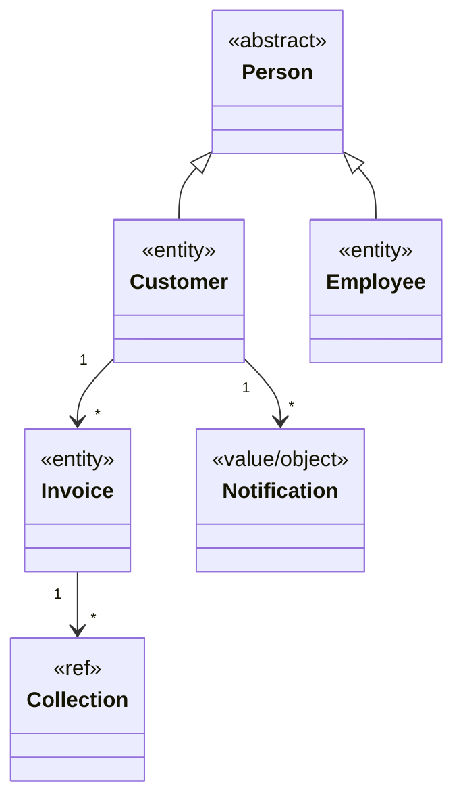
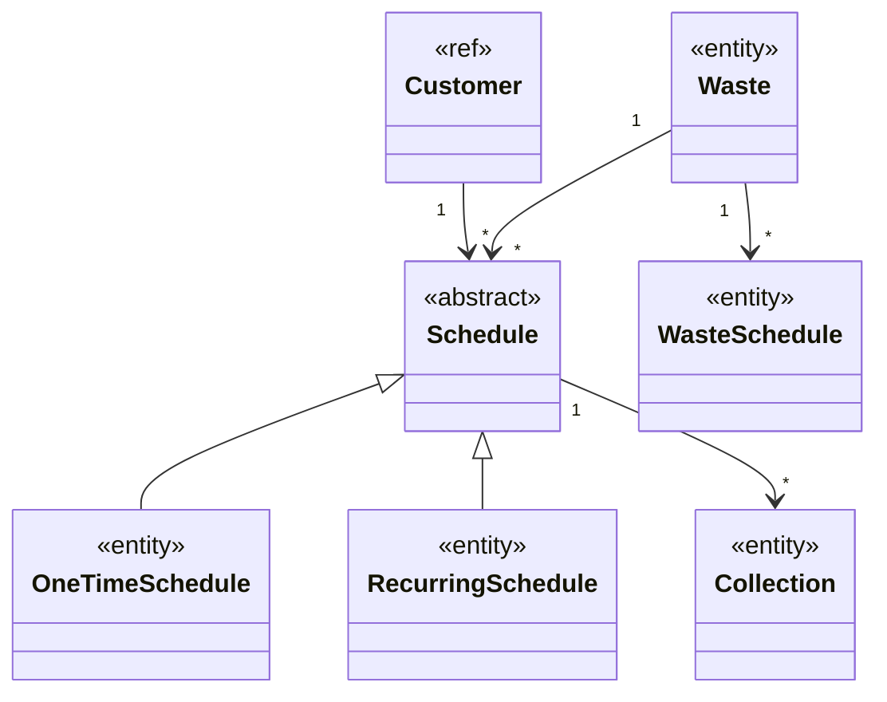
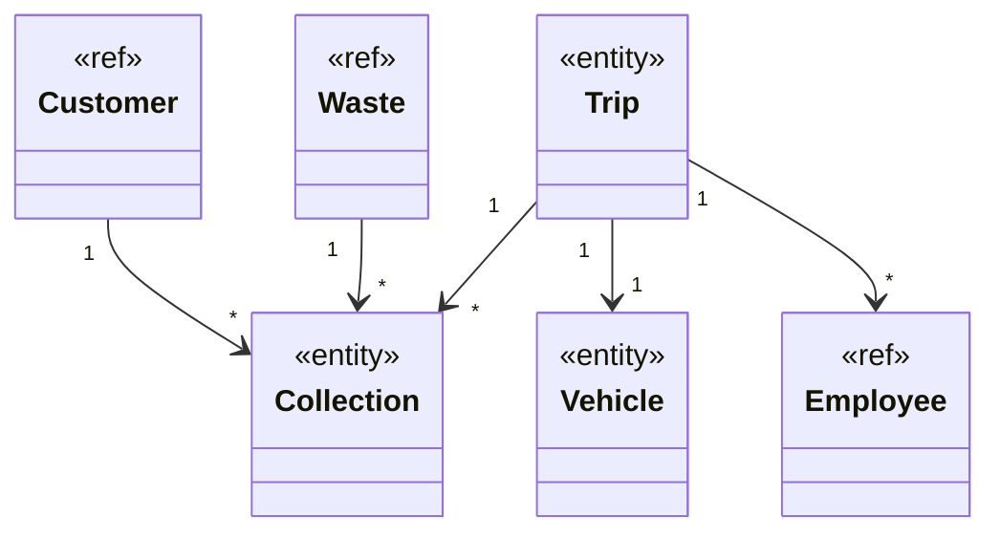

# Analisi

Il dominio riguarda la gestione operativa e amministrativa di un’azienda di smaltimento rifiuti. L’applicazione dovrà supportare le principali attività dell’azienda, tra cui la pianificazione dei ritiri dei rifiuti, l’organizzazione delle risorse operative (personale e mezzi), il monitoraggio dello stato dei ritiri e la rendicontazione economica.

Gli attori principali sono i clienti dell’azienda, che richiedono il servizio di raccolta dei rifiuti, e il personale amministrativo e operativo, che gestisce la pianificazione, la raccolta e il monitoraggio delle attività.

Le attività chiave comprendono:
- Pianificazione dei ritiri, occasionali o ricorrenti, con possibilità di modificare, sospendere o cancellare un ritiro prima della sua esecuzione.
- Organizzazione dei viaggi operativi, che raggruppano più ritiri in una stessa area e assegnano le risorse necessarie.
- Gestione della raccolta dei rifiuti, con registrazione delle attività completate e segnalazione di eventuali problemi o criticità.
- Fatturazione ai clienti, basata sui ritiri completati, e monitoraggio dei pagamenti.

Il sistema dovrà inoltre garantire la coerenza operativa, evitando assegnazioni errate di risorse o conflitti tra ritiri e viaggi, e comunicare in modo chiaro eventuali errori o aggiornamenti agli utenti interessati.

---

# Requisiti

- **Gestione clienti e personale**: il sistema deve permettere di registrare e aggiornare informazioni su clienti e personale, includendo la gestione dei ruoli del personale e la verifica delle abilitazioni necessarie per le attività operative.
- **Gestione mezzi operativi**: il sistema deve consentire di gestire i mezzi disponibili, controllando la disponibilità, la manutenzione e l’adeguatezza dei mezzi rispetto alle attività pianificate.
- **Gestione dei rifiuti e pianificazione settimanale**: il sistema deve supportare la definizione dei tipi di rifiuti da raccogliere e la pianificazione dei ritiri in base a giorni della settimana o periodi specifici.
- **Pianificazione dei ritiri**: il sistema deve consentire di creare, modificare, sospendere o cancellare i ritiri, sia occasionali che ricorrenti, e monitorarne lo stato fino al completamento.
- **Esecuzione delle raccolte**: il sistema deve registrare le raccolte effettuate, consentendo la segnalazione di completamenti, cancellazioni o problemi durante il ritiro.
- **Organizzazione dei viaggi operativi**: il sistema deve permettere di raggruppare più ritiri in un viaggio per area, assegnando personale e mezzi in modo coerente e senza sovrapposizioni.
- **Monitoraggio e notifiche**: il sistema deve aggiornare lo stato delle attività in tempo reale e notificare agli utenti eventuali criticità o aggiornamenti rilevanti.
- **Fatturazione e pagamenti**: il sistema deve generare fatture per i clienti basate sui ritiri completati e registrare lo stato di ciascuna fattura come pagata o non pagata.
- **Regole di coerenza operativa**: il sistema deve garantire che le risorse assegnate siano adeguate alle attività previste, evitando conflitti tra mezzi, personale e ritiri pianificati.

---

# Analisi e modello del dominio

Il dominio riguarda la gestione operativa e amministrativa di un’azienda di smaltimento rifiuti. L’applicazione dovrà supportare le principali attività aziendali, consentendo la pianificazione dei ritiri, l’organizzazione delle risorse operative (personale e mezzi), il monitoraggio dello stato delle attività e la gestione della fatturazione verso i clienti.

Gli attori principali sono i clienti, che richiedono il servizio di raccolta dei rifiuti, e il personale amministrativo e operativo, responsabile della pianificazione, della raccolta e del monitoraggio delle attività.

---

## Diagramma 1 – Utenti e Fatturazione

### Descrizione
Questo diagramma rappresenta le entità legate agli utenti e alla gestione economica.  
Le entità principali sono:

- **Person** (astratta): chiunque interagisca con il sistema.
- **Customer**: estende Person, utente del servizio di raccolta.
- **Employee**: estende Person, personale operativo o amministrativo.
- **Invoice**: fattura emessa ai clienti in base ai ritiri completati.
- **Notification**: comunica aggiornamenti o criticità agli utenti o al personale.
- **Collection** (riferimento): raccolta effettuata, definita in Diagramma 2/3.

**Relazioni chiave:**

- Customer può avere molte Invoice.
- Invoice può riguardare più Collection.
- Customer può ricevere più Notification.

### UML

## Diagramma 2 – Pianificazione dei ritiri

### Descrizione
Questo diagramma mostra le entità legate alla pianificazione dei ritiri e alla gestione dei rifiuti:

- **Schedule** (astratta): piano di raccolta.
- **OneTimeSchedule**: sottoclasse per ritiri occasionali.
- **RecurringSchedule**: sottoclasse per ritiri ricorrenti.
- **Waste**: tipi di rifiuto.
- **WasteSchedule**: gestisce raccolte ricorrenti.
- **Collection**: singolo evento di raccolta.
- **Customer** (riferimento): definito in Diagramma 1.

**Relazioni chiave:**

- Customer può avere molti Schedule.
- Waste può essere associato a molti Schedule.
- Schedule include molte Collection.
- Waste può avere molti WasteSchedule.

### UML

## Diagramma 3 – Operazioni e risorse

### Descrizione
Questo diagramma riguarda la gestione operativa delle risorse e dei viaggi:

- **Trip**: raggruppa più Collection in un’area geografica.
- **Vehicle**: mezzi utilizzati per le raccolte.
- **Employee**: come risorsa operativa.
- **Collection**: raccolta associata a Trip, Vehicle e Employee.
- **Customer** (riferimento): definito in Diagramma 1.
- **Waste** (riferimento): definito in Diagramma 2.

**Relazioni chiave:**

- Trip include molte Collection.
- Trip utilizza un Vehicle.
- Trip ha più Employee assegnati.
- Customer e Waste sono legati alle Collection.

### UML

