# Analisi

Il dominio riguarda la gestione operativa e amministrativa di un’azienda di smaltimento rifiuti. L’applicazione dovrà supportare le principali attività dell’azienda, tra cui la pianificazione dei ritiri dei rifiuti, l’organizzazione delle risorse operative (personale e mezzi), il monitoraggio dello stato dei ritiri e la rendicontazione economica.

Gli attori principali sono i clienti dell’azienda, che richiedono il servizio di raccolta dei rifiuti, e il personale amministrativo e operativo, che gestisce la pianificazione, la raccolta e il monitoraggio delle attività.

Le attività chiave comprendono:
- Pianificazione dei ritiri, occasionali o ricorrenti, con possibilità di modificare, sospendere o cancellare un ritiro prima della sua esecuzione.
- Organizzazione dei viaggi operativi, che raggruppano più ritiri in una stessa area e assegnano le risorse necessarie.
- Gestione della raccolta dei rifiuti, con registrazione delle attività completate e segnalazione di eventuali problemi o criticità.
- Fatturazione ai clienti, basata sui ritiri completati, e monitoraggio dei pagamenti.

Il sistema dovrà inoltre garantire la coerenza operativa, evitando assegnazioni errate di risorse o conflitti tra ritiri e viaggi, e comunicare in modo chiaro eventuali errori o aggiornamenti agli utenti interessati.

---

# Requisiti

- **Gestione clienti e personale**: il sistema deve permettere di registrare e aggiornare informazioni su clienti e personale, includendo la gestione dei ruoli del personale e la verifica delle abilitazioni necessarie per le attività operative.
- **Gestione mezzi operativi**: il sistema deve consentire di gestire i mezzi disponibili, controllando la disponibilità, la manutenzione e l’adeguatezza dei mezzi rispetto alle attività pianificate.
- **Gestione dei rifiuti e pianificazione settimanale**: il sistema deve supportare la definizione dei tipi di rifiuti da raccogliere e la pianificazione dei ritiri in base a giorni della settimana o periodi specifici.
- **Pianificazione dei ritiri**: il sistema deve consentire di creare, modificare, sospendere o cancellare i ritiri, sia occasionali che ricorrenti, e monitorarne lo stato fino al completamento.
- **Esecuzione delle raccolte**: il sistema deve registrare le raccolte effettuate, consentendo la segnalazione di completamenti, cancellazioni o problemi durante il ritiro.
- **Organizzazione dei viaggi operativi**: il sistema deve permettere di raggruppare più ritiri in un viaggio per area, assegnando personale e mezzi in modo coerente e senza sovrapposizioni.
- **Monitoraggio e notifiche**: il sistema deve aggiornare lo stato delle attività in tempo reale e notificare agli utenti eventuali criticità o aggiornamenti rilevanti.
- **Fatturazione e pagamenti**: il sistema deve generare fatture per i clienti basate sui ritiri completati e registrare lo stato di ciascuna fattura come pagata o non pagata.
- **Regole di coerenza operativa**: il sistema deve garantire che le risorse assegnate siano adeguate alle attività previste, evitando conflitti tra mezzi, personale e ritiri pianificati.

---

# Analisi e modello del dominio

Il dominio riguarda la gestione operativa e amministrativa di un’azienda di smaltimento rifiuti. L’applicazione dovrà supportare le principali attività aziendali, consentendo la pianificazione dei ritiri, l’organizzazione delle risorse operative (personale e mezzi), il monitoraggio dello stato delle attività e la gestione della fatturazione verso i clienti.

Gli attori principali sono i clienti, che richiedono il servizio di raccolta dei rifiuti, e il personale amministrativo e operativo, responsabile della pianificazione, della raccolta e del monitoraggio delle attività.

---

## Diagramma 1 – Utenti e Fatturazione

### Descrizione
Questo diagramma rappresenta le entità legate agli utenti e alla gestione economica.  
Le entità principali sono:

- **Person** (astratta): chiunque interagisca con il sistema.
- **Customer**: estende Person, utente del servizio di raccolta.
- **Employee**: estende Person, personale operativo o amministrativo.
- **Invoice**: fattura emessa ai clienti in base ai ritiri completati.
- **Notification**: comunica aggiornamenti o criticità agli utenti o al personale.
- **Collection** (riferimento): raccolta effettuata, definita in Diagramma 2/3.

**Relazioni chiave:**

- Customer può avere molte Invoice.
- Invoice può riguardare più Collection.
- Customer può ricevere più Notification.

### UML
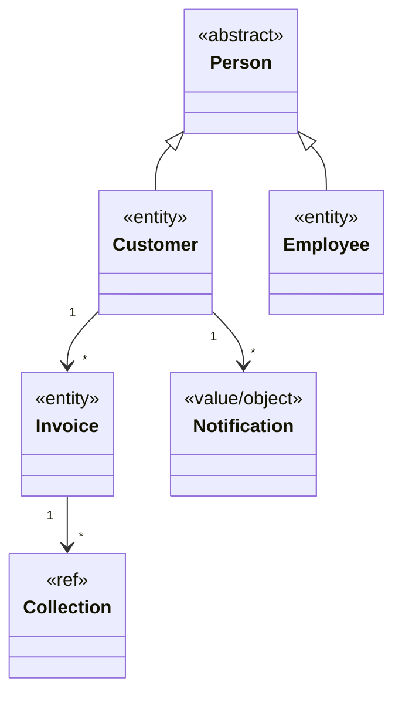

## Diagramma 2 – Pianificazione dei ritiri

### Descrizione
Questo diagramma mostra le entità legate alla pianificazione dei ritiri e alla gestione dei rifiuti:

- **Schedule** (astratta): piano di raccolta.
- **OneTimeSchedule**: sottoclasse per ritiri occasionali.
- **RecurringSchedule**: sottoclasse per ritiri ricorrenti.
- **Waste**: tipi di rifiuto.
- **WasteSchedule**: gestisce raccolte ricorrenti.
- **Collection**: singolo evento di raccolta.
- **Customer** (riferimento): definito in Diagramma 1.

**Relazioni chiave:**

- Customer può avere molti Schedule.
- Waste può essere associato a molti Schedule.
- Schedule include molte Collection.
- Waste può avere molti WasteSchedule.

### UML
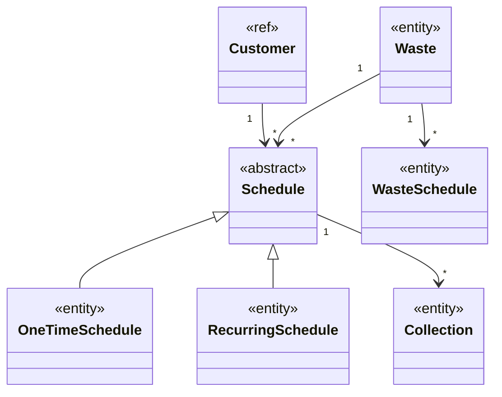


## Diagramma 3 – Operazioni e risorse

### Descrizione
Questo diagramma riguarda la gestione operativa delle risorse e dei viaggi:

- **Trip**: raggruppa più Collection in un’area geografica.
- **Vehicle**: mezzi utilizzati per le raccolte.
- **Employee**: come risorsa operativa.
- **Collection**: raccolta associata a Trip, Vehicle e Employee.
- **Customer** (riferimento): definito in Diagramma 1.
- **Waste** (riferimento): definito in Diagramma 2.

**Relazioni chiave:**

- Trip include molte Collection.
- Trip utilizza un Vehicle.
- Trip ha più Employee assegnati.
- Customer e Waste sono legati alle Collection.

### UML
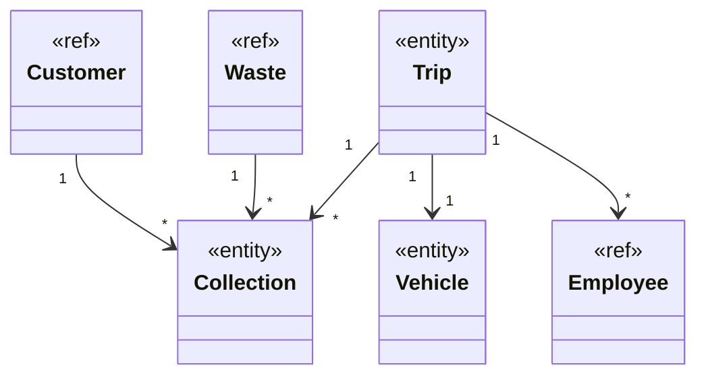

# Design

L’architettura di *WasteMaster* adotta una variante del pattern **MVC**, ispirata al modello **ECB (Entity–Control–Boundary)**, al fine di garantire una chiara separazione tra interfaccia grafica, logica applicativa e modello di dominio.

L’interfaccia utente è sviluppata in **JavaFX**. Ogni schermata è composta da un file FXML e dal relativo *controller*, responsabile esclusivamente della gestione degli input dell’utente e dell’aggiornamento della vista. I controller fungono quindi da semplici adattatori verso la logica sottostante, senza contenere regole di business.

La logica applicativa è incapsulata in specifici **manager**, ciascuno dedicato a un’area funzionale (gestione clienti, pianificazione raccolte, assegnazione viaggi, fatturazione, notifiche). Essi orchestrano la collaborazione tra più entità e applicano regole e validazioni centralizzate.

Le **entità di dominio** — come `Customer`, `Schedule`, `Collection`, `Trip`, `Vehicle`, `Invoice` — rappresentano lo stato persistente del sistema e sono manipolate esclusivamente dai manager, prevenendo modifiche dirette da parte dell’interfaccia utente.

Il flusso di interazione segue una struttura uniforme:

Vista (FXML) → Controller UI → Manager applicativo → Entità di dominio → ritorno al Controller → aggiornamento della UI

Questa organizzazione rende l’applicativo **estendibile e manutenibile**: l’introduzione di nuove funzionalità richiede unicamente l’aggiunta o l’estensione di un manager, senza impattare sui controller o sulle entità esistenti.

---

## Architettura

Questa sezione illustra come le principali componenti di *WasteMaster* interagiscono tra loro, descrivendone i ruoli e lo scambio di informazioni ad **alto livello** (senza dettagli implementativi).

### Componenti e ruoli

- **Controller UI (Boundary)**
    - Gestiscono input e navigazione delle viste JavaFX (FXML).
    - Delegano ogni operazione applicativa ai componenti di controllo (manager).
    - Raccolgono i risultati e aggiornano la UI (nessuna logica di business al loro interno).

- **Manager applicativi (Control)**
    - Incapsulano i casi d’uso (p.es. *Schedule/Recurring/OneTimeScheduleManager*, *CollectionManager*).
    - Applicano regole e validazioni, orchestrando più entità e collaborando tra manager quando necessario (es. generazione collection a partire da schedule).
    - Espongono metodi coesi e di alto livello ai controller.

- **Entità di dominio (Entity)**
    - Rappresentano lo stato del sistema: `Schedule` (astratta), `OneTimeSchedule`, `RecurringSchedule`, `Collection`, ecc.
    - Espongono comportamenti minimi e stati tipizzati (es. `ScheduleStatus`, `CollectionStatus`).
    - Sono manipolate esclusivamente dai manager.

- **Repository (Porte del dominio)**
    - Definiscono i contratti di accesso ai dati (interfacce lato dominio).
    - Forniscono ai manager operazioni di lettura/scrittura senza esporre dettagli di persistenza.

### Interazioni principali (panoramica)

1. **Vista → Controller:** l’utente compie un’azione (crea/aggiorna/cancella una pianificazione).
2. **Controller → Manager:** il controller invoca il manager appropriato con gli input dell’utente.
3. **Manager → Repository / Entità:** il manager applica le regole, coordina le entità e persiste/recupera dati tramite i repository.
4. **Manager → Controller → Vista:** il risultato (esito/oggetti/mesi successivi) torna al controller che aggiorna la UI.

### Schema UML architetturale

> Il diagramma mostra **soltanto** i macro–ruoli e le dipendenze tra componenti: controller → manager → repository → entità.  
> Sono **omessi** campi e metodi di dettaglio per mantenere la leggibilità.

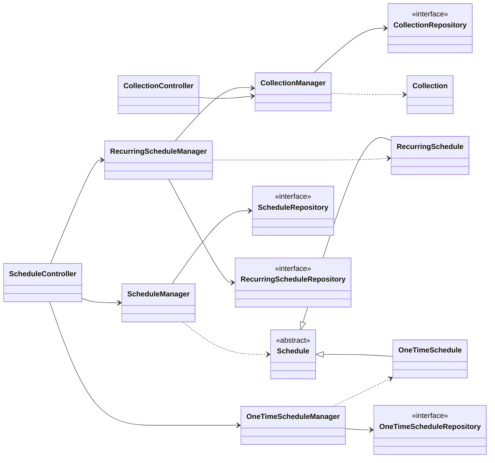
---
## Design Dettagliato — Vehicle Management (Ferrari Lorenzo)

### Problema affrontato

La gestione dei veicoli nel sistema *WasteMaster* non si limita al semplice salvataggio dei dati anagrafici: ogni veicolo deve poter:

- **Cambiare stato operativo** (IN_SERVICE → IN_MAINTENANCE → OUT_OF_SERVICE e viceversa),
- **Gestire automaticamente la manutenzione programmata**, aggiornando le date in modo consistente,
- **Essere compatibile solo con determinati autisti**, in base alla **patente richiesta**.

La sfida progettuale è quindi modellare un’entità che non sia un mero contenitore di dati, ma che **incapsuli regole di dominio reali**, mantenendo al contempo **pulita la logica applicativa** nei servizi esterni (es. `TripManager` e `EmployeeManager`).

---

### Soluzione adottata

La responsabilità è stata suddivisa in due livelli:

1. **`Vehicle` come *Entity ricca***
    - Mantiene lo **stato operativo** tramite l’enum `VehicleStatus` (`IN_SERVICE`, `IN_MAINTENANCE`, `OUT_OF_SERVICE`);
    - Espone metodi come `updateStatus(...)` e `handleMaintenanceButton(...)` per permettere cambiamenti **atomici e consistenti** dello stato;
    - Gestisce in autonomia **normalizzazione dei dati** (`@PrePersist` / `@PreUpdate` sulla targa).

2. **`VehicleManager` come *Control/Domain Service***
    - Applica **regole di business più complesse**, come:
        - transizione corretta dello stato operativo;
        - aggiornamento automatico della data di manutenzione (`markMaintenanceAsComplete`);
        - calcolo delle **patenti compatibili** per l’assegnazione del veicolo (`getAllowedLicences`).

In questo modo **la logica del dominio rimane centralizzata e riusabile**, evitando duplicazioni in altri servizi come `TripManager`.

---

### Pattern utilizzati

| Pattern | Applicazione nel progetto | Descrizione |
|---------|--------------------------|-------------|
| **State (semplificato)** | `VehicleStatus` + metodi di transizione nel `VehicleManager` | Ogni stato (`IN_SERVICE`, `IN_MAINTENANCE`, ...) definisce transizioni ammesse tramite metodi dedicati (`handleMaintenanceButton`, `handleServiceButton`). |
| **Validation Layer** | `ValidateUtils` + annotazioni `jakarta.validation` | Validazione dichiarativa sui campi, unita a controlli espliciti nel manager. |
| **Policy Strategy (per le licenze)** | `Vehicle.RequiredLicence` ↔ `Employee.Licence` | La compatibilità tra licenze è gestita tramite uno *switch* che funge da regola di policy esterna al dominio. |

---

### Schema UML della soluzione

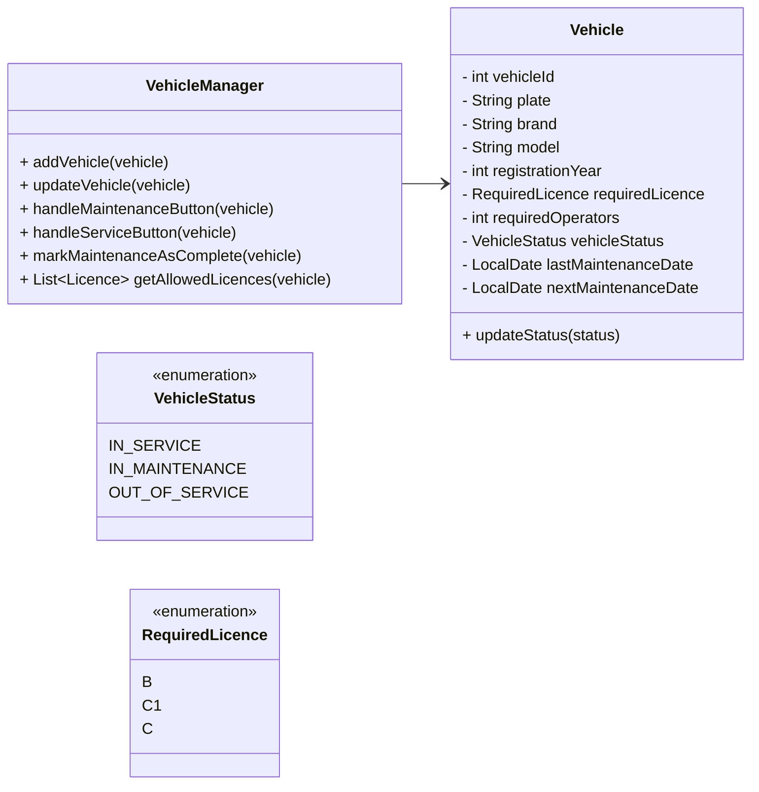
### Diagramma di Stato — VehicleStatus
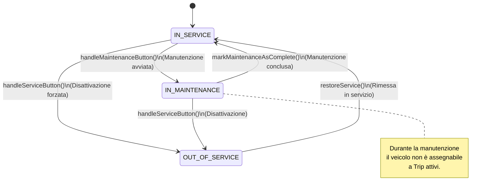

### Diagramma di Interazione — Transizione Manutenzione
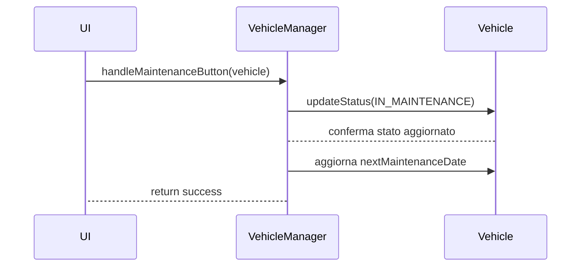

### Motivazioni e alternative scartate

Una possibile alternativa sarebbe stata quella di gestire gli stati operativi del veicolo **direttamente nei Controller o nella UI**, attraverso semplici blocchi condizionali (`if-else`).  
Questa soluzione è stata **scartata** per tre motivi principali:

- **Duplicazione della logica** in più punti dell'applicazione;
- **Scarsa estendibilità**: l’aggiunta di nuovi stati futuri (es. `DECOMMISSIONED`) avrebbe richiesto modifiche sparse in molti componenti;
- **Alto rischio di inconsistenze**, poiché sviluppatori disattenti potrebbero ad esempio consentire l'assegnazione di un veicolo *in manutenzione* a un `Trip`.

Con l’approccio adottato — **logica centralizzata nel dominio (Entity + Manager)** — le regole vengono applicate in modo coerente e restano **facilmente estendibili senza impattare il resto del sistema**.

## Design Dettagliato — Pianificazione delle Raccolte (Alex Cambrini)

### Problema affrontato

Il dominio *WasteMaster* richiede di gestire due tipologie di pianificazione delle raccolte:

- **One–Time**: una singola data richiesta dal cliente;
- **Recurring**: un ciclo (settimanale/mensile) allineato al giorno previsto dal calendario di quel rifiuto (*WasteSchedule*).

Vincoli principali:

- calcolare e **mantenere la prossima data utile** in base alla frequenza e al giorno prefissato dal *WasteSchedule*;
- **generare automaticamente la `Collection`** ogni volta che una pianificazione diventa effettiva;
- **regolare gli stati** (ACTIVE/PAUSED/CANCELLED/COMPLETED) e le transizioni consentite;
- **validare le cancellazioni** (es. One–Time cancellabile solo entro una soglia di giorni);
- evitare duplicazioni di logica tra UI e service, **centralizzando il comportamento nel dominio**.

---

### Soluzione adottata

La soluzione è stata strutturata in **Entity + Domain Service** ben separati:

1. **Gerarchia di dominio per la pianificazione**
    - `Schedule` (astratta) definisce l’interfaccia comune e il **template** per ottenere la “data di raccolta” (`getCollectionDate()`).
    - `OneTimeSchedule` fornisce la **data unica** (`pickupDate`) e la restituisce come `getCollectionDate()`.
    - `RecurringSchedule` mantiene `startDate`, `frequency (WEEKLY/MONTHLY)` e `nextCollectionDate`, che viene **calcolata e aggiornata** dai servizi.

2. **Servizi applicativi coesi**
    - `OneTimeScheduleManager`
        - valida la data (>= `CANCEL_LIMIT_DAYS`);
        - persiste lo schedule e **chiede a `CollectionManager`** di generare la relativa `Collection`.
    - `RecurringScheduleManager`
        - calcola la **prima** `nextCollectionDate` e le **successive** (allineando al giorno previsto dal `WasteSchedule`);
        - gestisce **stato e transizioni** (ACTIVE ⇄ PAUSED, ACTIVE → CANCELLED) e la **rigenerazione/annullamento** delle `Collection` associate;
        - aggiorna la `frequency` ricalcolando coerentemente la `nextCollectionDate`.
    - `CollectionManager`
        - fornisce un’API unica per **generare/aggiornare/annullare** `Collection` a partire da uno `Schedule`.

3. **Allineamento al calendario del rifiuto**
    - Il calcolo della `nextCollectionDate` usa `WasteScheduleManager` per recuperare il **giorno della settimana valido** per quel rifiuto e allineare la data richiesta (es. “ogni martedì”).

---
### Pattern utilizzati

#### Template Method (sui dati di pianificazione)
Il metodo `Schedule#getCollectionDate()` funge da **template method**:

- `OneTimeSchedule` lo implementa restituendo `pickupDate`;
- `RecurringSchedule` lo implementa restituendo `nextCollectionDate`.

Questo consente di trattare entrambi gli schedule in modo uniforme a livello di dominio.


#### Strategy (frequenza di ricorrenza)
La strategia è rappresentata da `RecurringSchedule.Frequency` (`WEEKLY`, `MONTHLY`).

Il calcolo della prossima data applica **la politica scelta** ed è facilmente estendibile (es. aggiungendo `QUARTERLY`) **senza modificare la UI né le entità**.

---

#### Factory Method / Creation Service (generazione di `Collection`)
La responsabilità di creare una nuova `Collection` è centralizzata in:

```java
CollectionManager.generateCollection(schedule)
```
Questo approccio consente di evitare:

- costruttori sparsi nel codice;
- generazioni incoerenti (ad esempio con date non ammissibili);

Poiché tutte le regole di business sono custodite all'interno del service dedicato.

---

#### State (transizioni di Schedule)

Il metodo:

```java
RecurringScheduleManager.updateStatusRecurringSchedule(...)
```

Il metodo `RecurringScheduleManager.updateStatusRecurringSchedule(...)` governa le transizioni tra gli stati:

`ACTIVE → PAUSED → CANCELLED → COMPLETED`

Durante tali cambiamenti, applica automaticamente le regole di coerenza del dominio:

- annulla la **Collection attiva** quando lo stato diventa `PAUSED` o `CANCELLED`;
- genera una **nuova Collection** quando lo stato ritorna `ACTIVE`.

In questo modo la UI non deve conoscere la logica delle transizioni, ma si limita a richiedere un cambio di stato.

---

### Validation Layer (Guard Clauses + Bean Validation)

Il progetto adotta un duplice sistema di validazione che combina dichiarazioni a livello di entità e controlli espliciti nei metodi:

| Tipo                                 | Esempi                          | Scopo                                     |
|--------------------------------------|---------------------------------|-------------------------------------------|
| `jakarta.validation`                 | `@NotNull`, `@FutureOrPresent` | Validazione dichiarativa sulle entità     |
| `ValidateUtils.requireArgNotNull(...)` | Invocata nei manager o nei service | Difesa immediata dei contratti (fail-fast) |

Questo approccio impedisce che logiche di business vengano eseguite su dati incompleti o incoerenti, garantendo robustezza del dominio.

---

### Schema UML della soluzione

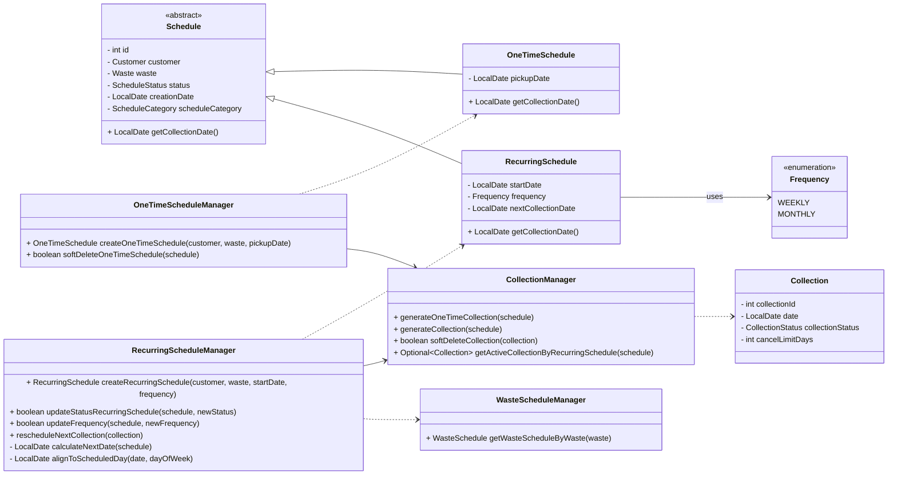
### Diagramma di Stato — Schedule/RecurringSchedule
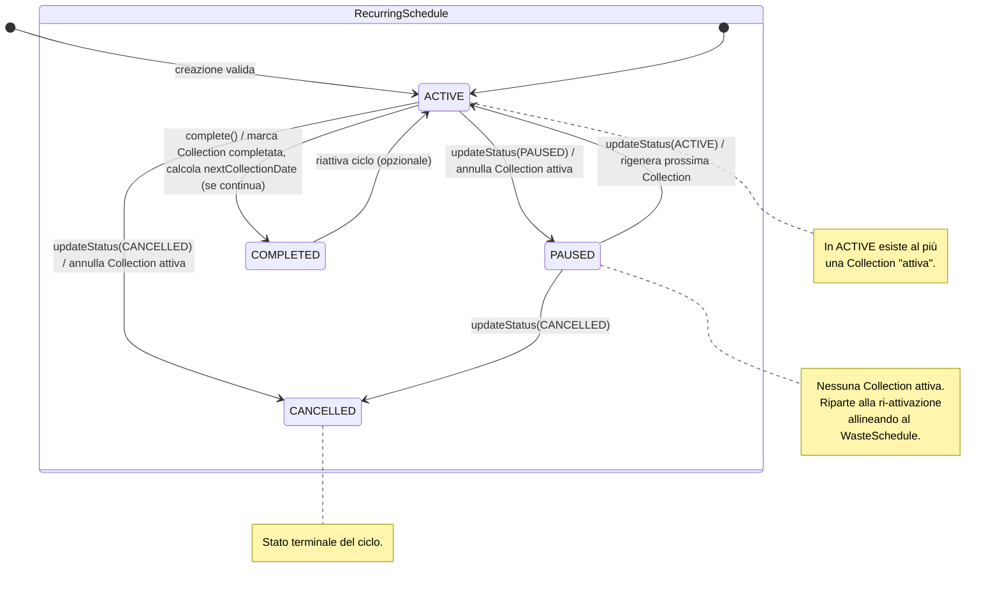
### Diagramma di Interazione — Creazione Recurring + Generazione Collection
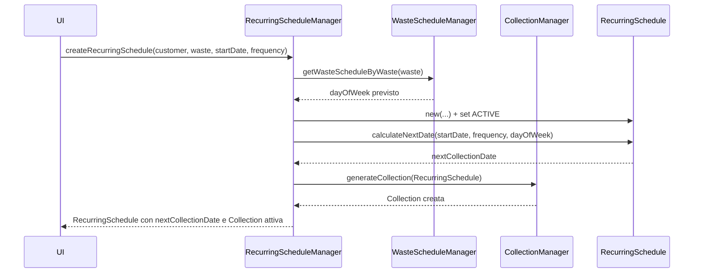
### Diagramma di Interazione — Cambio Stato Recurring (Pause/Resume/Cancel)
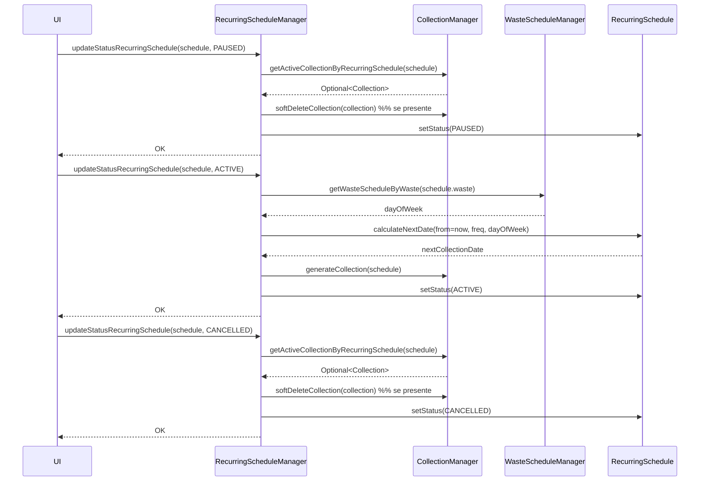

### Motivazioni e alternative scartate
- Calcolo/creazione Collection direttamente in Controller: scartata per duplicazione logica e rischio inconsistenze.
- Calcolo ricorrenze lato UI: scartata; la logica rimane nel dominio per estendibilità e testabilità.
- Allineamento al calendario del rifiuto demandato al DB: scartata; si perderebbe chiarezza del dominio.

### Design Dettagliato — Trip (Manuel Ragazzini)

### Problema affrontato

La gestione del ciclo di vita dei **viaggi di raccolta rifiuti (Trip)** richiede la coordinazione di diverse responsabilità:

- pianificazione per **CAP**,
- **assegnazione** del veicolo e degli operatori qualificati e disponibili,
- **associazione** delle Collection da eseguire,
- **cancellazione** con eventuale **notifica ai clienti**,
- **completamento** del viaggio con aggiornamento coerente delle Collection,
- eventuale **ripianificazione** per gli schedule ricorrenti.

I vincoli principali da rispettare sono:

- evitare conflitti di risorse (veicoli/operatori già impegnati);
- verificare la compatibilità tra **licenza del driver** e **veicolo assegnato**;
- mantenere **consistenza tra Trip e Collection**;
- gestire annullamenti e completamenti seguendo uno **stato macchina definito**.

---

### Soluzione adottata

La logica applicativa è stata **centralizzata nel `TripManager`**, che funge da *coordinatore del dominio*.  
Le sue responsabilità includono:

- interrogare i **repository** per verificare disponibilità e qualifiche;
- creare o aggiornare i **Trip**;
- propagare automaticamente gli effetti su **Collection** (annullamenti, completamenti, ripianificazioni);
- collaborare con `RecurringScheduleManager` e `NotificationService` quando necessario.

La **UI** invoca esclusivamente **metodi di alto livello** (es. `createTrip`, `softDeleteTrip`, `setTripAsCompleted`) senza duplicare logica applicativa.

#### API di dominio

| Categoria          | Metodi principali                                                                                     |
|-------------------|-------------------------------------------------------------------------------------------------------|
| **Creazione**      | `createTrip(postalCode, vehicle, operators, departure, expectedReturn, collections)`                  |
| **Disponibilità**  | `getAvailableVehicles(start, end)` · `getQualifiedDrivers(start, end, allowedLicences)` · `getAvailableOperatorsExcludeDriver(start, end, driver)` |
| **Cancellazione**  | `softDeleteTrip(trip)` · `softDeleteAndRescheduleNextCollection(trip)` · `cancelTripAndNotify(trip[, subject, body])` |
| **Completamento**  | `setTripAsCompleted(trip)`                                                                            |
| **Aggiornamenti**  | `updateVehicle(tripId, newVehicle)` · `updateOperators(tripId, newOperators)`                        |

---

### Pattern impiegati

- **Facade / Coordinator (TripManager)**  
  Centralizza i casi d’uso e coordina le collaborazioni tra repository, gestione delle schedule ricorrenti e sistema di notifica.  
  Riduce l’accoppiamento tra UI e dominio.

- **Repository**  
  Astrazione per query di disponibilità, ricerca di veicoli/operatori/driver e recupero dei Trip.  
  Favorisce testabilità e sostituibilità della persistenza.

- **State (TripStatus)**  
  Definisce le transizioni da `ACTIVE` a `CANCELLED` o `COMPLETED`, applicando automaticamente gli effetti sulle Collection collegate.

- **Observer-like (NotificationService)**  
  La notifica non è parte del dominio centrale: viene delegata a un’interfaccia esterna, facilmente sostituibile (es. mock vs implementazione reale).

- **Guard Clauses & Validation**  
  Verifiche *fail-fast* tramite `ValidateUtils` e controlli sugli argomenti, impedendo che vengano applicate modifiche con input incoerenti.

---

### Schema UML della soluzione
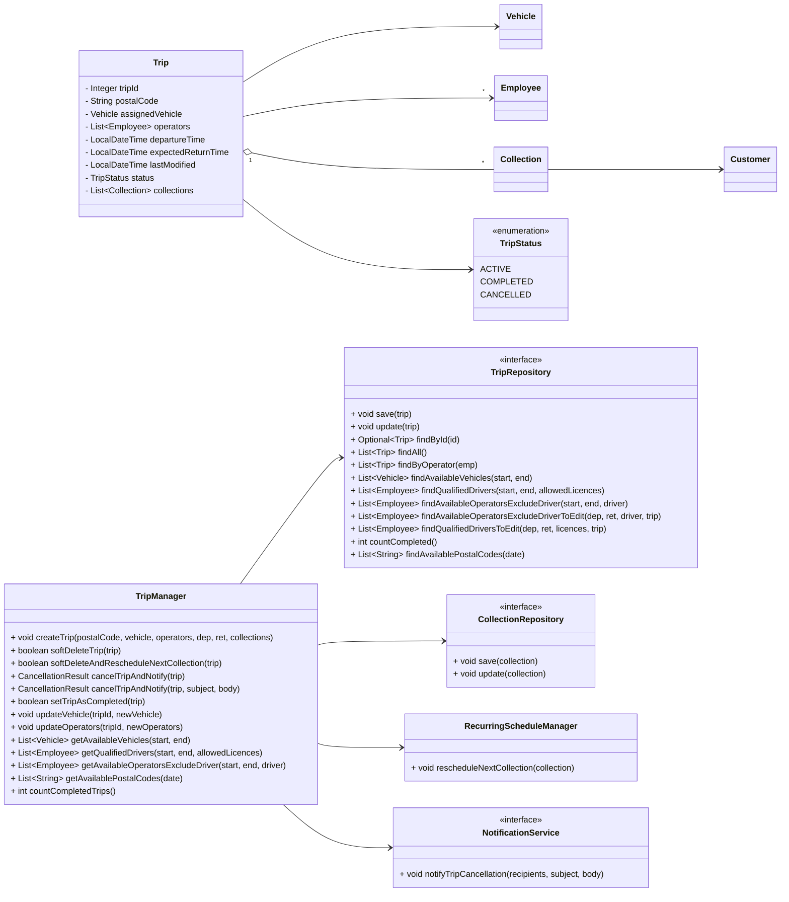
### Diagramma di Stato — TripStatus
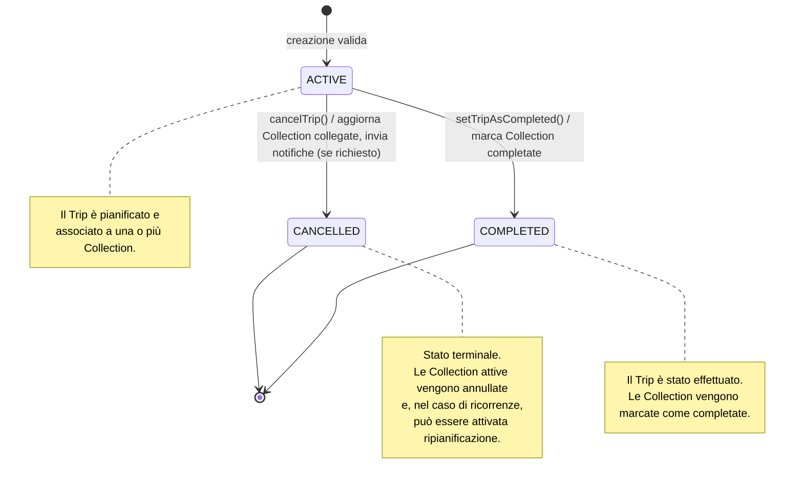
### Diagramma di Interazione — Cancellazione Trip con Notifica
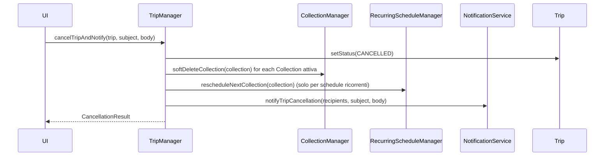
### Motivazioni e alternative scartate

- **Separazione dei ruoli**: la UI non gestisce regole applicative, ma invoca operazioni ad alto livello.
- **Coerenza dei dati**: ogni cancellazione o completamento aggiorna le Collection correlate e, se necessario, innesca la ripianificazione per schedule ricorrenti.
- **Evolvibilità**: nuove strategie di disponibilità o nuovi canali di notifica possono essere aggiunti senza impattare gli strati superiori.
- **Testabilità**: i casi d’uso sono isolabili tramite mock dei repository e dei servizi esterni.
- **Robustezza**: le guard clauses impediscono percorsi inconsistenzi (es. completare un trip senza Collection attive).

---

| Alternativa                     | Esito   | Motivazione dello scarto |
|--------------------------------|---------|---------------------------|
| Logica distribuita nei controller | Scartata | Rischio di duplicazioni e perdita di consistenza |
| Eventi di dominio asincroni per le notifiche | Rimandata | Utile in scenari più complessi; la chiamata sincrona è sufficiente e più semplice |
| Transazioni distribuite a livello di manager | Posticipata | L’attuale livello di persistenza è sufficiente; possibile evoluzione futura |

---
