# Analisi

Il dominio riguarda la gestione operativa e amministrativa di un’azienda di smaltimento rifiuti. L’applicazione dovrà
supportare le principali attività dell’azienda, tra cui la pianificazione dei ritiri dei rifiuti, l’organizzazione delle
risorse operative (personale e mezzi), il monitoraggio dello stato dei ritiri e la rendicontazione economica.

Gli attori principali sono i clienti dell’azienda, che richiedono il servizio di raccolta dei rifiuti, e il personale
amministrativo e operativo, che gestisce la pianificazione, la raccolta e il monitoraggio delle attività.

Le attività chiave comprendono:

- Pianificazione dei ritiri, occasionali o ricorrenti, con possibilità di modificare, sospendere o cancellare un ritiro
  prima della sua esecuzione.
- Organizzazione dei viaggi operativi, che raggruppano più ritiri in una stessa area e assegnano le risorse necessarie.
- Gestione della raccolta dei rifiuti, con registrazione delle attività completate e segnalazione di eventuali problemi
  o criticità.
- Fatturazione ai clienti, basata sui ritiri completati, e monitoraggio dei pagamenti.

Il sistema dovrà inoltre garantire la coerenza operativa, evitando assegnazioni errate di risorse o conflitti tra ritiri
e viaggi, e comunicare in modo chiaro eventuali errori o aggiornamenti agli utenti interessati.

---

# Requisiti

- **Gestione clienti e personale**: il sistema deve permettere di registrare e aggiornare informazioni su clienti e
  personale, includendo la gestione dei ruoli.
- **Gestione mezzi operativi**: il sistema deve consentire di gestire i mezzi disponibili, controllando la
  disponibilità, la manutenzione e l’adeguatezza dei mezzi rispetto alle attività pianificate.
- **Gestione dei rifiuti e pianificazione settimanale**: il sistema deve supportare la definizione dei tipi di rifiuti
  da raccogliere e la pianificazione dei ritiri in base a giorni della settimana o periodi specifici.
- **Pianificazione dei ritiri**: il sistema deve consentire di creare, modificare, sospendere o cancellare i ritiri, sia
  occasionali che ricorrenti, e monitorarne lo stato fino al completamento.
- **Esecuzione delle raccolte**: il sistema deve registrare le raccolte effettuate e segnalare eventuali problemi.
- **Organizzazione dei viaggi operativi**: il sistema deve consentire di raggruppare più ritiri in un viaggio per area e assegnare personale e mezzi.
- **Monitoraggio e notifiche**: il sistema deve aggiornare lo stato delle attività e notificare agli utenti eventuali criticità o aggiornamenti.
- **Fatturazione e pagamenti**: il sistema deve generare fatture per i clienti basate sui ritiri completati e registrare
  lo stato di ciascuna fattura come pagata o non pagata.
- **Regole di coerenza operativa**: il sistema deve garantire che le risorse assegnate siano adeguate alle attività previste.

## Requisiti non funzionali

- Il sistema deve garantire affidabilità, chiarezza delle informazioni e coerenza nello stato delle attività visualizzate agli utenti.
- Il sistema deve gestire diversi livelli di accesso in base alla tipologia di dipendente (Administrator, Office Worker e Operator), limitando determinate funzionalità dell’interfaccia in base al ruolo assegnato.

## Nota finale

- L’analisi dei requisiti definisce ciò che l’applicazione deve fare, senza entrare nel design interno o nelle tecnologie utilizzate.
---

# Analisi e modello del dominio

Il dominio riguarda la gestione operativa e amministrativa di un’azienda di smaltimento rifiuti. L’applicazione supporta
le principali attività aziendali, consentendo la pianificazione dei ritiri, l’organizzazione delle risorse operative(
personale e mezzi), il monitoraggio dello stato delle attività e la gestione della fatturazione verso i clienti.
Gli attori principali sono i clienti, che richiedono il servizio di raccolta dei rifiuti, e il personale amministrativo
e operativo, responsabile della pianificazione, della raccolta e del monitoraggio delle attività.

## Difficoltà principali del dominio:

- il coordinamento tra personale e veicoli in caso di ritiri multipli contemporanei;
- la gestione di modifiche last-minute o ritardi nelle raccolte;
- la corretta associazione tra programmi di raccolta e tipo di rifiuto previsto;
- la gestione di clienti con più programmi di raccolta diversi.

---

## Diagramma 1 – Persone e Clienti

### Descrizione

Rappresenta le entità legate alle persone e ai clienti, mostrando l’ereditarietà tra tipi di persone e le relazioni con le loro ubicazioni e attività economiche.

### Entità principali

- **Person**: entità base per tutte le persone.
- **Customer**: cliente che eredita da `Person`.
- **Employee**: dipendente che eredita da `Person`.
- **Account**: credenziali di accesso associate a un dipendente del sistema.
- **Location**: indirizzo di residenza dei clienti.
- **Invoice**: fattura emessa per un cliente in seguito ai servizi di raccolta erogati.
- **Collection**: operazione di raccolta associata a una fattura.

### Relazioni chiave

- `Customer` eredita da `Person`.
- `Employee` eredita da `Person`.
- Ogni `Employee` ha un singolo `Account` (1:1).
- Ogni `Customer` risiede in una singola `Location` (1:1).
- Ogni `Customer` può ricevere una o più `Invoice` (1:N).
- Ogni `Invoice` include una o più `Collection` (1:N).

### UML

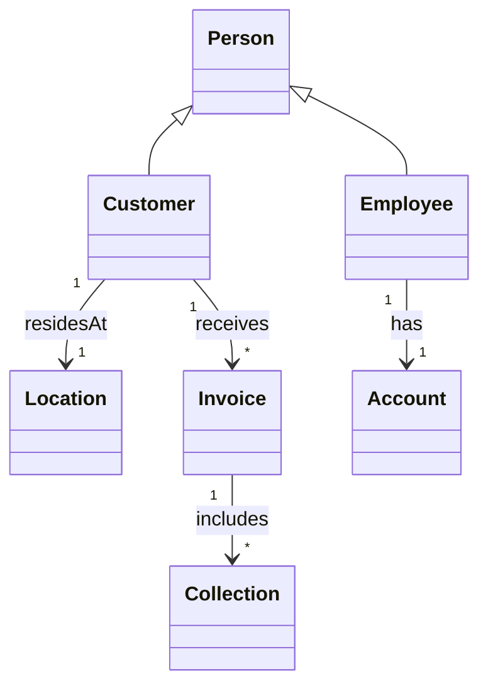

## Diagramma 2 – Programmazione della raccolta

### Descrizione

Rappresenta le entità legate alla pianificazione e gestione della raccolta dei rifiuti. Mostra come i programmi di raccolta si collegano ai clienti e alle singole operazioni di raccolta.

### Entità principali

- **Schedule**: piano di raccolta generico.
- **OneTimeSchedule**: pianificazione di raccolta singola, eredita da `Schedule`.
- **RecurringSchedule**: pianificazione ricorrente, eredita da `Schedule`.
- **WasteSchedule**: programma specifico per un tipo di rifiuto in un giorno della settimana.
- **Waste**: tipologia di rifiuto raccolto.
- **Collection**: rappresenta un’operazione di raccolta specifica.
- **Customer**: cliente associato a uno specifico programma di raccolta.

### Relazioni chiave

- `OneTimeSchedule` e `RecurringSchedule` ereditano da `Schedule`.
- Ogni `Schedule` appartiene a un singolo `Customer`.
- Ogni `WasteSchedule` è associato a un singolo `Waste`.
- Ogni `Collection` appartiene a un singolo `Schedule`.
- Ogni `Collection` raccoglie il `Waste` previsto dal `WasteSchedule`.

### UML

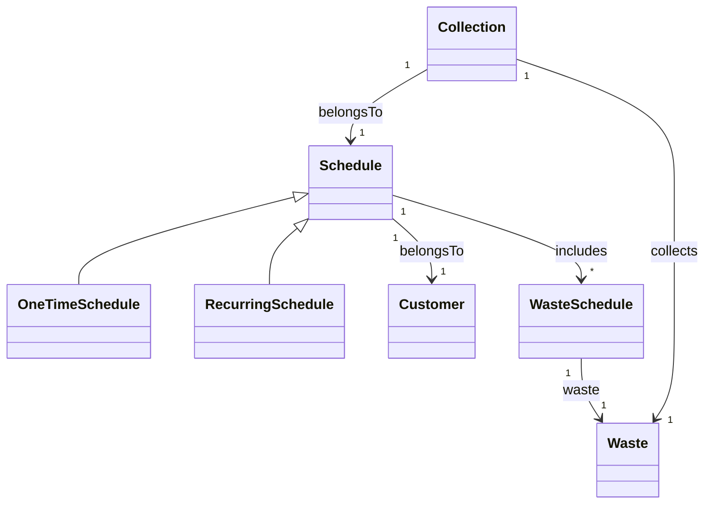

## Diagramma 3 – Logistica e Trasporto

### Descrizione

Rappresenta le entità legate alla gestione operativa della raccolta, inclusi viaggi, mezzi e operatori, mostrando come le attività di raccolta vengono organizzate sul campo.

### Entità principali

- **Trip**: viaggio operativo per effettuare le raccolte.
- **Vehicle**: veicolo utilizzato per eseguire uno o più viaggi.
- **Employee**: operatore assegnato a uno o più viaggi.
- **Collection**: raccolta specifica eseguita durante un viaggio.

### Relazioni chiave

- Ogni `Trip` utilizza un singolo `Vehicle`.
- Ogni `Trip` coinvolge uno o più `Employee` come operatori.
- Ogni `Trip` comprende una o più `Collection`.
- Ogni `Vehicle` può essere utilizzato in zero o più `Trip`.

### UML

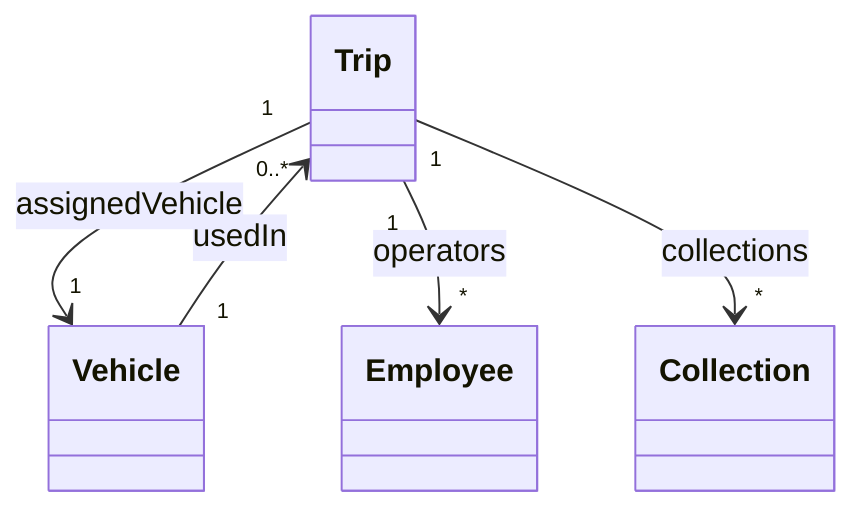

## Sintesi del modello del dominio

I tre diagrammi descrivono il dominio in maniera coerente e integrata:

- **Diagramma 1**: utenti ed entità economiche (`Customer`, `Employee`, `Invoice`), collegando le raccolte agli utenti.
- **Diagramma 2**: pianificazione dei ritiri, mostrando la relazione tra `Customer`, `Schedule`, `Waste` e `WasteSchedule`.
- **Diagramma 3**: gestione operativa con `Trip`, `Vehicle` e `Employee`, collegati alle `Collection`.

I programmi di raccolta (Diagramma 2) generano le Collection attive, che vengono poi aggregate in Trip (Diagramma 3) in base a criteri operativi come area e disponibilità delle risorse, garantendo che ogni raccolta pianificata sia effettivamente eseguita.

Le criticità principali del dominio riguardano la gestione delle risorse in scenari complessi e la corretta associazione tra programmi di raccolta e tipologia di rifiuti, senza però suggerire soluzioni implementative.

# Design

L’architettura di *WasteMaster* segue un approccio **Clean Architecture / 3-layer**, che separa chiaramente **UI**, **logica applicativa** e **dominio**.

I **Controller UI** (Boundary) gestiscono esclusivamente input e output della View e delegano ogni logica ai manager.  
I **Manager applicativi** (Control) centralizzano i casi d’uso e orchestrano le entità e i repository.  
Le **Entità di dominio** (Entity) rappresentano lo stato persistente e sono manipolate solo dai manager.  
I **Repository** definiscono le interfacce per l’accesso ai dati, separate dall’implementazione concreta.

Il flusso di interazione ad alto livello è:

View → Controller UI → Manager → Repository / Entity → Controller UI → View


Questa struttura rende l’applicazione **estendibile e manutenibile**, senza che modifiche alla UI richiedano interventi sul dominio o sui manager.

---

## Architettura

### Componenti e ruoli

- **Controller UI (Boundary)**
    - Gestiscono input dell’utente e navigazione tra le viste.
    - Delegano operazioni ai manager.
    - Raccolgono risultati e aggiornano la UI.

- **Manager applicativi (Control)**
    - Incapsulano i casi d’uso principali.
    - Applicano regole e validazioni.
    - Coordinano più entità e repository.

- **Entità di dominio (Entity)**
    - Rappresentano lo stato del sistema.
    - Espongono comportamenti minimi.
    - Manipolate solo dai manager.

- **Repository (Repository Pattern)**
  - Agiscono come ponte tra dominio e persistenza.
  - Sono interfacce definite nel layer applicativo/dominio, mentre le implementazioni concrete risiedono nel layer di infrastruttura.
  - Permettono ai manager di leggere e scrivere dati senza conoscere tecnologia o formato di memorizzazione.

### Tecnologia di persistenza

L’implementazione concreta dei repository utilizza un **database relazionale MySQL** come sistema di persistenza,
gestendo operazioni di lettura e scrittura dei dati attraverso query SQL.

### Interazioni principali

1. **Vista → Controller:** l’utente compie un’azione (creazione/aggiornamento/cancellazione).
2. **Controller → Manager:** il controller invoca il manager corrispondente.
3. **Manager → Repository / Entità:** il manager applica le regole, coordina le entità e passa ai repository le operazioni di persistenza.
4. **Manager → Controller → Vista:** i risultati tornano al controller che aggiorna la View.

### Schema UML architetturale

> Sono mostrati solo i ruoli principali e le relazioni, senza dettagli di campi o metodi.

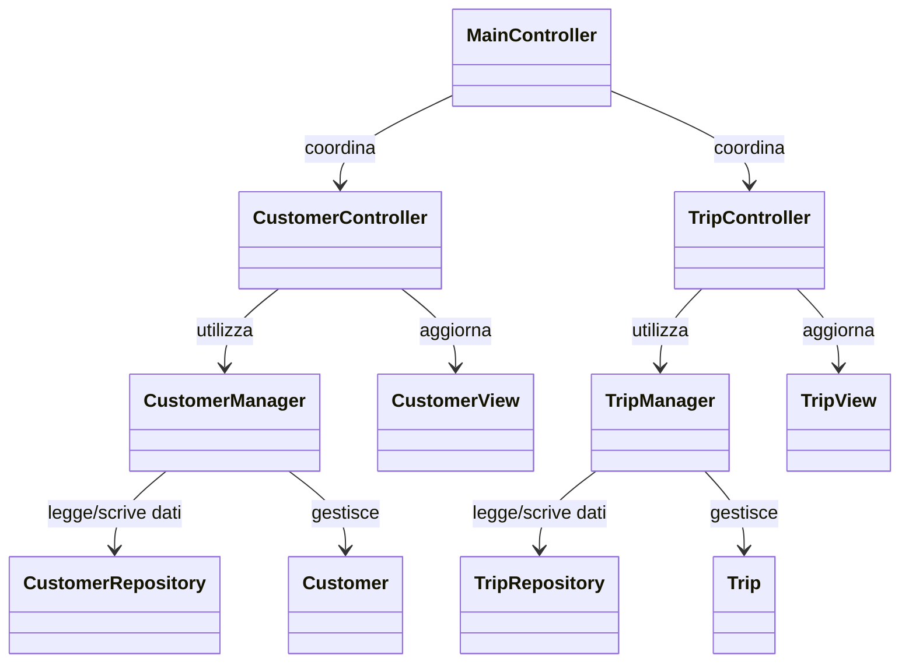
---
# Design Dettagliato — Gestione Veicoli (Ferrari Lorenzo)

## 1. Gestione dello Stato Operativo del Veicolo

### Problema

Ogni veicolo può trovarsi in diversi stati operativi (`IN_SERVICE`, `IN_MAINTENANCE`, `OUT_OF_SERVICE`) e tali stati devono poter cambiare in base alle azioni degli operatori.

Una gestione manuale basata su `if/else` dispersi tra UI, Controller o altri Manager (es. `TripManager`) avrebbe comportato:

- Duplicazione della logica in più componenti.
- Incoerenze nei flussi (es. un componente consente un cambio stato che un altro blocca).
- Difficoltà nell’aggiungere nuovi stati in futuro, richiedendo modifiche globali.

### Alternative valutate

Una possibile soluzione iniziale era gestire tutte le transizioni direttamente nei Controller o nella UI, verificando lo stato con condizioni procedurali (`if(vehicle.status == ...) ...`).

Soluzione scartata perché:

- Poco estensibile e difficile da mantenere.
- Ogni modifica alle regole avrebbe imposto aggiornamenti manuali su più componenti.
- Violazione del Single Responsibility Principle, con la UI che si occupa di logica di dominio.

### Soluzione

È stata centralizzata la gestione dello stato attraverso:

- L’entità `Vehicle`, che mantiene lo stato corrente e fornisce `updateStatus(...)` per eseguire cambiamenti atomici.
- Il `VehicleManager`, che funge da domain service e applica le regole di transizione consentite, tramite metodi come `handleMaintenanceButton(...)` o `handleServiceButton(...)`.

In questo modo tutte le transizioni avvengono in un unico punto, evitando comportamenti divergenti nei vari componenti dell'applicazione.

### Pattern di progettazione applicato

È stato applicato un **pattern State semplificato**:

- `VehicleStatus` → rappresenta gli **stati concreti**.
- `Vehicle` → contiene lo **stato attuale e il cambio atomico** (`updateStatus`).
- `VehicleManager` → funge da **contesto**, definendo le **transizioni ammesse**.

### Vantaggi della soluzione

- Coerenza delle regole tra tutti i componenti.
- Riduzione della duplicazione di logica.
- Facilità nell’aggiungere nuovi stati o regole.
- Rispetto del SRP e principio Open/Closed (nuovi stati senza modificare codice esistente).

### Schema UML

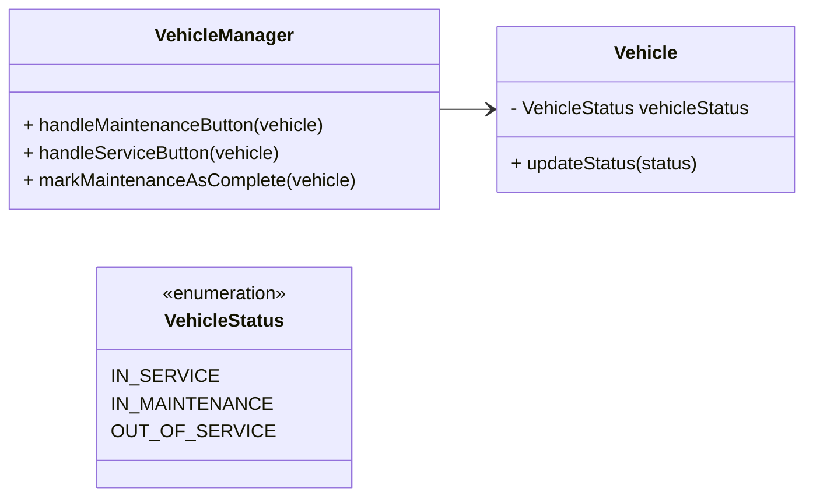
#### Diagramma di Stato - Transizioni del VehicleStatus
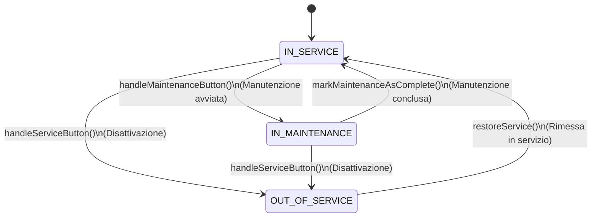
## 2. Gestione Automatica delle Date di Manutenzione

### Problema

Ogni veicolo deve mantenere coerenti due date:

- `lastMaintenanceDate`
- `nextMaintenanceDate`

Se tali date venissero aggiornate manualmente in più punti dell’applicazione, si rischierebbe:

- Dimenticanze di aggiornamento
- Inconsistenze tra i dati
- Regole duplicate in UI o Controller

### Alternative valutate

Una possibile alternativa era lasciare che ogni componente aggiornasse manualmente le date, ad esempio quando viene chiusa una manutenzione o avviato un intervento.

Soluzione scartata perché soggetta a errori umani e difficile da verificare.

### Soluzione

La gestione è stata accentrata nel `VehicleManager`, in particolare nel metodo `markMaintenanceAsComplete(vehicle)` che:

- Imposta `lastMaintenanceDate` alla data corrente.
- Calcola `nextMaintenanceDate` secondo una politica predefinita (es. +6 mesi).

### Pattern e principi applicati

- Nessun pattern strutturato, ma forte applicazione del principio di **centralizzazione della business logic**.
- Il `VehicleManager` funge da servizio di dominio responsabile delle politiche sulle date.

### Vantaggi

- Coerenza garantita.
- Nessun altro componente può modificare direttamente le date.
- Facilità di estendere la politica di manutenzione in futuro.

### Schema UML

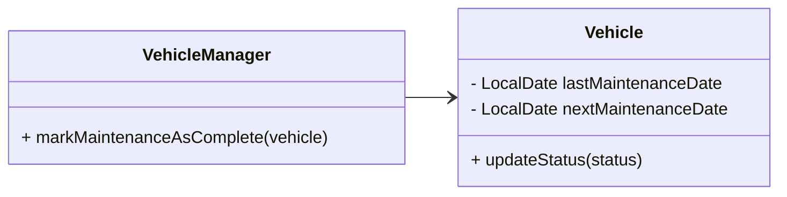
## 3. Compatibilità tra Veicoli e Autisti in base alla Patente

### Problema

Un veicolo può essere assegnato solo ad autisti con patente compatibile (`RequiredLicence`).  
Se la verifica viene effettuata in più punti (UI, `TripManager`, Controller), si rischiano:

- Eccezioni e incoerenze
- Possibilità di assegnare veicoli non idonei

### Alternative valutate

Una gestione distribuita con verifiche condizionali ovunque (`if(driver.licence >= vehicle.licence) ...`).

Soluzione scartata per rischio di duplicazione e buchi di controllo.

### Soluzione

È stato introdotto il metodo:

```java
VehicleManager.getAllowedLicences(vehicle);
```
Confronta la `RequiredLicence` del veicolo con le licenze degli autisti disponibili e restituisce solo quelli idonei.

### Pattern / Principi applicati

- Nessun pattern formale, ma approccio di **policy centralizzata**: la regola è definita in un solo punto e riusata ovunque.

### Vantaggi

- Nessuna duplicazione di logica.
- Facile estendere nuove licenze o eccezioni.
- Maggiore affidabilità operativa.

### Schema UML
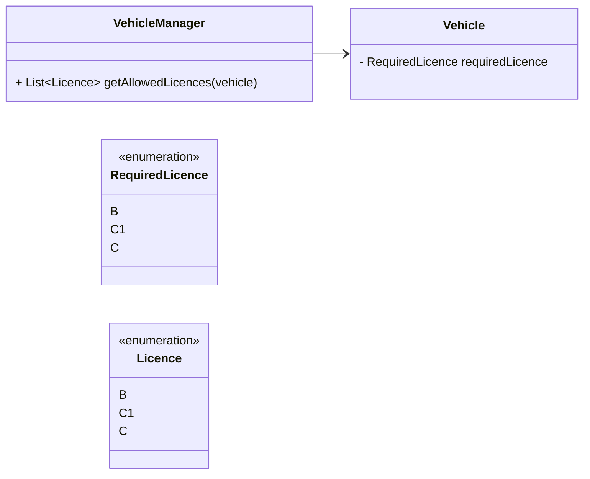
---

# Design Dettagliato — Pianificazione delle Raccolte (Alex Cambrini)

- **OneTimeSchedule**: una singola data richiesta dal cliente
- **RecurringSchedule**: un ciclo (settimanale/mensile) allineato al giorno previsto dal calendario di quel rifiuto (*WasteSchedule*).

---

## 1. Calcolo della prossima data di raccolta

### Problema
La logica di calcolo della prossima data di raccolta varia in base alla frequenza dello schedule (settimanale o mensile).  
Una singola implementazione nel manager avrebbe richiesto continue modifiche e condizionali, rendendo difficile aggiungere nuovi tipi di frequenza e aumentando il rischio di errori: duplicazioni, raccolte mancanti o date incoerenti.

**Esempio concreto:** Se oggi è lunedì e la raccolta settimanale è prevista per mercoledì, il sistema deve restituire la data del prossimo mercoledì; se la frequenza è mensile, deve restituire il giorno corrispondente del mese successivo.

### Alternative valutate
Un approccio alternativo avrebbe potuto essere implementare tutta la logica di calcolo della prossima data direttamente nel `RecurringScheduleManager` usando strutture condizionali (`if/else`) basate sulla frequenza dello schedule.  
**Svantaggi di questa soluzione:**
- Poco estensibile: aggiungere nuove frequenze richiederebbe modifiche continue al manager.
- Maggiore rischio di errori: duplicazioni, date incoerenti o raccolte mancanti.
- Violazione dei principi SOLID, in particolare Open/Closed e Single Responsibility.
- Testabilità ridotta, poiché tutta la logica è concentrata in un unico componente.

### Soluzione
È stato applicato il **pattern Strategy**, separando la logica di calcolo in strategie indipendenti e intercambiabili.  
Il manager (`RecurringScheduleManager`) agisce come **contesto**, delegando il calcolo alla strategia appropriata tramite l’interfaccia comune `NextCollectionCalculator`.

**Metodi principali della soluzione:**

- `calculateNextDate(schedule: RecurringSchedule): LocalDate`
- `alignToScheduledDay(date: LocalDate, dayOfWeek: DayOfWeek): LocalDate`

**Vantaggi della soluzione:**

- Aggiungere nuove frequenze richiede solo nuove strategie, senza modifiche al manager.
- Migliore leggibilità e testabilità.
- Rispetto dei principi SOLID (Open/Closed, Single Responsibility).
- Chiara separazione fra business logic e policy di calcolo.

### Pattern di progettazione
- **Strategy:**
    - `NextCollectionCalculator` rappresenta l’interfaccia della strategia.
    - `WeeklyCalculator` e `MonthlyCalculator` sono implementazioni concrete della strategia.
    - `RecurringScheduleManager` funge da contesto, delegando il calcolo alla strategia selezionata in base alla frequenza dello schedule.

**Dinamica di selezione della strategia:**  
Il `RecurringScheduleManager` determina quale strategia utilizzare al momento della richiesta del calcolo della prossima data. La scelta avviene tipicamente tramite un semplice mapping tra la frequenza dello schedule e l’implementazione concreta corrispondente. In questo modo, il manager **non contiene logica condizionale complessa**, ma delega dinamicamente la responsabilità di calcolo alla strategia appropriata.

### Schema UML


## 2. Generazione automatica e coordinamento delle Collection

### Problema
Ogni schedule deve generare una **Collection** coerente senza duplicazioni o errori di data.  
Più manager (**RecurringScheduleManager**, **CollectionManager**, **WasteScheduleManager**) devono collaborare senza duplicare logica.  
Distribuire la logica tra i manager rischia incoerenze, difficoltà di manutenzione e ridotta testabilità.

**Esempio concreto:** Se più schedule ricorrenti hanno date che coincidono o si sovrappongono, il sistema deve generare le collection corrette senza creare duplicati o errori di persistenza.

### Vecchio approccio implementativo
Inizialmente era stata implementata una funzione `generateRecurringCollections()` eseguita come **task giornaliero automatico**, che calcolava tutte le date future delle collection ricorrenti.
- Garantiva coerenza anche se il software rimaneva spento per più giorni.
- Evitava date nel passato e duplicazioni.
- Richiedeva controlli aggiuntivi e generava un **costo prestazionale** maggiore.

Questo approccio automatizzava tutto, ma introdusse complessità, difficoltà di manutenzione e test più complicati.

### Nuovo approccio adottato
- La collection viene generata **solo al momento della creazione dello schedule**.
- Le collection vengono raggruppate in un **trip**, cioè un insieme di ritiri fisici nella stessa zona.
- Una volta completato un trip, l’operatore lo marca come completato.
- Solo le collection coinvolte vengono aggiornate in caso di modifiche o errori (ad esempio mezzo rotto o annullo).

**Motivazioni della scelta:**
- Riduzione della complessità e del carico di lavoro.
- Miglior testabilità: ogni schedule genera solo le collection coinvolte.
- Maggiore chiarezza operativa e manutenzione più semplice.
- Estensibilità futura: se in futuro servono nuovi tipi di collection, basta aggiungere nuove implementazioni della factory senza modificare i manager.

### Pattern di progettazione
È stato utilizzato il **Factory Pattern** per la creazione delle collection:
- `CollectionFactory` definisce l’interfaccia per creare collection one-time e ricorrenti.
- `CollectionFactoryImpl` implementa la logica concreta di costruzione.
- `CollectionManager` coordina la creazione e persistenza delle collection, **senza contenere logica di costruzione**, usando la factory come unico punto di creazione.

**Metodi principali della soluzione:**
- `generateOneTimeCollection(schedule: OneTimeSchedule)`
- `generateRecurringCollection(schedule: RecurringSchedule)`

**Vantaggi della soluzione:**
- Separazione chiara tra **coordinamento** e **creazione degli oggetti**.
- Aggiornamento mirato delle collection coinvolte, evitando ricalcoli globali.
- Prestazioni ottimizzate rispetto al vecchio task automatico.
- Chiarezza delle responsabilità e facilità di test.
- Applicazione di un pattern noto (Factory) per migliorare riuso ed estensibilità.

### Schema UML


## 3. Gestione degli stati dello Schedule

### Problema
Un `RecurringSchedule` può assumere diversi stati (`ACTIVE`, `PAUSED`, `CANCELLED`, `COMPLETED`).  
Ogni transizione può richiedere azioni collaterali, come cancellare una `Collection`, generarne una nuova o aggiornare la prossima data di raccolta.  
Se tali logiche fossero distribuite tra più componenti (UI, repository, manager vari), si rischierebbero **incoerenze** e **duplicazioni**.

**Esempio concreto:**  
Se uno schedule `PAUSED` viene riattivato (`ACTIVE`), il sistema deve ricalcolare la prossima data e generare la collection corretta senza duplicazioni.

### Soluzione
La gestione delle transizioni di stato è **centralizzata** nel metodo
```java
`RecurringScheduleManager.updateStatusRecurringSchedule(schedule: RecurringSchedule, newStatus: ScheduleStatus)`.
```

### Logica principale implementata
- Blocca modifiche su schedule già `CANCELLED` o `COMPLETED`.
- Gestisce solo le **transizioni valide**:
  - `PAUSED → CANCELLED`: aggiorna lo stato e salva.
  - `PAUSED → ACTIVE`: ricalcola la prossima data, aggiorna lo stato, genera nuova collection.
  - `ACTIVE → PAUSED` o `ACTIVE → CANCELLED`: aggiorna lo stato ed elimina la collection attiva.
- Aggiornamento repository e collection tramite `CollectionManager`.
- Le transizioni non valide restituiscono `false`, evitando stati inconsistenti o side effect indesiderati.

### Vantaggi della soluzione
- **Centralizzazione della logica**: facilità di manutenzione e test.
- **Chiarezza operativa**: un punto unico per le transizioni.
- **Rispetto del Single Responsibility Principle (SRP)**: la gestione degli stati è separata dalla UI e dalla persistenza.
- **Estensibilità**: nuove transizioni possono essere aggiunte modificando solo il manager, senza impattare altri componenti.

### Alternative valutate
Si è valutato l’uso del **State Pattern**, che rappresenta ogni stato come oggetto separato con comportamenti e transizioni proprie, delegando al contesto l’esecuzione delle operazioni.

**Motivo per cui non è stato adottato**:
- Il numero di stati è limitato e le azioni collaterali sono semplici.
- L’uso del pattern avrebbe aumentato la complessità senza benefici significativi in termini di estensibilità o chiarezza.
- La gestione centralizzata risulta più leggibile, testabile e sufficiente per il progetto.


### Pattern applicati
- Nessun pattern di progettazione noto è stato applicato in questa parte del progetto.

### Principi di design applicati
- Principio di singola responsabilità (SRP): il RecurringScheduleManager gestisce esclusivamente le transizioni di stato, separando la logica di business dalla UI e dalla persistenza.

### Schema UML
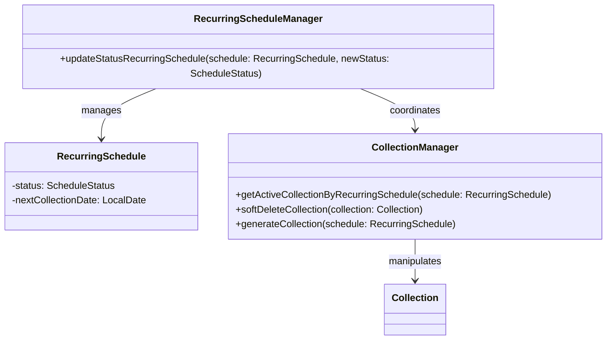

---

# Design Dettagliato — Gestione Trip & Invoice (Manuel Ragazzini)

- **Trip**: Viaggio di raccolta che aggrega una o più Collection, assegnato a veicolo e operatori.
- **Invoice**: Fattura generata sulle Collection completate, associata a un Customer, con gestione di pagamenti e cancellazioni.
- **Collection**: Singola raccolta schedulata, collegata sia a Trip che a Invoice.

---

## 1. Gestione delle transizioni di stato e propagazione tra entità

### Problema

Trip, Invoice e Collection hanno cicli di vita distinti ma intrecciati: certe transizioni (es. cancellazione, completamento, pagamento) devono propagarsi tra le entità correlate per mantenere la coerenza.

**Esempio concreto:**  
Quando viene chiamato il metodo `InvoiceManager.deleteInvoice(invoiceId)`, la fattura viene marcata come cancellata tramite `setDeleted(true)` e tutte le Collection collegate vengono “sbillate” (`setIsBilled(false)`).  
Allo stesso modo, `TripManager.deleteTrip(tripId)` mette tutte le Collection associate in stato `CANCELLED` aggiornando il loro attributo `CollectionStatus`.

### Alternative valutate

- Gestire transizioni e propagazioni direttamente nelle entità (`Trip`, `Invoice`) o nei Controller avrebbe portato a duplicazione di codice, rischio di inconsistenze e difficoltà di manutenzione.
- Demandare la propagazione all’UI o a più componenti avrebbe reso il sistema fragile e difficile da testare.

### Soluzione

La logica di dominio è **centralizzata nei manager**:
- `TripManager` e `InvoiceManager` orchestrano tutte le transizioni di stato e si occupano di propagare gli effetti su entità collegate.
- Le transizioni non ammesse sollevano eccezioni (es. `IllegalStateException`) o restituiscono risultati negativi.


#### Pattern e principi applicati

- **Transaction Script** centralizzato nei manager.
- **Single Responsibility Principle**: tutto il dominio e la propagazione sono in un unico punto.

#### Vantaggi

- Niente logica duplicata.
- Coerenza garantita.
- Facilità di test (mock dei DAO/servizi).
- Facilità di estensione: nuove regole si aggiungono solo nei manager.

#### Schema UML

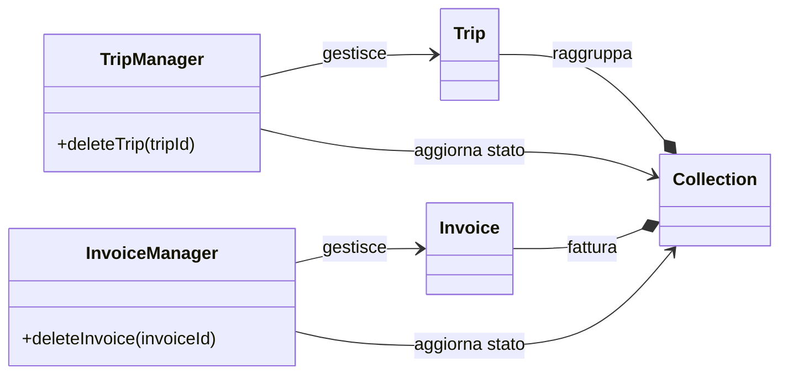

---

## 2. Calcolo aggregato di importi e pagamenti

### Problema

Per ogni Customer è necessario calcolare in modo affidabile:
- Il totale fatturato (somma delle Invoice emesse, escluse quelle cancellate).
- Il totale pagato (somma delle Invoice pagate).

**Esempio concreto:**  
I metodi `InvoiceManager.getTotalBilledAmountForCustomer(customer)` e `InvoiceManager.getTotalPaidAmountForCustomer(customer)` interrogano il DAO delle invoice (`InvoiceDAO`) e aggregano solo gli importi delle fatture in stato valido o pagato.  
Se una Invoice viene cancellata tramite `deleteInvoice()`, viene esclusa dai calcoli, grazie al controllo dell’attributo `deleted`.

### Alternative valutate

- Calcolare i totali ad ogni richiesta iterando su tutte le Collection e Invoice (semplice ma inefficiente e potenzialmente soggetto a errori se la logica è duplicata).
- Salvare valori aggregati come attributi persistenti (rischio di inconsistenza).

### Soluzione

I metodi di calcolo sono centralizzati in `InvoiceManager`:
- `getTotalBilledAmountForCustomer(customer)` calcola la somma delle Invoice valide interrogando il DAO.
- `getTotalPaidAmountForCustomer(customer)` somma solo le Invoice con `PaymentStatus.PAID`.
- I calcoli sono sempre eseguiti interrogando i DAO, senza dati duplicati o rischi di inconsistenza.

**Esempio di codice:**
```java
double totaleFatturato = getInvoiceManager().getTotalBilledAmountForCustomer(customer);
double totalePagato = getInvoiceManager().getTotalPaidAmountForCustomer(customer);
```

#### Pattern e principi applicati

- Nessun pattern strutturato, ma forte applicazione del principio di **policy centralizzata** e **separazione della business logic** nei manager.
- Tutti i calcoli e le query sono concentrati in un unico punto, evitando duplicazioni o errori di aggregazione.

#### Vantaggi

- Niente duplicazione.
- Coerenza garantita anche in caso di modifiche.
- Facilità di test (mock dei DAO).

#### Schema UML

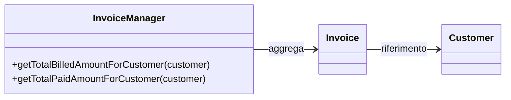
---

## 3. Validazione di compatibilità e regole di dominio

### Problema

Operazioni come assegnare operatori a un Trip o saldare una Invoice richiedono validazioni di dominio:
- Un Trip può essere assegnato solo a operatori con la patente richiesta dal veicolo.
- Una Invoice può essere pagata solo se è in stato `EMESSA`.


### Alternative valutate

- Verifiche distribuite in UI/Controller (rischio di errori e duplicazione logica).
- Controlli sparsi nelle entità (difficile da mantenere).

### Soluzione

La validazione è **centralizzata nei Manager**:
- Prima di ogni operazione critica il manager esegue tutti i controlli sulle entità coinvolte.
- Se una regola non è rispettata, il metodo solleva un’eccezione o restituisce errore.

**Esempio di codice:**
```java
// Verifica patente durante assegnazione operatore
if (!operator.getLicence().equals(vehicle.getRequiredLicence())) {
    throw new IllegalArgumentException("Patente non compatibile per il veicolo selezionato.");
}

// Pagamento Invoice solo se in stato corretto
if (invoice.getPaymentStatus() != PaymentStatus.UNPAID) {
    throw new IllegalStateException("Invoice non saldabile nello stato attuale.");
}
invoice.setPaymentStatus(PaymentStatus.PAID);
```

#### Pattern e principi applicati

- Nessun pattern strutturato, ma rigorosa **policy centralizzata**: tutte le regole e i controlli di validità sono implementati nei manager.
- Uso di **guard clause** per fermare subito le operazioni non valide.

#### Vantaggi

- Robustezza e riusabilità.
- Nessuna duplicazione di logica.
- Facilità di modifica delle regole.

#### Schema UML

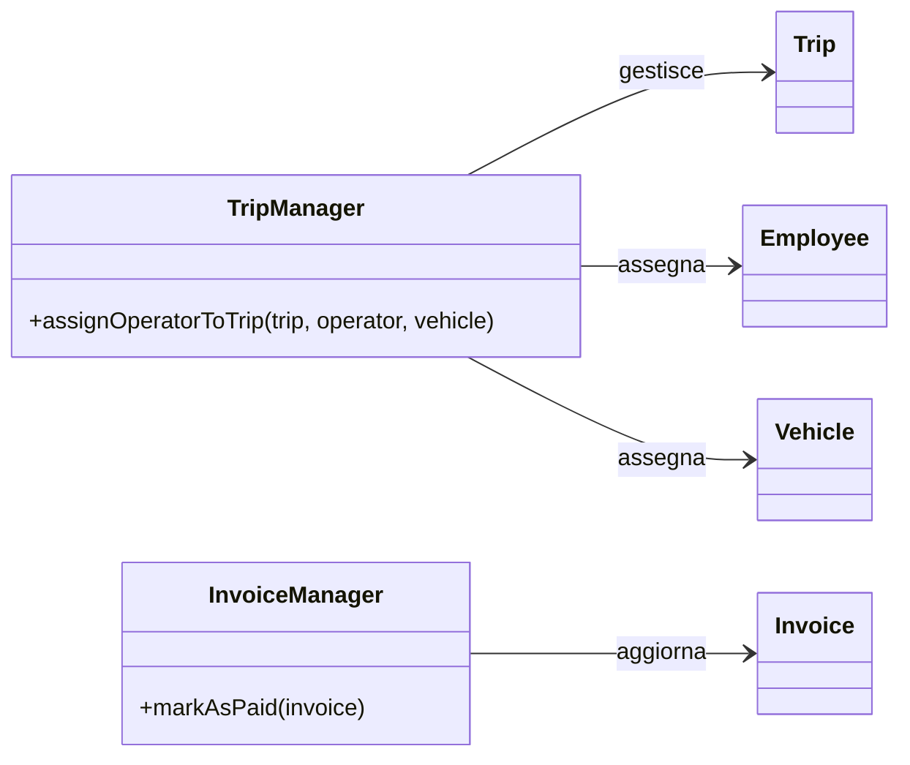
---

## Testing automatizzato

Per garantire l’affidabilità delle funzionalità principali, il progetto adotta una strategia di testing automatico basata su **JUnit 5**. I test sono organizzati per coprire le principali componenti del dominio.

### Componenti testate

- **Anagrafiche e risorse**: verifica di creazione, aggiornamento e validazione di clienti, personale, veicoli e rifiuti.
- **Pianificazione e raccolte**: test su pianificazioni, modifiche, cancellazioni e transizioni di stato di raccolte e viaggi.
- **Gestione mezzi e viaggi**: verifica delle regole di assegnazione veicoli/operatori, pianificazione viaggi e gestione delle disponibilità.
- **Fatturazione e pagamenti**: test automatici su generazione e aggiornamento delle fatture, integrazione con i pagamenti.

### Strumenti utilizzati

- **Framework di testing:**  
  - JUnit 5
- **Database di test**:
  - H2 (in-memory), configurato per essere creato e distrutto automaticamente a ogni esecuzione. Garantisce isolamento dei test e assenza di effetti collaterali sul database reale.
- **Livelli coperti:**
  - **DAO** – verifica di inserimento, ricerca e cancellazione dei dati.
  - **Model** – validazione e coerenza delle entità di dominio.
  - **Service (manager)** – test delle regole di business e delle interazioni tra componenti.
- **Classi di test rappresentative:**
  - DAO: `GenericDAOTest`, `CustomerDAOTest`
  - Model: `RecurringScheduleTest`, `InvoiceTest`
  - Service: `RecurringScheduleManagerTest`, `VehicleManagerTest`

- **Architettura di supporto:**  
    Tutti i test ereditano da `AbstractDatabaseTest`, che gestisce automaticamente il ciclo di vita del database (EntityManager, transazioni, inizializzazione di DAO, repository e manager).  
    L’intero processo è completamente automatico e non richiede intervento manuale.
    
### Esempi di test automatici

Verifica il corretto funzionamento di `GenericDAO` per la ricerca di entità di esempio (`Location` e `Customer`) tramite `findById`.

```java
@Test
public void testFindById() {
    getLocationDAO().insert(location1);
    getCustomerDAO().insert(customer1);

    Optional<Location> foundLocation = getLocationDAO().findById(location1.getId());
    assertTrue(foundLocation.isPresent());
    assertEquals(location1.getId(), foundLocation.get().getId());

    Optional<Customer> foundCustomer =
            getCustomerDAO().findById(customer1.getCustomerId());
    assertTrue(foundCustomer.isPresent());
    assertEquals(customer1.getCustomerId(), foundCustomer.get().getCustomerId());
}
```

Verifica che la validazione delle entità `RecurringSchedule` rilevi correttamente vincoli null per attributi obbligatori.

```java
@Test
void testRecurringScheduleValidation() {
    RecurringSchedule invalid = new RecurringSchedule();
    invalid.setFrequency(null);
    invalid.setCustomer(null);
    invalid.setWaste(null);
    invalid.setScheduleStatus(null);

    Set<ConstraintViolation<RecurringSchedule>> violations =
            ValidateUtils.VALIDATOR.validate(invalid);
    assertFalse(violations.isEmpty());

    assertTrue(violations.stream()
            .anyMatch(v -> v.getMessage().contains("Frequency cannot be null")));
    assertTrue(violations.stream()
            .anyMatch(v -> v.getMessage().contains("Customer cannot be null")));
    assertTrue(violations.stream()
            .anyMatch(v -> v.getMessage().contains("WasteType cannot be null")));
    assertTrue(violations.stream()
            .anyMatch(v -> v.getMessage().contains("Status cannot be null")));
}
```

Verifica che la creazione di un `RecurringSchedule` calcoli correttamente la prossima data di raccolta.

```java
@Test
void testCreateRecurringScheduleCalculatesNextCollectionDate() {
  RecurringSchedule schedule =
          getRecurringScheduleManager().createRecurringSchedule(customer, waste,
                  LocalDate.now(), Frequency.WEEKLY);
  assertNotNull(schedule.getNextCollectionDate());
  WasteSchedule ws = getWasteScheduleDAO().findSchedulebyWaste(waste);
  LocalDate expectedDate = LocalDate.now().plusDays(1);
  while (expectedDate.getDayOfWeek() != ws.getDayOfWeek()) {
    expectedDate = expectedDate.plusDays(1);
  }
  assertEquals(expectedDate, schedule.getNextCollectionDate());
}
```

## Note di sviluppo

---

### Lorenzo Ferrari

#### 1. Query JPA null-safe con Optional e stream

**Dove:** `src/main/java/it/unibo/wastemaster/infrastructure/dao/EmployeeDAO.java`

**Permalink:** https://github.com/Alex-Cambrini/pss24-25-WasteMaster-Cambrini-Ferrari-Ragazzini/blob/1502b350bfc2575f5485cfdaa0d44c75661a3405/src/main/java/it/unibo/wastemaster/infrastructure/dao/EmployeeDAO.java#L42-L49

**Snippet**
```java
public Optional<Employee> findByEmail(final String email) {
  return getEntityManager()
          .createQuery("SELECT e FROM Employee e WHERE e.email = :email",
                  Employee.class)
          .setParameter("email", email)
          .getResultStream()
          .findFirst();
}
```
**Descrizione:** anziché utilizzare getSingleResult(), che solleva una NoResultException quando la query non trova risultati, qui si ricorre a getResultStream().findFirst(). Questo approccio restituisce direttamente un Optional<Employee>, evitando la gestione esplicita delle eccezioni e rendendo il metodo più sicuro e lineare da utilizzare nel service layer.

---

#### 2. Policy di dominio con switch expression ed enum

**Dove:** `src/main/java/it/unibo/wastemaster/domain/service/EmployeeManager.java`

**Permalink:** https://github.com/Alex-Cambrini/pss24-25-WasteMaster-Cambrini-Ferrari-Ragazzini/blob/1502b350bfc2575f5485cfdaa0d44c75661a3405/src/main/java/it/unibo/wastemaster/domain/service/EmployeeManager.java#L144-L155
**Snippet**
```java
public boolean canDriveVehicle(final Employee employee, final Vehicle vehicle) {
  ValidateUtils.requireArgNotNull(employee, EMPLOYEE_NULL_MSG);
  ValidateUtils.requireArgNotNull(vehicle, "Vehicle cannot be null");

  return switch (employee.getLicence()) {
    case C -> true;
    case C1 -> vehicle.getRequiredLicence() == Vehicle.RequiredLicence.B
            || vehicle.getRequiredLicence() == Vehicle.RequiredLicence.C1;
    case B -> vehicle.getRequiredLicence() == Vehicle.RequiredLicence.B;
    default -> false;
  };
}
```
**Descrizione:** modellazione delle regole di abilitazione alla guida tramite enum e switch expression moderna, sostituendo catene di if con una logica compatta, leggibile e facilmente estendibile.

---

#### 3. Rollback applicativo con validazione centralizzata

**Dove:** `src/main/java/it/unibo/wastemaster/domain/service/EmployeeManager.java`

**Permalink:** https://github.com/Alex-Cambrini/pss24-25-WasteMaster-Cambrini-Ferrari-Ragazzini/blob/1502b350bfc2575f5485cfdaa0d44c75661a3405/src/main/java/it/unibo/wastemaster/domain/service/EmployeeManager.java#L53-L72

**Snippet**
```java
public Employee addEmployee(final Employee employee, final String rawPassword) {
  ValidateUtils.requireArgNotNull(employee, EMPLOYEE_NULL_MSG);
  ValidateUtils.requireArgNotNull(rawPassword, "Password cannot be null");
  ValidateUtils.validateEntity(employee);

  if (isEmailRegistered(employee.getEmail())) {
    throw new IllegalArgumentException("Email already registered");
  }

  employeeRepository.save(employee);

  try {
    accountManager.createAccount(employee, rawPassword);
  } catch (Exception e) {
    employeeRepository.delete(employee);
    throw new RuntimeException("Failed to create account, employee rolled back",
            e);
  }
  return employee;
}
```
**Descrizione:** la validazione viene eseguita all’inizio del metodo, così eventuali dati errati vengono bloccati prima di toccare il database. Dopo il salvataggio, se la creazione dell’account esterno fallisce, l’operazione viene annullata eliminando l’employee appena inserito. Questo agisce come un rollback applicativo esplicito, garantendo coerenza dei dati pur senza affidarsi a transazioni distribuite.

---

#### 4. Menu filtri dinamico per ricerca multi-campo (ContextMenu + CheckBox)

**Dove:** `src/main/java/it/unibo/wastemaster/controller/customer/CustomersController.java`

**Permalink:** https://github.com/Alex-Cambrini/pss24-25-WasteMaster-Cambrini-Ferrari-Ragazzini/blob/1502b350bfc2575f5485cfdaa0d44c75661a3405/src/main/java/it/unibo/wastemaster/controller/customer/CustomersController.java#L310-L342

**Snippet**
```java
@FXML
private void showFilterMenu(final javafx.scene.input.MouseEvent event) {
  if (filterMenu != null && filterMenu.isShowing()) {
    filterMenu.hide();
    return;
  }

  filterMenu = new ContextMenu();
  String[] fields = {FIELD_NAME, FIELD_SURNAME, FIELD_EMAIL, FILTER_LOCATION};
  String[] labels = {"Name", "Surname", "Email", "Location"};

  for (int i = 0; i < fields.length; i++) {
    String key = fields[i];
    String label = labels[i];

    CheckBox checkBox = new CheckBox(label);
    checkBox.setSelected(activeFilters.contains(key));
    checkBox.selectedProperty().addListener((obs, wasSelected, isSelected) -> {
      if (isSelected.booleanValue()) {
        activeFilters.add(key);
      } else {
        activeFilters.remove(key);
      }
      handleSearch();
    });

    CustomMenuItem item = new CustomMenuItem(checkBox);
    item.setHideOnClick(false);
    filterMenu.getItems().add(item);
  }

  filterMenu.show(filterButton, event.getScreenX(), event.getScreenY());
}
```
**Descrizione:** il menu dei filtri viene generato dinamicamente tramite ContextMenu e CustomMenuItem, senza doverlo definire staticamente nell’FXML. Ogni CheckBox è collegata alla lista activeFilters e, quando cambia stato, aggiorna i filtri attivi e richiama subito handleSearch(). In questo modo la ricerca multi-campo è reattiva e centralizzata nel controller, senza duplicare logica nel modello o nella view.

---

#### 5. DTO immutabile con formattazione locale per la UI

**Dove:** `src/main/java/it/unibo/wastemaster/presentationdto/CustomerRow.java`

**Permalink (costruttore con formattazione data):** https://github.com/Alex-Cambrini/pss24-25-WasteMaster-Cambrini-Ferrari-Ragazzini/blob/1502b350bfc2575f5485cfdaa0d44c75661a3405/src/main/java/it/unibo/wastemaster/presentationdto/CustomerRow.java#L27-L37

**Permalink (metodo per indirizzo completo):** https://github.com/Alex-Cambrini/pss24-25-WasteMaster-Cambrini-Ferrari-Ragazzini/blob/1502b350bfc2575f5485cfdaa0d44c75661a3405/src/main/java/it/unibo/wastemaster/presentationdto/CustomerRow.java#L107-L109

**Snippet**
```java
public final class CustomerRow {
  private final String name, surname, email, street, civic, city, postalCode;
  private final String creationDate;

  public CustomerRow(final Customer customer) {
    this.name = customer.getName();
    this.surname = customer.getSurname();
    this.email = customer.getEmail();
    this.street = customer.getLocation().getStreet();
    this.civic = customer.getLocation().getCivicNumber();
    this.city = customer.getLocation().getCity();
    this.postalCode = customer.getLocation().getPostalCode();
    this.creationDate = customer.getCreatedDate()
            .format(DateTimeFormatter.ofPattern("dd/MM/yyyy HH:mm"));
  }

  public String getFullLocation() {
    return street + " " + civic + ", " + city + " (" + postalCode + ")";
  }
}
```
**Descrizione:** classe DTO immutabile che estrae solo i dati realmente necessari alla UI, trasformandoli in formati già pronti alla visualizzazione (es. data formattata e indirizzo concatenato). In questo modo si alleggeriscono i controller e le celle della TableView, mantenendo il dominio pulito da dettagli di presentazione.

---

### Alex Cambrini

#### 1. Switch su enum per selezione dinamica della strategia

**Dove:** `src/main/java/it/unibo/wastemaster/domain/service/RecurringScheduleManager.java`
**Permalink:** https://github.com/Alex-Cambrini/pss24-25-WasteMaster-Cambrini-Ferrari-Ragazzini/blob/925f05189fa63debcb40e850869faae40e9f675a/src/main/java/it/unibo/wastemaster/domain/service/RecurringScheduleManager.java#L89-L92

**Snippet:**

```java

NextCollectionCalculator calculator = switch (schedule.getFrequency()) {
    case WEEKLY -> new WeeklyCalculator();
    case MONTHLY -> new MonthlyCalculator();
};

```

**Descrizione:**  
Uso avanzato di `switch` expressions con enum per selezionare dinamicamente la strategia di calcolo della prossima
raccolta. Riduce if-else annidati e rende il codice più leggibile e facilmente estendibile.

---

#### 2. Uso di Optional per gestione sicura di valori potenzialmente nulli

**Dove:** `src/main/java/it/unibo/wastemaster/domain/service/RecurringScheduleManager.java`
**Permalink:** https://github.com/Alex-Cambrini/pss24-25-WasteMaster-Cambrini-Ferrari-Ragazzini/blob/925f05189fa63debcb40e850869faae40e9f675a/src/main/java/it/unibo/wastemaster/domain/service/RecurringScheduleManager.java#L260-L264

**Snippet:**

```java
Optional<Collection> activeCollectionOpt =
        collectionManager.getActiveCollectionByRecurringSchedule(schedule);

if (activeCollectionOpt.isPresent()) {
        collectionManager.softDeleteCollection(activeCollectionOpt.get());
        }
   
```

**Descrizione:**  
Gestione sicura di oggetti che possono essere null, evitando NullPointerException, con utilizzo di `Optional`,
funzionalità avanzata del linguaggio Java.

---

#### 3. Algoritmo per allineamento della data al giorno programmato

**Dove:** `src/main/java/it/unibo/wastemaster/domain/service/RecurringScheduleManager.java`
**Permalink:** https://github.com/Alex-Cambrini/pss24-25-WasteMaster-Cambrini-Ferrari-Ragazzini/blob/925f05189fa63debcb40e850869faae40e9f675a/src/main/java/it/unibo/wastemaster/domain/service/RecurringScheduleManager.java#L105-L112

```java
public static LocalDate alignToScheduledDay(final LocalDate date,
                                            final DayOfWeek scheduledDay) {
    LocalDate adjustedDate = date;
    while (adjustedDate.getDayOfWeek() != scheduledDay) {
        adjustedDate = adjustedDate.plusDays(1);
    }
    return adjustedDate;
}

```

**Descrizione:**

Calcola e riallinea automaticamente una data al giorno della settimana programmato usando `java.time.LocalDate`. Metodo generico e riutilizzabile per la gestione coerente delle pianificazioni.

---

#### 4. Filtraggio dinamico e aggiornamento dello stato delle raccolte (CollectionController)

**Dove:** `src/main/java/it/unibo/wastemaster/controller/collection/CollectionController.java`  
**Permalink:** https://github.com/Alex-Cambrini/pss24-25-WasteMaster-Cambrini-Ferrari-Ragazzini/blob/925f05189fa63debcb40e850869faae40e9f675a/src/main/java/it/unibo/wastemaster/controller/collection/CollectionController.java#L256-L263

```java
private boolean isStatusVisible(final CollectionRow row) {
  return switch (row.getStatus()) {
    case COMPLETED -> showCompletedCheckBox.isSelected();
    case CANCELLED -> showCancelledCheckBox.isSelected();
    case ACTIVE -> showActiveCheckBox.isSelected();
    default -> false;
  };
}

```

**Descrizione:**
Uso avanzato di switch expression con `case ->` per valutare dinamicamente lo stato delle raccolte. Riduce if-else annidati e rende il codice più leggibile e compatto.

---

#### 5. Strategia di calcolo date mensili (MonthlyCalculator)

Strategia di calcolo date per raccolte mensili, integrata con l’allineamento al giorno della settimana.

**Dove:** `src/main/java/it/unibo/wastemaster/domain/strategy/MonthlyCalculator.java`  
**Permalink:** https://github.com/Alex-Cambrini/pss24-25-WasteMaster-Cambrini-Ferrari-Ragazzini/blob/925f05189fa63debcb40e850869faae40e9f675a/src/main/java/it/unibo/wastemaster/domain/strategy/MonthlyCalculator.java#L24-L35

```java

@Override
public LocalDate calculateNextDate(final RecurringSchedule schedule,
                                   final WasteSchedule wasteSchedule) {
  LocalDate date;
  if (schedule.getNextCollectionDate() == null) {
    date = schedule.getStartDate().plusDays(2);
  } else {
    date = schedule.getNextCollectionDate().plusMonths(1);
  }

  return alignToScheduledDay(date, wasteSchedule.getDayOfWeek());
}

```

**Descrizione:**
Calcola la prossima data mensile partendo dai dati del piano ricorrente, con riallineamento automatico al giorno corretto.
Rende la logica di scheduling modulare e facilmente estendibile.

> **Nota generale:** tutto il codice riportato nel presente documento è stato scritto dagli autori del progetto e non contiene snippet presi da altre fonti.


#### Note di sviluppo — Trip & Invoice (Manuel Ragazzini)

### 1. Cancellazione di una Invoice e aggiornamento delle Collection associate

**Dove:** src/test/java/it/unibo/wastemaster/domain/service/InvoiceManagerTest.java  
Permalink: https://github.com/Alex-Cambrini/pss24-25-WasteMaster-Cambrini-Ferrari-Ragazzini/blob/925f05189fa63debcb40e850869faae40e9f675a/src/test/java/it/unibo/wastemaster/domain/service/InvoiceManagerTest.java#L111-L127

```java
@Test
void testDeleteInvoiceSetsDeletedAndUnbillsCollections() {
    Collection c1 = insertCompletedCollection(LocalDate.now());
    Invoice invoice =
            getInvoiceManager().createInvoice(customer, new ArrayList<>(List.of(c1)));
    int invoiceId = invoice.getInvoiceId();

    boolean canceled = getInvoiceManager().deleteInvoice(invoiceId);
    assertTrue(canceled);

    Invoice canceledInvoice = getInvoiceDAO().findById(invoiceId).get();
    assertTrue(canceledInvoice.isDeleted());
    for (Collection c : canceledInvoice.getCollections()) {
        assertFalse(c.getIsBilled());
    }
}
```
**Descrizione:**  
Test che verifica che l’eliminazione di una Invoice imposti il flag di cancellazione e rimuova la fatturazione dalle Collection collegate.

---

### 2. Calcolo dell’importo totale fatturato per cliente

**Dove:** src/test/java/it/unibo/wastemaster/domain/service/InvoiceManagerTest.java  
Permalink: https://github.com/Alex-Cambrini/pss24-25-WasteMaster-Cambrini-Ferrari-Ragazzini/blob/925f05189fa63debcb40e850869faae40e9f675a/src/test/java/it/unibo/wastemaster/domain/service/InvoiceManagerTest.java#L71-L95

```java
@Test
void testGetTotalBilledAmountForCustomer() {
    Collection c1 = insertCompletedCollection(LocalDate.now());
    Collection c2 = insertCompletedCollection(LocalDate.now().plusDays(1));

    Invoice invoice1 =
            getInvoiceManager().createInvoice(customer, new ArrayList<>(List.of(c1)));
    invoice1.setAmount(50.0);
    invoice1.setPaymentStatus(PaymentStatus.UNPAID);
    getInvoiceDAO().update(invoice1);

    Invoice invoice2 =
            getInvoiceManager().createInvoice(customer, new ArrayList<>(List.of(c2)));
    invoice2.setAmount(100.0);
    invoice2.setPaymentStatus(PaymentStatus.PAID);
    getInvoiceDAO().update(invoice2);

    double total = getInvoiceManager().getTotalBilledAmountForCustomer(customer);
    assertEquals(150.0, total, 0.001);
}
```
**Descrizione:**  
Test che assicura il corretto calcolo della somma totale fatturata da un cliente, validando la logica di aggregazione sulle Invoice.

---

### 3. Settaggio e verifica dello stato pagato su una Invoice

**Dove:** src/test/java/it/unibo/wastemaster/domain/service/InvoiceManagerTest.java  
Permalink: https://github.com/Alex-Cambrini/pss24-25-WasteMaster-Cambrini-Ferrari-Ragazzini/blob/925f05189fa63debcb40e850869faae40e9f675a/src/test/java/it/unibo/wastemaster/domain/service/InvoiceManagerTest.java#L96-L110

```java
@Test
void testSetInvoicePaid() {
    Collection c1 = insertCompletedCollection(LocalDate.now());
    Invoice invoice = getInvoiceManager().createInvoice(customer, new ArrayList<>(List.of(c1)));
    invoice.setAmount(50.0);
    invoice.setPaymentStatus(PaymentStatus.UNPAID);
    getInvoiceDAO().update(invoice);

    invoice.setPaymentStatus(PaymentStatus.PAID);
    getInvoiceDAO().update(invoice);

    Invoice updated = getInvoiceDAO().findById(invoice.getInvoiceId()).get();
    assertEquals(PaymentStatus.PAID, updated.getPaymentStatus());
}
```
**Descrizione:**  
Test che verifica che la marcatura come “paid” di una Invoice aggiorni correttamente lo stato e sia persistita senza errori.

---

### 4. Setup avanzato per test su Trip e risorse associate

**Dove:** src/test/java/it/unibo/wastemaster/domain/service/TripManagerTest.java  
Permalink: https://github.com/Alex-Cambrini/pss24-25-WasteMaster-Cambrini-Ferrari-Ragazzini/blob/925f05189fa63debcb40e850869faae40e9f675a/src/test/java/it/unibo/wastemaster/domain/service/TripManagerTest.java#L29-L100

```java
@BeforeEach
public void setUp() {
    super.setUp();
    // Inserimento location, vehicle, employee/operator
    vehicle1 = new Vehicle("AB123CD", "Iveco", "Daily", 2020,
            Vehicle.RequiredLicence.C1, Vehicle.VehicleStatus.IN_SERVICE, 3);
    getVehicleDAO().insert(vehicle1);
    operator1 = new Employee("John", "Doe", locBo,
            "john.doe@example.com", "+391234567890",
            Employee.Role.OPERATOR, Employee.Licence.C1);
    getEmployeeDAO().insert(operator1);
    // ...
}
```
**Descrizione:**  
Setup che garantisce la presenza delle risorse necessarie per i test su Trip: veicoli, operatori, location, permettendo test robusti su tutto il ciclo di vita dei viaggi.

---

### 5. Calcolo dell’importo totale pagato per cliente

**Dove:** src/test/java/it/unibo/wastemaster/domain/service/InvoiceManagerTest.java  
Permalink: https://github.com/Alex-Cambrini/pss24-25-WasteMaster-Cambrini-Ferrari-Ragazzini/blob/925f05189fa63debcb40e850869faae40e9f675a/src/test/java/it/unibo/wastemaster/domain/service/InvoiceManagerTest.java##L81-L100

```java
@Test
void testGetTotalPaidAmountForCustomer() {
    Collection c1 = insertCompletedCollection(LocalDate.now());
    Collection c2 = insertCompletedCollection(LocalDate.now().plusDays(1));

    Invoice invoice1 =
            getInvoiceManager().createInvoice(customer, new ArrayList<>(List.of(c1)));
    invoice1.setAmount(50.0);
    invoice1.setPaymentStatus(PaymentStatus.UNPAID);
    getInvoiceDAO().update(invoice1);

    Invoice invoice2 =
            getInvoiceManager().createInvoice(customer, new ArrayList<>(List.of(c2)));
    invoice2.setAmount(100.0);
    invoice2.setPaymentStatus(PaymentStatus.PAID);
    getInvoiceDAO().update(invoice2);

    double totalPaid = getInvoiceManager().getTotalPaidAmountForCustomer(customer);
    assertEquals(100.0, totalPaid, 0.001);
}
```
**Descrizione:**  
Test che verifica che la somma degli importi pagati venga calcolata correttamente solo sulle Invoice effettivamente saldate dal cliente.

---

## Commenti finali

### Autovalutazione e lavori futuri

#### Ferrari Lorenzo
La realizzazione di questo progetto mi ha permesso di lavorare su un sistema gestionale sviluppato in Java, pensato per coprire l’intero flusso operativo di un’azienda che si occupa di smaltimento rifiuti.

Mi sono occupato in particolare di:

- Gestione delle anagrafiche di clienti e operatori

- Amministrazione delle risorse aziendali (mezzi e personale)

- Gestione dei rifiuti

- Implementazione delle notifiche automatiche

- Sistema di manutenzione dei mezzi

Tra tutte le funzionalità, quella che ha richiesto maggiore approfondimento è stata la gestione delle notifiche automatiche: più che lo sviluppo in sé, la parte più impegnativa è stata lo studio preliminare necessario a trovare una soluzione adatta ai vincoli del progetto universitario. Ho quindi optato per una simulazione dell’invio, visualizzando le notifiche tramite stampa su terminale, così da mantenere la coerenza logica del sistema e poter testare facilmente il flusso.

Un aspetto fondamentale è stata la collaborazione con il gruppo. Le mie funzionalità erano strettamente collegate a quelle degli altri componenti, quindi è stato essenziale coordinarsi e mantenere una struttura condivisa del progetto. Questo mi ha fatto comprendere quanto la comunicazione e la divisione dei compiti siano cruciali nello sviluppo software reale.

In generale, sento di aver migliorato notevolmente la mia capacità di scrivere codice strutturato e, soprattutto, di lavorare efficacemente in un contesto collaborativo.

In futuro, mi piacerebbe collegare realmente il sistema di notifiche a un servizio email esterno.

In conclusione, considero questa esperienza estremamente formativa: mi ha fatto crescere sia dal punto di vista tecnico che organizzativo e mi ha dato una visione più chiara di cosa significhi applicare concretamente la programmazione orientata agli oggetti.


#### Alex Cambrini

Nel gruppo di tre persone, ho contribuito principalmente allo sviluppo della parte relativa alle **collection** e alla **schedule** (comprendente sia le *one time schedule* sia le *recurring schedule*).  
Questa componente gestisce la pianificazione delle collection, generandole una tantum o periodicamente in base alla frequenza impostata.

Oltre a questa parte, ho collaborato anche su altre sezioni del codice, intervenendo spesso per integrare o correggere funzionalità sviluppate dagli altri membri del gruppo.  
Ritengo di aver avuto un ruolo tecnico piuttosto centrale, anche se formalmente tutti avevamo lo stesso compito.

Tra i punti di forza metto la costanza e la capacità di risolvere problemi complessi; come limite, riconosco una certa tendenza a curare troppo i dettagli, che ha rallentato alcune fasi.  
Per lavori futuri, mi concentrerei su una maggiore pianificazione iniziale del lavoro di gruppo, per evitare sovrapposizioni e migliorare la distribuzione dei compiti.


### Manuel Ragazzini

Durante lo sviluppo del progetto mi sono concentrato principalmente sulla progettazione e implementazione della gestione dei **Trip** (viaggi di raccolta) e sulla gestione delle **Invoice** (fatturazione e stato dei pagamenti).  
Ho lavorato in modo efficace sulla logica dei Trip e sulla gestione delle fatture, confrontandomi spesso con gli altri membri del team per decidere le funzionalità più adatte. Abbiamo sperimentato diverse soluzioni prima di arrivare a una versione completa e corretta. Ho posto particolare attenzione alla testabilità delle funzionalità, scrivendo test automatici sia per i casi di successo che di errore.

Riconosco che devo ancora migliorare nella gestione del tempo, dell impegno e nella cura dei dettagli, ma considero questa esperienza molto formativa sia dal punto di vista personale che da quello tecnico, in particolare nell’approccio alla programmazione ad oggetti.  
Dal momento che le funzionalità da me implementate erano strettamente collegate a quelle degli altri componenti, la collaborazione e il coordinamento sono stati fondamentali: questo mi ha fatto capire quanto sia importante lavorare in squadra e quanto ci sia ancora margine di crescita nella gestione delle risorse e del lavoro condiviso.

Tra i punti di forza metto la cura per la validazione degli input, la copertura dei casi limite nei test e la propensione a documentare le motivazioni delle scelte progettuali.


---


## Guida utente


### Avvio dell’applicazione

#### 1. Prerequisiti
- Assicurati di avere **XAMPP** installato e che il servizio **MySQL** sia attivo.
- Prima di avviare l’applicazione, è necessario **creare il database MySQL** con i seguenti parametri:
  - **Nome DB:** `wastemaster_db`
  - **Utente:** `wastemaster`
  - **Password:** `wastemaster`

Esegui le seguenti query nel **pannello SQL di phpMyAdmin** oppure nella **console MySQL**:

```sql
CREATE DATABASE wastemaster_db;
CREATE USER 'wastemaster'@'localhost' IDENTIFIED BY 'wastemaster';
GRANT ALL PRIVILEGES ON wastemaster_db.* TO 'wastemaster'@'localhost';
FLUSH PRIVILEGES;
```
> Per comodità sono disponibili dei **dati d’esempio** in un file SQL opzionale.  
> L’applicazione crea automaticamente la struttura del database e l’utente amministratore al primo avvio.
>
> **Per importare i dati d’esempio:**
> 1. Avvia l’applicazione una prima volta (per creare le tabelle e l’admin).
> 2. Chiudi l’app.
> 3. Esegui la query SQL di popolamento dei dati dal file `database/dati_esempio.sql`.
> 4. Riavvia l’applicazione.
---

#### 2. Avvio
- Dopo aver creato il database, **avvia l’applicazione** tramite il file eseguibile.
- All’avvio viene mostrata la **schermata di login**.
---

#### 3. Credenziali iniziali
Al primo avvio viene generato automaticamente un **account di default**.

**Amministratore**
- Email: `admin@admin.com`
- Password: `admin123`

All'interno dei dati d'esempio sono presenti altri utenti già registrati:

**Office Worker**
- Email: `mario.rossi@yahoo.com`
- Password: `mario.rossi25`

**Operatore**
- Email: `marco.esposito@yahoo.com`
- Password: `marco.esposito7`

> **Nota:** Le password dei dati d’esempio seguono sempre il formato  
> `nome.cognome + numero civico`, per comodità di accesso.

---

#### 4. Flusso operativo
Per utilizzare il software, è necessario creare dipendenti e clienti, aggiungere rifiuti e veicoli, pianificare le raccolte, organizzare i viaggi e gestire le fatture; questa sequenza rappresenta il normale flusso operativo dell’applicativo.

---

#### 5. Login
- Inserisci l’**email** e la **password** corrispondente.
- Dopo l’accesso, le **funzionalità disponibili** dipendono dal ruolo dell’utente (*Amministratore*, *Office Worker*, *Operatore*).

### Funzionalità principali

#### 1. Dashboard
- La dashboard principale offre una panoramica rapida delle attività:
  - **Customer:** numero totale di clienti attivi.
  - **Collection attive:** numero di raccolte in corso.
  - **Trip completati:** numero di viaggi conclusi.
  - **Fatture da pagare:** numero di fatture ancora non saldate.
- Visualizza un grafico a barre con tutte le collection, suddivise tra **cancellate**, **attive** e **completate**.
- Mostra le **notifiche recenti**.
- Non richiede interazioni: serve principalmente per monitorare lo stato delle operazioni.

#### 2. Gestione clienti e personale
- Dal menu **Customers** puoi:
  - Visualizzare, aggiungere, modificare o eliminare clienti.
  - Assegnare ruoli e aggiornare informazioni di contatto.
  - Per aggiungere un nuovo cliente, premi su **Nuovo cliente**, compila i dati richiesti e salva.
- Dal menu **Employee** puoi:
  - Visualizzare, aggiungere, modificare o eliminare il personale.
  - Assegnare ruoli e aggiornare informazioni.
  - Per aggiungere un nuovo dipendente, premi su **Nuovo Employee**, compila i dati richiesti e salva.

#### 3. Gestione rifiuti
- Dal menu **Waste** puoi:
  - Visualizzare la lista dei rifiuti e aggiungere, modificare o eliminare elementi.
  - Premendo **Add Programm** puoi aggiungere un giorno di raccolta per il rifiuto selezionato.
    - Premendo **Change Day** puoi modificare il giorno di raccolta già impostato.

#### 4. Gestione mezzi
- Dal menu **Vehicle** puoi:
  - Visualizzare la lista dei mezzi e aggiungere, modificare o eliminare elementi.
  - Impostare lo stato del mezzo (**in servizio**, **fuori servizio**, **in manutenzione**).

#### 5. Pianificazione raccolte
- Dal menu **Schedule** puoi:
  - Visualizzare le raccolte già inserite.
  - Inserire nuove raccolte, sia programmate che occasionali.
  - Modificare, sospendere o cancellare programmazioni esistenti.
  - Premendo **Show Collection** puoi visualizzare i ritiri collegati alla programmazione selezionata.
  - Premendo **Change Frequency** puoi modificare la frequenza delle raccolte ricorrenti.

#### 6. Gestione viaggi
- Dal menu **Trip** puoi:
  - Visualizzare i viaggi pianificati.
  - Pianificare nuovi viaggi, associando più raccolte nello stesso viaggio.
  - Assegnare personale e mezzi disponibili.
  - Modificare le assegnazioni in caso di imprevisti.
  - Premendo **Delete Permanently** elimini il viaggio selezionato e notifichi i clienti; il viaggio non sarà più riprogrammato se collegato a raccolte ricorrenti.
  - Premendo **Delete** elimini il viaggio ma puoi riprogrammarlo successivamente.
  - Premendo **Show Collections** visualizzi le raccolte relative al viaggio selezionato.
  - Premendo **Complete Trip** concludi il viaggio e segni le raccolte come completate.

#### 7. Fatturazione e pagamenti
- Dal menu **Invoice** puoi:
  - Visualizzare le fatture emesse per ogni cliente.
  - Creare una nuova fattura scegliendo di includere **una o più collection** dello stesso cliente.
  - Segnare una fattura come pagata.
  - Esportare le fatture in formato PDF.
  - Cancellare fatture non ancora pagate in caso di errori di compilazione.
