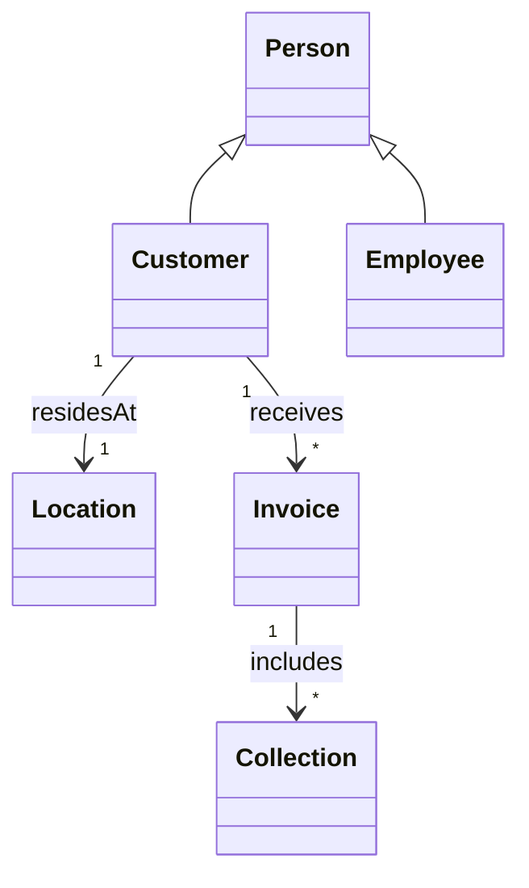
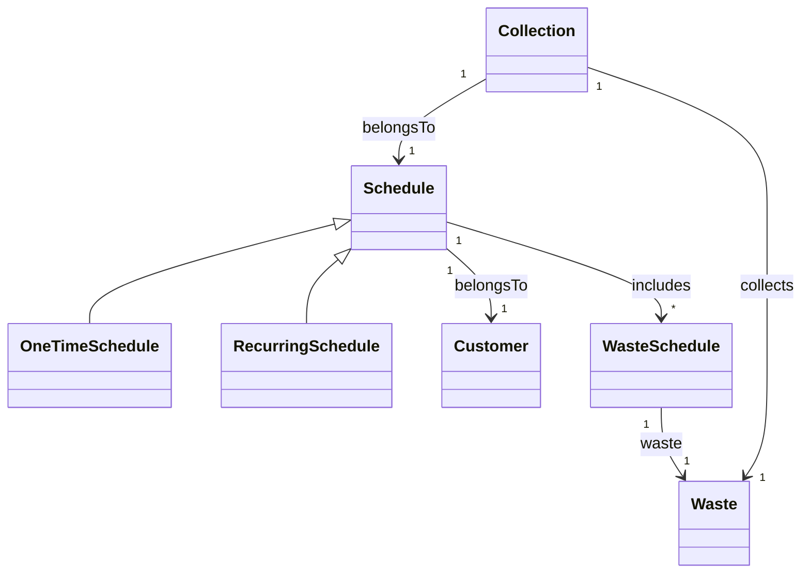
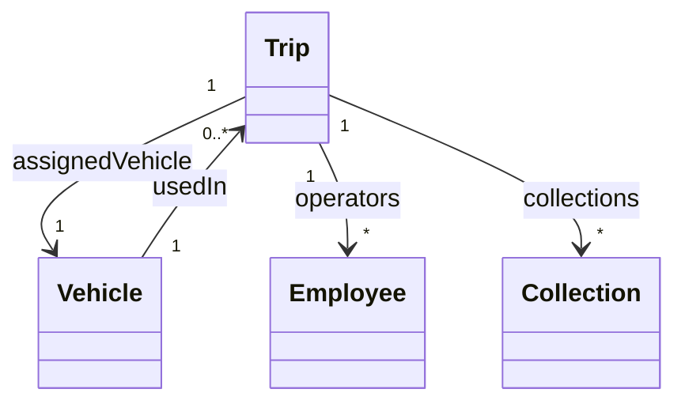

# Analisi

Il dominio riguarda la gestione operativa e amministrativa di un’azienda di smaltimento rifiuti. L’applicazione dovrà
supportare le principali attività dell’azienda, tra cui la pianificazione dei ritiri dei rifiuti, l’organizzazione delle
risorse operative (personale e mezzi), il monitoraggio dello stato dei ritiri e la rendicontazione economica.

Gli attori principali sono i clienti dell’azienda, che richiedono il servizio di raccolta dei rifiuti, e il personale
amministrativo e operativo, che gestisce la pianificazione, la raccolta e il monitoraggio delle attività.

Le attività chiave comprendono:

- Pianificazione dei ritiri, occasionali o ricorrenti, con possibilità di modificare, sospendere o cancellare un ritiro
  prima della sua esecuzione.
- Organizzazione dei viaggi operativi, che raggruppano più ritiri in una stessa area e assegnano le risorse necessarie.
- Gestione della raccolta dei rifiuti, con registrazione delle attività completate e segnalazione di eventuali problemi
  o criticità.
- Fatturazione ai clienti, basata sui ritiri completati, e monitoraggio dei pagamenti.

Il sistema dovrà inoltre garantire la coerenza operativa, evitando assegnazioni errate di risorse o conflitti tra ritiri
e viaggi, e comunicare in modo chiaro eventuali errori o aggiornamenti agli utenti interessati.

---

# Requisiti

- **Gestione clienti e personale**: il sistema deve permettere di registrare e aggiornare informazioni su clienti e
  personale, includendo la gestione dei ruoli del personale e la verifica delle abilitazioni necessarie per le attività
  operative.
- **Gestione mezzi operativi**: il sistema deve consentire di gestire i mezzi disponibili, controllando la
  disponibilità, la manutenzione e l’adeguatezza dei mezzi rispetto alle attività pianificate.
- **Gestione dei rifiuti e pianificazione settimanale**: il sistema deve supportare la definizione dei tipi di rifiuti
  da raccogliere e la pianificazione dei ritiri in base a giorni della settimana o periodi specifici.
- **Pianificazione dei ritiri**: il sistema deve consentire di creare, modificare, sospendere o cancellare i ritiri, sia
  occasionali che ricorrenti, e monitorarne lo stato fino al completamento.
- **Esecuzione delle raccolte**: il sistema deve registrare le raccolte effettuate, consentendo la segnalazione di
  completamenti, cancellazioni o problemi durante il ritiro.
- **Organizzazione dei viaggi operativi**: il sistema deve permettere di raggruppare più ritiri in un viaggio per area,
  assegnando personale e mezzi in modo coerente e senza sovrapposizioni.
- **Monitoraggio e notifiche**: il sistema deve aggiornare lo stato delle attività in tempo reale e notificare agli
  utenti eventuali criticità o aggiornamenti rilevanti.
- **Fatturazione e pagamenti**: il sistema deve generare fatture per i clienti basate sui ritiri completati e registrare
  lo stato di ciascuna fattura come pagata o non pagata.
- **Regole di coerenza operativa**: il sistema deve garantire che le risorse assegnate siano adeguate alle attività
  previste, evitando conflitti tra mezzi, personale e ritiri pianificati.

---

# Analisi e modello del dominio

Il dominio riguarda la gestione operativa e amministrativa di un’azienda di smaltimento rifiuti. L’applicazione supporta
le principali attività aziendali, consentendo la pianificazione dei ritiri, l’organizzazione delle risorse operative (
personale e mezzi), il monitoraggio dello stato delle attività e la gestione della fatturazione verso i clienti.
Gli attori principali sono i clienti, che richiedono il servizio di raccolta dei rifiuti, e il personale amministrativo
e operativo, responsabile della pianificazione, della raccolta e del monitoraggio delle attività.

## Difficoltà principali del dominio:

- il coordinamento tra personale e veicoli in caso di ritiri multipli contemporanei;
- la gestione di modifiche last-minute o ritardi nelle raccolte;
- la corretta associazione tra programmi di raccolta e tipo di rifiuto previsto;
- la gestione di clienti con più programmi di raccolta diversi.
-

---

## Diagramma 1 – Persone e Clienti

### Descrizione

Rappresenta le entità legate alle persone e ai clienti, mostrando l’ereditarietà tra tipi di persone e le relazioni con le loro ubicazioni e attività economiche.

### Entità principali

- **Person**: entità base per tutte le persone.
- **Customer**: cliente che eredita da `Person`.
- **Employee**: dipendente che eredita da `Person`.
- **Location**: indirizzo di residenza dei clienti.
- **Invoice**: fattura emessa per un cliente in seguito ai servizi di raccolta erogati.
- **Collection**: operazione di raccolta associata a una fattura.

### Relazioni chiave

- `Customer` eredita da `Person`.
- `Employee` eredita da `Person`.
- Ogni `Customer` risiede in una singola `Location` (1:1).
- Ogni `Customer` può ricevere una o più `Invoice` (1:N).
- Ogni `Invoice` include una o più `Collection` (1:N).

### UML

## Diagramma 2 – Programmazione della raccolta

### Descrizione

Rappresenta le entità legate alla pianificazione e gestione della raccolta dei rifiuti. Mostra come i programmi di raccolta si collegano ai clienti e alle singole operazioni di raccolta.

### Entità principali

- **Schedule**: piano di raccolta generico.
- **OneTimeSchedule**: pianificazione di raccolta singola, eredita da `Schedule`.
- **RecurringSchedule**: pianificazione ricorrente, eredita da `Schedule`.
- **WasteSchedule**: programma specifico per un tipo di rifiuto in un giorno della settimana.
- **Waste**: tipologia di rifiuto raccolto.
- **Collection**: rappresenta un’operazione di raccolta specifica.
- **Customer**: cliente associato a uno specifico programma di raccolta.

### Relazioni chiave

- `OneTimeSchedule` e `RecurringSchedule` ereditano da `Schedule`.
- Ogni `Schedule` appartiene a un singolo `Customer`.
- Ogni `WasteSchedule` è associato a un singolo `Waste`.
- Ogni `Collection` appartiene a un singolo `Schedule`.
- Ogni `Collection` raccoglie il `Waste` previsto dal `WasteSchedule`.

### UML

## Diagramma 3 – Logistica e Trasporto

### Descrizione

Rappresenta le entità legate alla gestione operativa della raccolta, inclusi viaggi, mezzi e operatori, mostrando come le attività di raccolta vengono organizzate sul campo.

### Entità principali

- **Trip**: viaggio operativo per effettuare le raccolte.
- **Vehicle**: veicolo utilizzato per eseguire uno o più viaggi.
- **Employee**: operatore assegnato a uno o più viaggi.
- **Collection**: raccolta specifica eseguita durante un viaggio.

### Relazioni chiave

- Ogni `Trip` utilizza un singolo `Vehicle`.
- Ogni `Trip` coinvolge uno o più `Employee` come operatori.
- Ogni `Trip` comprende una o più `Collection`.
- Ogni `Vehicle` può essere utilizzato in zero o più `Trip`.

### UML

## Sintesi del modello del dominio

I tre diagrammi descrivono il dominio in maniera coerente e integrata:

- **Diagramma 1**: utenti e entità economiche (`Customer`, `Employee`, `Invoice`), collegando le raccolte agli utenti.
- **Diagramma 2**: pianificazione dei ritiri, mostrando la relazione tra `Customer`, `Schedule`, `Waste` e `WasteSchedule`.
- **Diagramma 3**: gestione operativa con `Trip`, `Vehicle` e `Employee`, collegati alle `Collection`.

I programmi di raccolta (Diagramma 2) generano le Collection attive, che vengono poi aggregate in Trip (Diagramma 3) in base a criteri operativi come area e disponibilità delle risorse, garantendo che ogni raccolta pianificata sia effettivamente eseguita.

Le criticità principali del dominio riguardano la gestione delle risorse in scenari complessi e la corretta associazione tra programmi di raccolta e tipologia di rifiuti, senza però suggerire soluzioni implementative.
