# Analisi

Il dominio riguarda la gestione operativa e amministrativa di un’azienda di smaltimento rifiuti. L’applicazione dovrà
supportare le principali attività dell’azienda, tra cui la pianificazione dei ritiri dei rifiuti, l’organizzazione delle
risorse operative (personale e mezzi), il monitoraggio dello stato dei ritiri e la rendicontazione economica.

Gli attori principali sono i clienti dell’azienda, che richiedono il servizio di raccolta dei rifiuti, e il personale
amministrativo e operativo, che gestisce la pianificazione, la raccolta e il monitoraggio delle attività.

Le attività chiave comprendono:

- Pianificazione dei ritiri, occasionali o ricorrenti, con possibilità di modificare, sospendere o cancellare un ritiro
  prima della sua esecuzione.
- Organizzazione dei viaggi operativi, che raggruppano più ritiri in una stessa area e assegnano le risorse necessarie.
- Gestione della raccolta dei rifiuti, con registrazione delle attività completate e segnalazione di eventuali problemi
  o criticità.
- Fatturazione ai clienti, basata sui ritiri completati, e monitoraggio dei pagamenti.

Il sistema dovrà inoltre garantire la coerenza operativa, evitando assegnazioni errate di risorse o conflitti tra ritiri
e viaggi, e comunicare in modo chiaro eventuali errori o aggiornamenti agli utenti interessati.

---

# Requisiti

- **Gestione clienti e personale**: il sistema deve permettere di registrare e aggiornare informazioni su clienti e
  personale, includendo la gestione dei ruoli.
- **Gestione mezzi operativi**: il sistema deve consentire di gestire i mezzi disponibili, controllando la
  disponibilità, la manutenzione e l’adeguatezza dei mezzi rispetto alle attività pianificate.
- **Gestione dei rifiuti e pianificazione settimanale**: il sistema deve supportare la definizione dei tipi di rifiuti
  da raccogliere e la pianificazione dei ritiri in base a giorni della settimana o periodi specifici.
- **Pianificazione dei ritiri**: il sistema deve consentire di creare, modificare, sospendere o cancellare i ritiri, sia
  occasionali che ricorrenti, e monitorarne lo stato fino al completamento.
- **Esecuzione delle raccolte**: il sistema deve registrare le raccolte effettuate e segnalare eventuali problemi.
- **Organizzazione dei viaggi operativi**: il sistema deve consentire di raggruppare più ritiri in un viaggio per area e assegnare personale e mezzi.
- **Monitoraggio e notifiche**: il sistema deve aggiornare lo stato delle attività e notificare agli utenti eventuali criticità o aggiornamenti.
- **Fatturazione e pagamenti**: il sistema deve generare fatture per i clienti basate sui ritiri completati e registrare
  lo stato di ciascuna fattura come pagata o non pagata.
- **Regole di coerenza operativa**: il sistema deve garantire che le risorse assegnate siano adeguate alle attività previste.

## Requisiti non funzionali

- Il sistema deve garantire affidabilità, chiarezza delle informazioni e coerenza nello stato delle attività visualizzate agli utenti.

## Nota finale

- L’analisi dei requisiti definisce ciò che l’applicazione deve fare, senza entrare nel design interno o nelle tecnologie utilizzate.
---

# Analisi e modello del dominio

Il dominio riguarda la gestione operativa e amministrativa di un’azienda di smaltimento rifiuti. L’applicazione supporta
le principali attività aziendali, consentendo la pianificazione dei ritiri, l’organizzazione delle risorse operative(
personale e mezzi), il monitoraggio dello stato delle attività e la gestione della fatturazione verso i clienti.
Gli attori principali sono i clienti, che richiedono il servizio di raccolta dei rifiuti, e il personale amministrativo
e operativo, responsabile della pianificazione, della raccolta e del monitoraggio delle attività.

## Difficoltà principali del dominio:

- il coordinamento tra personale e veicoli in caso di ritiri multipli contemporanei;
- la gestione di modifiche last-minute o ritardi nelle raccolte;
- la corretta associazione tra programmi di raccolta e tipo di rifiuto previsto;
- la gestione di clienti con più programmi di raccolta diversi.
-

---

## Diagramma 1 – Persone e Clienti

### Descrizione

Rappresenta le entità legate alle persone e ai clienti, mostrando l’ereditarietà tra tipi di persone e le relazioni con le loro ubicazioni e attività economiche.

### Entità principali

- **Person**: entità base per tutte le persone.
- **Customer**: cliente che eredita da `Person`.
- **Employee**: dipendente che eredita da `Person`.
- **Location**: indirizzo di residenza dei clienti.
- **Invoice**: fattura emessa per un cliente in seguito ai servizi di raccolta erogati.
- **Collection**: operazione di raccolta associata a una fattura.

### Relazioni chiave

- `Customer` eredita da `Person`.
- `Employee` eredita da `Person`.
- Ogni `Customer` risiede in una singola `Location` (1:1).
- Ogni `Customer` può ricevere una o più `Invoice` (1:N).
- Ogni `Invoice` include una o più `Collection` (1:N).

### UML

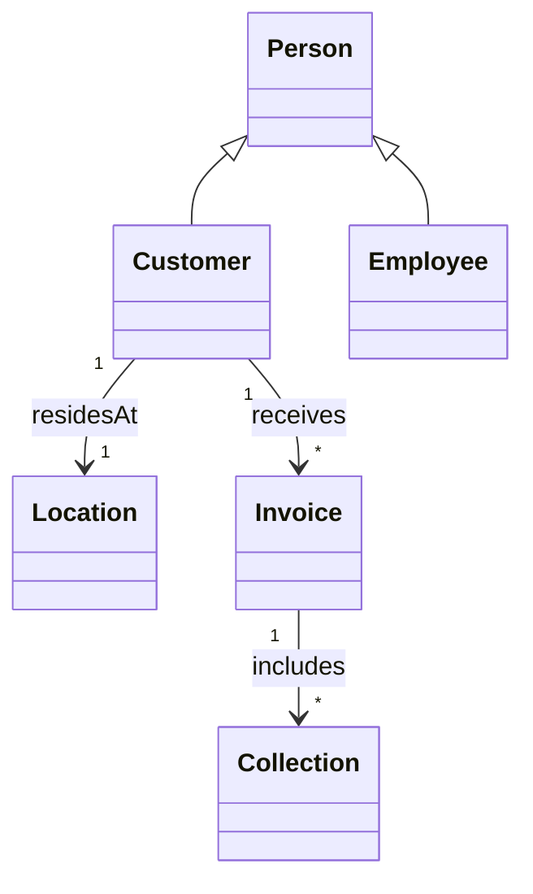

## Diagramma 2 – Programmazione della raccolta

### Descrizione

Rappresenta le entità legate alla pianificazione e gestione della raccolta dei rifiuti. Mostra come i programmi di raccolta si collegano ai clienti e alle singole operazioni di raccolta.

### Entità principali

- **Schedule**: piano di raccolta generico.
- **OneTimeSchedule**: pianificazione di raccolta singola, eredita da `Schedule`.
- **RecurringSchedule**: pianificazione ricorrente, eredita da `Schedule`.
- **WasteSchedule**: programma specifico per un tipo di rifiuto in un giorno della settimana.
- **Waste**: tipologia di rifiuto raccolto.
- **Collection**: rappresenta un’operazione di raccolta specifica.
- **Customer**: cliente associato a uno specifico programma di raccolta.

### Relazioni chiave

- `OneTimeSchedule` e `RecurringSchedule` ereditano da `Schedule`.
- Ogni `Schedule` appartiene a un singolo `Customer`.
- Ogni `WasteSchedule` è associato a un singolo `Waste`.
- Ogni `Collection` appartiene a un singolo `Schedule`.
- Ogni `Collection` raccoglie il `Waste` previsto dal `WasteSchedule`.

### UML

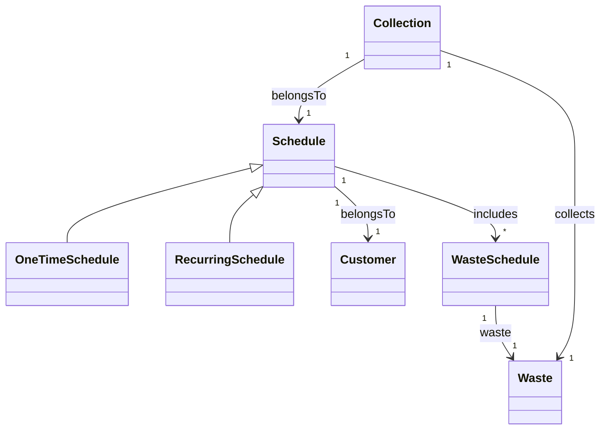

## Diagramma 3 – Logistica e Trasporto

### Descrizione

Rappresenta le entità legate alla gestione operativa della raccolta, inclusi viaggi, mezzi e operatori, mostrando come le attività di raccolta vengono organizzate sul campo.

### Entità principali

- **Trip**: viaggio operativo per effettuare le raccolte.
- **Vehicle**: veicolo utilizzato per eseguire uno o più viaggi.
- **Employee**: operatore assegnato a uno o più viaggi.
- **Collection**: raccolta specifica eseguita durante un viaggio.

### Relazioni chiave

- Ogni `Trip` utilizza un singolo `Vehicle`.
- Ogni `Trip` coinvolge uno o più `Employee` come operatori.
- Ogni `Trip` comprende una o più `Collection`.
- Ogni `Vehicle` può essere utilizzato in zero o più `Trip`.

### UML

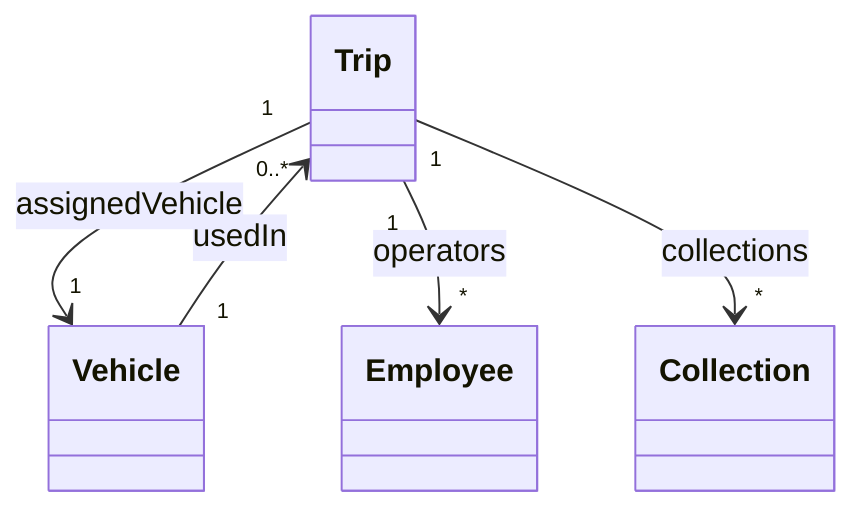

## Sintesi del modello del dominio

I tre diagrammi descrivono il dominio in maniera coerente e integrata:

- **Diagramma 1**: utenti ed entità economiche (`Customer`, `Employee`, `Invoice`), collegando le raccolte agli utenti.
- **Diagramma 2**: pianificazione dei ritiri, mostrando la relazione tra `Customer`, `Schedule`, `Waste` e `WasteSchedule`.
- **Diagramma 3**: gestione operativa con `Trip`, `Vehicle` e `Employee`, collegati alle `Collection`.

I programmi di raccolta (Diagramma 2) generano le Collection attive, che vengono poi aggregate in Trip (Diagramma 3) in base a criteri operativi come area e disponibilità delle risorse, garantendo che ogni raccolta pianificata sia effettivamente eseguita.

Le criticità principali del dominio riguardano la gestione delle risorse in scenari complessi e la corretta associazione tra programmi di raccolta e tipologia di rifiuti, senza però suggerire soluzioni implementative.

# Design

L’architettura di *WasteMaster* segue un approccio **Clean Architecture / 3-layer**, che separa chiaramente **UI**, **logica applicativa** e **dominio**.

I **Controller UI** (Boundary) gestiscono esclusivamente input e output della View e delegano ogni logica ai manager.  
I **Manager applicativi** (Control) centralizzano i casi d’uso e orchestrano le entità e i repository.  
Le **Entità di dominio** (Entity) rappresentano lo stato persistente e sono manipolate solo dai manager.  
I **Repository** definiscono le interfacce per l’accesso ai dati, separate dall’implementazione concreta.

Il flusso di interazione ad alto livello è:

View → Controller UI → Manager → Repository / Entity → Controller UI → View


Questa struttura rende l’applicazione **estendibile e manutenibile**, senza che modifiche alla UI richiedano interventi sul dominio o sui manager.

---

## Architettura

### Componenti e ruoli

- **Controller UI (Boundary)**
    - Gestiscono input dell’utente e navigazione tra le viste.
    - Delegano operazioni ai manager.
    - Raccolgono risultati e aggiornano la UI.

- **Manager applicativi (Control)**
    - Incapsulano i casi d’uso principali.
    - Applicano regole e validazioni.
    - Coordinano più entità e repository.

- **Entità di dominio (Entity)**
    - Rappresentano lo stato del sistema.
    - Espongono comportamenti minimi.
    - Manipolate solo dai manager.

- **Repository**
    - Definiscono i contratti per l’accesso ai dati.
    - Permettono ai manager di leggere e scrivere dati senza conoscere i dettagli di persistenza.

### Interazioni principali

1. **Vista → Controller:** l’utente compie un’azione (creazione/aggiornamento/cancellazione).
2. **Controller → Manager:** il controller invoca il manager corrispondente.
3. **Manager → Repository / Entità:** il manager applica le regole, coordina le entità e persiste i dati.
4. **Manager → Controller → Vista:** i risultati tornano al controller che aggiorna la View.

### Schema UML architetturale

> Sono mostrati solo i ruoli principali e le relazioni, senza dettagli di campi o metodi.

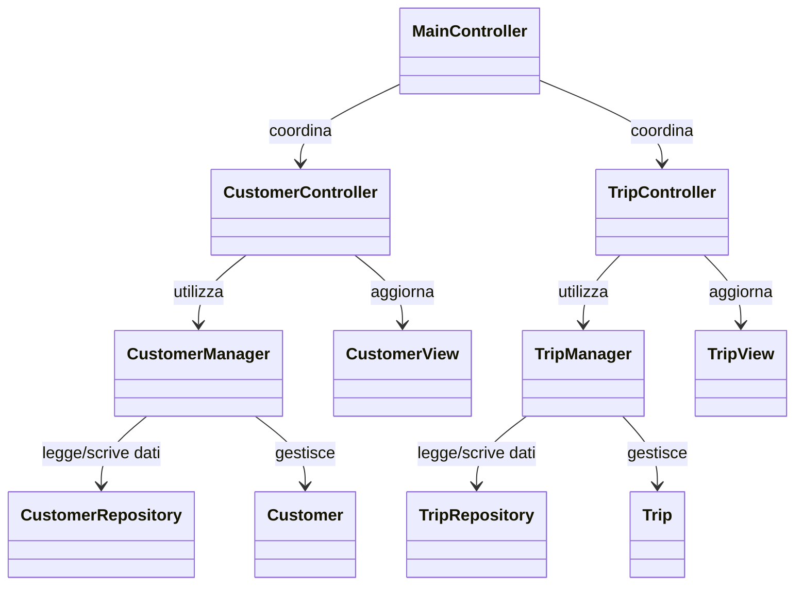
---
# Design Dettagliato — Gestione Veicoli (Ferrari Lorenzo)

## 1. Gestione dello Stato Operativo del Veicolo

### Problema

Ogni veicolo può trovarsi in diversi stati operativi (`IN_SERVICE`, `IN_MAINTENANCE`, `OUT_OF_SERVICE`) e tali stati devono poter cambiare in base alle azioni degli operatori.

Una gestione manuale basata su `if/else` dispersi tra UI, Controller o altri Manager (es. `TripManager`) avrebbe comportato:

- Duplicazione della logica in più componenti.
- Incoerenze nei flussi (es. un componente consente un cambio stato che un altro blocca).
- Difficoltà nell’aggiungere nuovi stati in futuro, richiedendo modifiche globali.

### Alternative valutate

Una possibile soluzione iniziale era gestire tutte le transizioni direttamente nei Controller o nella UI, verificando lo stato con condizioni procedurali (`if(vehicle.status == ...) ...`).

Soluzione scartata perché:

- Poco estensibile e difficile da mantenere.
- Ogni modifica alle regole avrebbe imposto aggiornamenti manuali su più componenti.
- Violazione del Single Responsibility Principle, con la UI che si occupa di logica di dominio.

### Soluzione

È stata centralizzata la gestione dello stato attraverso:

- L’entità `Vehicle`, che mantiene lo stato corrente e fornisce `updateStatus(...)` per eseguire cambiamenti atomici.
- Il `VehicleManager`, che funge da domain service e applica le regole di transizione consentite, tramite metodi come `handleMaintenanceButton(...)` o `handleServiceButton(...)`.

In questo modo tutte le transizioni avvengono in un unico punto, evitando comportamenti divergenti nei vari componenti dell'applicazione.

### Pattern di progettazione applicato

È stato applicato un **pattern State semplificato**:

- `VehicleStatus` → rappresenta gli **stati concreti**.
- `Vehicle` → contiene lo **stato attuale e il cambio atomico** (`updateStatus`).
- `VehicleManager` → funge da **contesto**, definendo le **transizioni ammesse**.

### Vantaggi della soluzione

- Coerenza delle regole tra tutti i componenti.
- Riduzione della duplicazione di logica.
- Facilità nell’aggiungere nuovi stati o regole.
- Rispetto del SRP e principio Open/Closed (nuovi stati senza modificare codice esistente).

### Schema UML

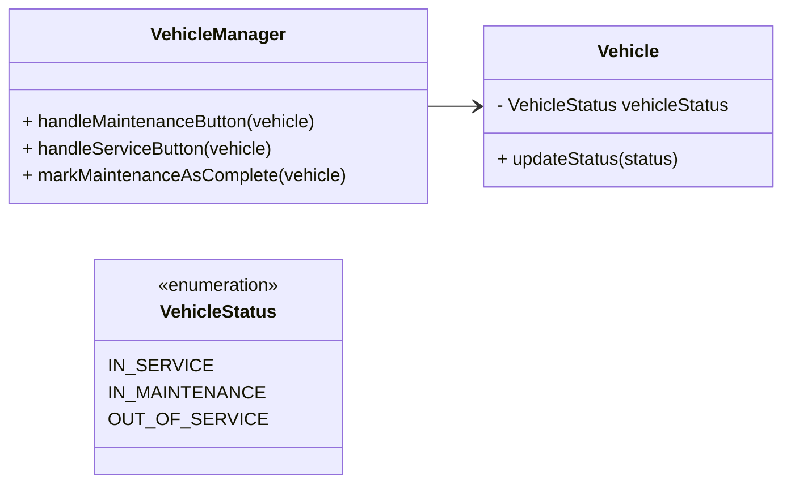
#### Diagramma di Stato - Transizioni del VehicleStatus
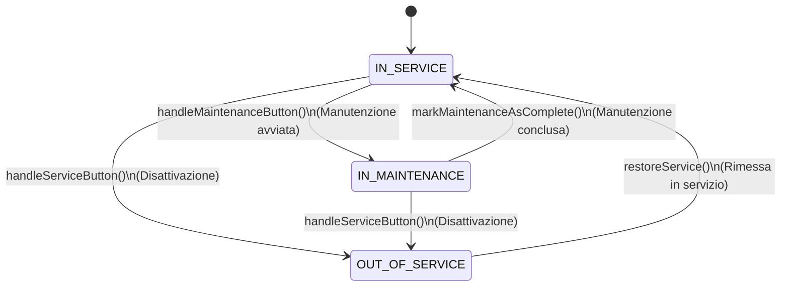
## 2. Gestione Automatica delle Date di Manutenzione

### Problema

Ogni veicolo deve mantenere coerenti due date:

- `lastMaintenanceDate`
- `nextMaintenanceDate`

Se tali date venissero aggiornate manualmente in più punti dell’applicazione, si rischierebbe:

- Dimenticanze di aggiornamento
- Inconsistenze tra i dati
- Regole duplicate in UI o Controller

### Alternative valutate

Una possibile alternativa era lasciare che ogni componente aggiornasse manualmente le date, ad esempio quando viene chiusa una manutenzione o avviato un intervento.

Soluzione scartata perché soggetta a errori umani e difficile da verificare.

### Soluzione

La gestione è stata accentrata nel `VehicleManager`, in particolare nel metodo `markMaintenanceAsComplete(vehicle)` che:

- Imposta `lastMaintenanceDate` alla data corrente.
- Calcola `nextMaintenanceDate` secondo una politica predefinita (es. +6 mesi).

### Pattern e principi applicati

- Nessun pattern strutturato, ma forte applicazione del principio di **centralizzazione della business logic**.
- Il `VehicleManager` funge da servizio di dominio responsabile delle politiche sulle date.

### Vantaggi

- Coerenza garantita.
- Nessun altro componente può modificare direttamente le date.
- Facilità di estendere la politica di manutenzione in futuro.

### Schema UML

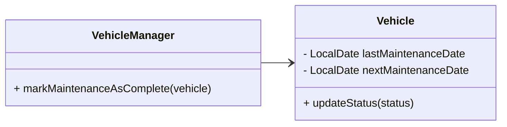
## 3. Compatibilità tra Veicoli e Autisti in base alla Patente

### Problema

Un veicolo può essere assegnato solo ad autisti con patente compatibile (`RequiredLicence`).  
Se la verifica viene effettuata in più punti (UI, `TripManager`, Controller), si rischiano:

- Eccezioni e incoerenze
- Possibilità di assegnare veicoli non idonei

### Alternative valutate

Una gestione distribuita con verifiche condizionali ovunque (`if(driver.licence >= vehicle.licence) ...`).

Soluzione scartata per rischio di duplicazione e buchi di controllo.

### Soluzione

È stato introdotto il metodo:

```java
VehicleManager.getAllowedLicences(vehicle);
```
Confronta la `RequiredLicence` del veicolo con le licenze degli autisti disponibili e restituisce solo quelli idonei.

### Pattern / Principi applicati

- Nessun pattern formale, ma approccio di **policy centralizzata**: la regola è definita in un solo punto e riusata ovunque.

### Vantaggi

- Nessuna duplicazione di logica.
- Facile estendere nuove licenze o eccezioni.
- Maggiore affidabilità operativa.

### Schema UML
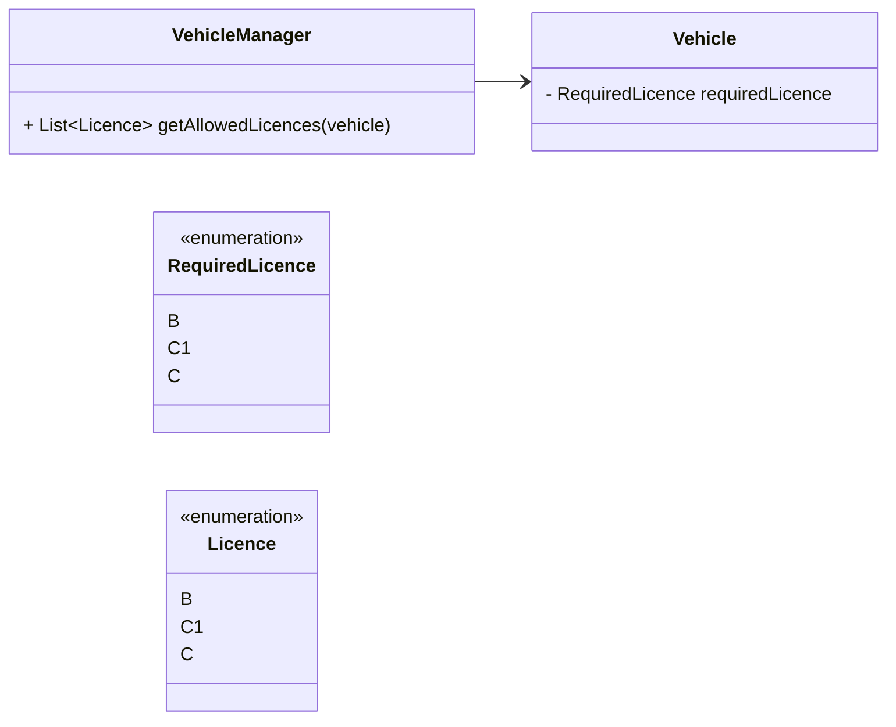
---

# Design Dettagliato — Pianificazione delle Raccolte (Alex Cambrini)

- **OneTimeSchedule**: una singola data richiesta dal cliente
- **RecurringSchedule**: un ciclo (settimanale/mensile) allineato al giorno previsto dal calendario di quel rifiuto (*WasteSchedule*).

---

## 1. Calcolo della prossima data di raccolta

### Problema
La logica di calcolo della prossima data di raccolta varia in base alla frequenza dello schedule (settimanale o mensile).  
Una singola implementazione nel manager avrebbe richiesto continue modifiche e condizionali, rendendo difficile aggiungere nuovi tipi di frequenza e aumentando il rischio di errori: duplicazioni, raccolte mancanti o date incoerenti.

**Esempio concreto:** Se oggi è lunedì e la raccolta settimanale è prevista per mercoledì, il sistema deve restituire la data del prossimo mercoledì; se la frequenza è mensile, deve restituire il giorno corrispondente del mese successivo.

### Alternative valutate
Un approccio alternativo avrebbe potuto essere implementare tutta la logica di calcolo della prossima data direttamente nel `RecurringScheduleManager` usando strutture condizionali (`if/else`) basate sulla frequenza dello schedule.  
**Svantaggi di questa soluzione:**
- Poco estensibile: aggiungere nuove frequenze richiederebbe modifiche continue al manager.
- Maggiore rischio di errori: duplicazioni, date incoerenti o raccolte mancanti.
- Violazione dei principi SOLID, in particolare Open/Closed e Single Responsibility.
- Testabilità ridotta, poiché tutta la logica è concentrata in un unico componente.

### Soluzione
È stato applicato il **pattern Strategy**, separando la logica di calcolo in strategie indipendenti e intercambiabili.  
Il manager (`RecurringScheduleManager`) agisce come **contesto**, delegando il calcolo alla strategia appropriata tramite l’interfaccia comune `NextCollectionCalculator`.

**Metodi principali della soluzione:**

- `calculateNextDate(schedule: RecurringSchedule): LocalDate`
- `alignToScheduledDay(date: LocalDate, dayOfWeek: DayOfWeek): LocalDate`

**Vantaggi della soluzione:**

- Aggiungere nuove frequenze richiede solo nuove strategie, senza modifiche al manager.
- Migliore leggibilità e testabilità.
- Rispetto dei principi SOLID (Open/Closed, Single Responsibility).
- Chiara separazione fra business logic e policy di calcolo.

### Pattern di progettazione
- **Strategy:**
    - `NextCollectionCalculator` rappresenta l’interfaccia della strategia.
    - `WeeklyCalculator` e `MonthlyCalculator` sono implementazioni concrete della strategia.
    - `RecurringScheduleManager` funge da contesto, delegando il calcolo alla strategia selezionata in base alla frequenza dello schedule.

**Dinamica di selezione della strategia:**  
Il `RecurringScheduleManager` determina quale strategia utilizzare al momento della richiesta del calcolo della prossima data. La scelta avviene tipicamente tramite un semplice mapping tra la frequenza dello schedule e l’implementazione concreta corrispondente. In questo modo, il manager **non contiene logica condizionale complessa**, ma delega dinamicamente la responsabilità di calcolo alla strategia appropriata.

### Schema UML
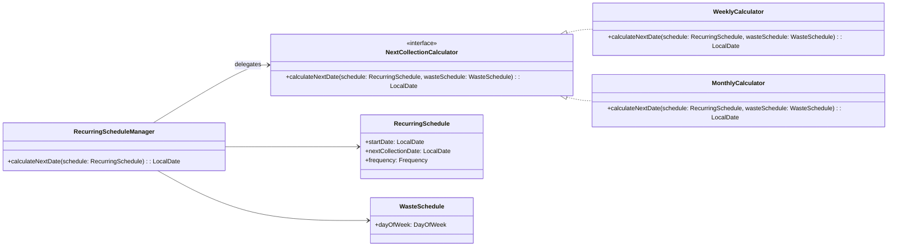

## 2. Generazione automatica e coordinamento delle Collection

### Problema
Ogni schedule deve generare una **Collection** coerente senza duplicazioni o errori di data.  
Più manager (**RecurringScheduleManager**, **CollectionManager**, **WasteScheduleManager**) devono collaborare senza duplicare logica.  
Distribuire la logica tra i manager rischia incoerenze, difficoltà di manutenzione e ridotta testabilità.

**Esempio concreto:** Se più schedule ricorrenti hanno date che coincidono o si sovrappongono, il sistema deve generare le collection corrette senza creare duplicati o errori di persistenza.

### Vecchio approccio implementativo
Inizialmente era stata implementata una funzione `generateRecurringCollections()` eseguita come **task giornaliero automatico**, che calcolava tutte le date future delle collection ricorrenti.
- Garantiva coerenza anche se il software rimaneva spento per più giorni.
- Evitava date nel passato e duplicazioni.
- Richiedeva controlli aggiuntivi e generava un **costo prestazionale** maggiore.

Questo approccio automatizzava tutto, ma introdusse complessità, difficoltà di manutenzione e test più complicati.

### Nuovo approccio adottato
- La collection viene generata **solo al momento della creazione dello schedule**.
- Le collection vengono raggruppate in un **trip**, cioè un insieme di ritiri fisici nella stessa zona.
- Una volta completato un trip, l’operatore lo marca come completato.
- Solo le collection coinvolte vengono aggiornate in caso di modifiche o errori (ad esempio mezzo rotto o annullo).

**Motivazioni della scelta:**
- Riduzione della complessità e del carico di lavoro.
- Miglior testabilità: ogni schedule genera solo le collection coinvolte.
- Maggiore chiarezza operativa e manutenzione più semplice.
- Estensibilità futura: se in futuro servono nuovi tipi di collection, basta aggiungere nuove implementazioni della factory senza modificare i manager.

### Pattern di progettazione
È stato utilizzato il **Factory Pattern** per la creazione delle collection:
- `CollectionFactory` definisce l’interfaccia per creare collection one-time e ricorrenti.
- `CollectionFactoryImpl` implementa la logica concreta di costruzione.
- `CollectionManager` coordina la creazione e persistenza delle collection, **senza contenere logica di costruzione**, usando la factory come unico punto di creazione.

**Metodi principali della soluzione:**
- `generateOneTimeCollection(schedule: OneTimeSchedule)`
- `generateRecurringCollection(schedule: RecurringSchedule)`

**Vantaggi della soluzione:**
- Separazione chiara tra **coordinamento** e **creazione degli oggetti**.
- Aggiornamento mirato delle collection coinvolte, evitando ricalcoli globali.
- Prestazioni ottimizzate rispetto al vecchio task automatico.
- Chiarezza delle responsabilità e facilità di test.
- Applicazione di un pattern noto (Factory) per migliorare riuso ed estensibilità.

### Schema UML
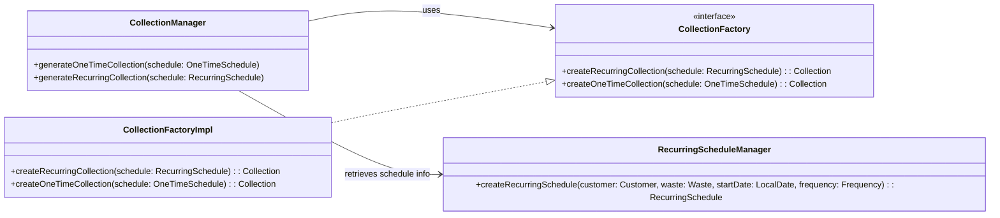

## 3. Gestione degli stati dello Schedule

### Problema
Un `RecurringSchedule` può assumere diversi stati (`ACTIVE`, `PAUSED`, `CANCELLED`, `COMPLETED`).  
Ogni transizione può richiedere azioni collaterali, come cancellare una `Collection`, generarne una nuova o aggiornare la prossima data di raccolta.  
Se tali logiche fossero distribuite tra più componenti (UI, repository, manager vari), si rischierebbero **incoerenze** e **duplicazioni**.

**Esempio concreto:**  
Se uno schedule `PAUSED` viene riattivato (`ACTIVE`), il sistema deve ricalcolare la prossima data e generare la collection corretta senza duplicazioni.

### Soluzione
La gestione delle transizioni di stato è **centralizzata** nel metodo
```java
`RecurringScheduleManager.updateStatusRecurringSchedule(schedule: RecurringSchedule, newStatus: ScheduleStatus)`.
```

### Logica principale implementata
- Blocca modifiche su schedule già `CANCELLED` o `COMPLETED`.
- Gestisce solo le **transizioni valide**:
  - `PAUSED → CANCELLED`: aggiorna lo stato e salva.
  - `PAUSED → ACTIVE`: ricalcola la prossima data, aggiorna lo stato, genera nuova collection.
  - `ACTIVE → PAUSED` o `ACTIVE → CANCELLED`: aggiorna lo stato ed elimina la collection attiva.
- Aggiornamento repository e collection tramite `CollectionManager`.
- Le transizioni non valide restituiscono `false`, evitando stati inconsistenti o side effect indesiderati.

### Vantaggi della soluzione
- **Centralizzazione della logica**: facilità di manutenzione e test.
- **Chiarezza operativa**: un punto unico per le transizioni.
- **Rispetto del Single Responsibility Principle (SRP)**: la gestione degli stati è separata dalla UI e dalla persistenza.
- **Estensibilità**: nuove transizioni possono essere aggiunte modificando solo il manager, senza impattare altri componenti.

### Alternative valutate
Si è valutato l’uso del **State Pattern**, che rappresenta ogni stato come oggetto separato con comportamenti e transizioni proprie, delegando al contesto l’esecuzione delle operazioni.

**Motivo per cui non è stato adottato**:
- Il numero di stati è limitato e le azioni collaterali sono semplici.
- L’uso del pattern avrebbe aumentato la complessità senza benefici significativi in termini di estensibilità o chiarezza.
- La gestione centralizzata risulta più leggibile, testabile e sufficiente per il progetto.


### Pattern applicati
- Nessun pattern di progettazione noto è stato applicato in questa parte del progetto.

### Principi di design applicati
- Principio di singola responsabilità (SRP): il RecurringScheduleManager gestisce esclusivamente le transizioni di stato, separando la logica di business dalla UI e dalla persistenza.

### Schema UML
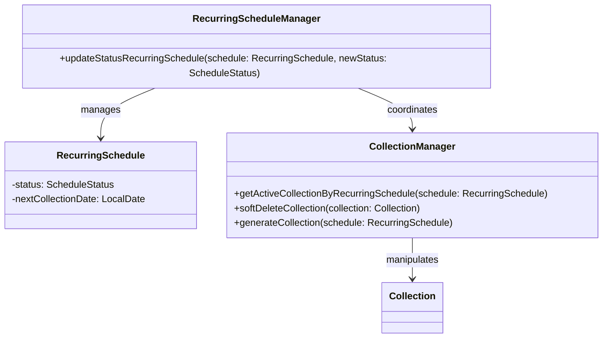

---

### Design Dettagliato - Trip (Manuel Ragazzini)

### Problema affrontato

La gestione del ciclo di vita dei **viaggi di raccolta rifiuti (Trip)** richiede la coordinazione di diverse responsabilità:

- pianificazione per **CAP**,
- **assegnazione** del veicolo e degli operatori qualificati e disponibili,
- **associazione** delle Collection da eseguire,
- **cancellazione** con eventuale **notifica ai clienti**,
- **completamento** del viaggio con aggiornamento coerente delle Collection,
- eventuale **ripianificazione** per gli schedule ricorrenti.

I vincoli principali da rispettare sono:

- evitare conflitti di risorse (veicoli/operatori già impegnati);
- verificare la compatibilità tra **licenza del driver** e **veicolo assegnato**;
- mantenere **consistenza tra Trip e Collection**;
- gestire annullamenti e completamenti seguendo uno **stato macchina definito**.

---

### Soluzione adottata

La logica applicativa è stata **centralizzata nel `TripManager`**, che funge da *coordinatore del dominio*.  
Le sue responsabilità includono:

- interrogare i **repository** per verificare disponibilità e qualifiche;
- creare o aggiornare i **Trip**;
- propagare automaticamente gli effetti su **Collection** (annullamenti, completamenti, ripianificazioni);
- collaborare con `RecurringScheduleManager` e `NotificationService` quando necessario.

La **UI** invoca esclusivamente **metodi di alto livello** (es. `createTrip`, `softDeleteTrip`, `setTripAsCompleted`) senza duplicare logica applicativa.

#### API di dominio

| Categoria          | Metodi principali                                                                                     |
|-------------------|-------------------------------------------------------------------------------------------------------|
| **Creazione**      | `createTrip(postalCode, vehicle, operators, departure, expectedReturn, collections)`                  |
| **Disponibilità**  | `getAvailableVehicles(start, end)` · `getQualifiedDrivers(start, end, allowedLicences)` · `getAvailableOperatorsExcludeDriver(start, end, driver)` |
| **Cancellazione**  | `softDeleteTrip(trip)` · `softDeleteAndRescheduleNextCollection(trip)` · `cancelTripAndNotify(trip[, subject, body])` |
| **Completamento**  | `setTripAsCompleted(trip)`                                                                            |
| **Aggiornamenti**  | `updateVehicle(tripId, newVehicle)` · `updateOperators(tripId, newOperators)`                        |

---

### Pattern impiegati

- **Facade / Coordinator (TripManager)**  
  Centralizza i casi d’uso e coordina le collaborazioni tra repository, gestione delle schedule ricorrenti e sistema di notifica.  
  Riduce l’accoppiamento tra UI e dominio.

- **Repository**  
  Astrazione per query di disponibilità, ricerca di veicoli/operatori/driver e recupero dei Trip.  
  Favorisce testabilità e sostituibilità della persistenza.

- **State (TripStatus)**  
  Definisce le transizioni da `ACTIVE` a `CANCELLED` o `COMPLETED`, applicando automaticamente gli effetti sulle Collection collegate.

- **Observer-like (NotificationService)**  
  La notifica non è parte del dominio centrale: viene delegata a un’interfaccia esterna, facilmente sostituibile (es. mock vs implementazione reale).

- **Guard Clauses & Validation**  
  Verifiche *fail-fast* tramite `ValidateUtils` e controlli sugli argomenti, impedendo che vengano applicate modifiche con input incoerenti.

---

### Schema UML della soluzione
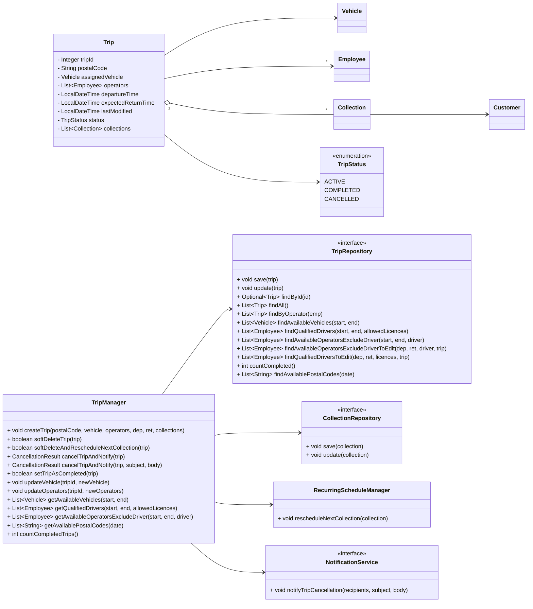
### Diagramma di Stato - TripStatus
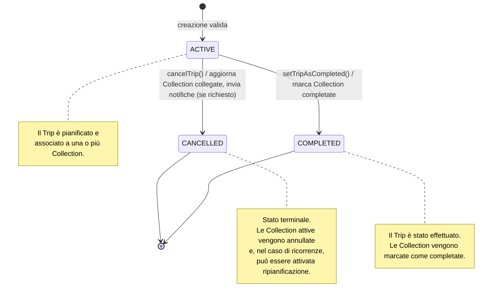
### Diagramma di Interazione - Cancellazione Trip con Notifica
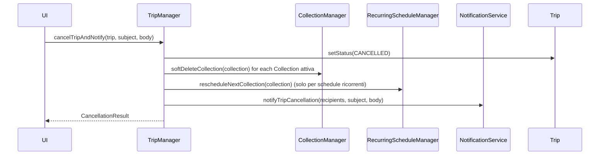
### Motivazioni e alternative scartate

- **Separazione dei ruoli**: la UI non gestisce regole applicative, ma invoca operazioni ad alto livello.
- **Coerenza dei dati**: ogni cancellazione o completamento aggiorna le Collection correlate e, se necessario, innesca la ripianificazione per schedule ricorrenti.
- **Evolvibilità**: nuove strategie di disponibilità o nuovi canali di notifica possono essere aggiunti senza impattare gli strati superiori.
- **Testabilità**: i casi d’uso sono isolabili tramite mock dei repository e dei servizi esterni.
- **Robustezza**: le guard clauses impediscono percorsi inconsistenzi (es. completare un trip senza Collection attive).

---

| Alternativa                     | Esito   | Motivazione dello scarto |
|--------------------------------|---------|---------------------------|
| Logica distribuita nei controller | Scartata | Rischio di duplicazioni e perdita di consistenza |
| Eventi di dominio asincroni per le notifiche | Rimandata | Utile in scenari più complessi; la chiamata sincrona è sufficiente e più semplice |
| Transazioni distribuite a livello di manager | Posticipata | L’attuale livello di persistenza è sufficiente; possibile evoluzione futura |

---


## Testing automatizzato

Per garantire l’affidabilità delle funzionalità principali, il progetto adotta una strategia di testing automatico basata su **JUnit 5**. I test sono organizzati per coprire le principali componenti del dominio.

### Componenti testate

- **Anagrafiche e risorse**: verifica di creazione, aggiornamento e validazione di clienti, personale, veicoli e rifiuti.
- **Pianificazione e raccolte**: test su pianificazioni, modifiche, cancellazioni e transizioni di stato di raccolte e viaggi.
- **Gestione mezzi e viaggi**: verifica delle regole di assegnazione veicoli/operatori, pianificazione viaggi e gestione delle disponibilità.
- **Fatturazione e pagamenti**: test automatici su generazione e aggiornamento delle fatture, integrazione con i pagamenti.

### Strumenti utilizzati

- **Framework di testing:**  
  - JUnit 5
- **Database di test**:
  - H2 (in-memory), configurato per essere creato e distrutto automaticamente a ogni esecuzione. Garantisce isolamento dei test e assenza di effetti collaterali sul database reale.
- **Livelli coperti:**
  - **DAO** – verifica di inserimento, ricerca e cancellazione dei dati.
  - **Model** – validazione e coerenza delle entità di dominio.
  - **Service (manager)** – test delle regole di business e delle interazioni tra componenti.
- **Classi di test rappresentative:**
  - DAO: `GenericDAOTest`, `CustomerDAOTest`
  - Model: `RecurringScheduleTest`, `InvoiceTest`
  - Service: `RecurringScheduleManagerTest`, `VehicleManagerTest`

- **Architettura di supporto:**  
    Tutti i test ereditano da `AbstractDatabaseTest`, che gestisce automaticamente il ciclo di vita del database (EntityManager, transazioni, inizializzazione di DAO, repository e manager).  
    L’intero processo è completamente automatico e non richiede intervento manuale.
    
### Esempi di test automatici

Verifica il corretto funzionamento di `GenericDAO` per la ricerca di entità di esempio (`Location` e `Customer`) tramite `findById`.

```java
@Test
public void testFindById() {
    getLocationDAO().insert(location1);
    getCustomerDAO().insert(customer1);

    Optional<Location> foundLocation = getLocationDAO().findById(location1.getId());
    assertTrue(foundLocation.isPresent());
    assertEquals(location1.getId(), foundLocation.get().getId());

    Optional<Customer> foundCustomer =
            getCustomerDAO().findById(customer1.getCustomerId());
    assertTrue(foundCustomer.isPresent());
    assertEquals(customer1.getCustomerId(), foundCustomer.get().getCustomerId());
}
```

Verifica che la validazione delle entità `RecurringSchedule` rilevi correttamente vincoli null per attributi obbligatori.

```java
@Test
void testRecurringScheduleValidation() {
    RecurringSchedule invalid = new RecurringSchedule();
    invalid.setFrequency(null);
    invalid.setCustomer(null);
    invalid.setWaste(null);
    invalid.setScheduleStatus(null);

    Set<ConstraintViolation<RecurringSchedule>> violations =
            ValidateUtils.VALIDATOR.validate(invalid);
    assertFalse(violations.isEmpty());

    assertTrue(violations.stream()
            .anyMatch(v -> v.getMessage().contains("Frequency cannot be null")));
    assertTrue(violations.stream()
            .anyMatch(v -> v.getMessage().contains("Customer cannot be null")));
    assertTrue(violations.stream()
            .anyMatch(v -> v.getMessage().contains("WasteType cannot be null")));
    assertTrue(violations.stream()
            .anyMatch(v -> v.getMessage().contains("Status cannot be null")));
}
```

Verifica che la creazione di un `RecurringSchedule` calcoli correttamente la prossima data di raccolta.

```java
@Test
void testCreateRecurringScheduleCalculatesNextCollectionDate() {
  RecurringSchedule schedule =
          getRecurringScheduleManager().createRecurringSchedule(customer, waste,
                  LocalDate.now(), Frequency.WEEKLY);
  assertNotNull(schedule.getNextCollectionDate());
  WasteSchedule ws = getWasteScheduleDAO().findSchedulebyWaste(waste);
  LocalDate expectedDate = LocalDate.now().plusDays(1);
  while (expectedDate.getDayOfWeek() != ws.getDayOfWeek()) {
    expectedDate = expectedDate.plusDays(1);
  }
  assertEquals(expectedDate, schedule.getNextCollectionDate());
}
```

## Note di sviluppo

---

### Lorenzo Ferrari

#### 1. Uso di Stream e Optional per la ricerca tra entità
**Dove:** `src/main/java/it/unibo/wastemaster/domain/repository/VehicleRepositoryImpl.java`
```java
@Override
public Optional<Vehicle> findByPlate(String plate) {
    return vehicles.stream()
        .filter(v -> v.getPlate().equalsIgnoreCase(plate))
        .findFirst();
}
```
*Implementa una ricerca null-safe, concisa ed efficiente, sfruttando costrutti funzionali avanzati.*

---

#### 2. Validazione avanzata con annotazioni Bean Validation
**Dove:** `src/main/java/it/unibo/wastemaster/domain/model/Vehicle.java`
```java
@NotNull(message = "Plate must not be null")
@Pattern(regexp = "[A-Z0-9]{7}", message = "Invalid plate format")
private String plate;
```
*Garantisce la correttezza dei dati direttamente a livello di modello.*

---

#### 3. Normalizzazione automatica dei dati in setter
**Dove:** `src/main/java/it/unibo/wastemaster/domain/model/Vehicle.java`
```java
public void setPlate(String plate) {
    if (plate != null) {
        this.plate = plate.trim().toUpperCase();
    } else {
        throw new IllegalArgumentException("Plate must not be null");
    }
}
```
*Centralizza la normalizzazione, prevenendo errori di inserimento e confronti.*

---

#### 4. Uso di Enum per stati e policy sulle licenze
**Dove:** `src/main/java/it/unibo/wastemaster/domain/model/Vehicle.java`
```java
public enum VehicleStatus {
    IN_SERVICE, IN_MAINTENANCE, OUT_OF_SERVICE
}
```
*Rende il codice robusto e facilmente estendibile nella gestione degli stati.*

---

#### 5. Gestione automatica delle date di manutenzione
**Dove:** `src/main/java/it/unibo/wastemaster/domain/service/VehicleManager.java`
```java
public void markMaintenanceAsComplete(Vehicle vehicle) {
    vehicle.setVehicleStatus(Vehicle.VehicleStatus.IN_SERVICE);
    vehicle.setLastMaintenanceDate(LocalDate.now());
    vehicle.setNextMaintenanceDate(LocalDate.now().plusYears(1));
    vehicleDAO.update(vehicle);
}
```
*Automatizza la gestione delle scadenze manutentive e lo stato del mezzo.*

---

**Codice adattato:**  
Per la validazione dati sono stati seguiti esempi dalla documentazione ufficiale di Hibernate Validator.

---

### Alex Cambrini

#### 1. Calcolo dinamico della prossima raccolta ricorrente
**Dove:** `src/main/java/it/unibo/wastemaster/domain/model/RecurringSchedule.java`
```java
public LocalDate calculateNextCollectionDate(LocalDate from, Frequency freq, DayOfWeek dayOfWeek) {
    LocalDate next = from.with(TemporalAdjusters.nextOrSame(dayOfWeek));
    return freq == Frequency.MONTHLY ? next.plusMonths(1) : next.plusWeeks(1);
}
```
*Gestisce la ricorrenza delle raccolte in modo flessibile ed estendibile.*

---

#### 2. Uso di Stream e Optional per la raccolta attiva
**Dove:** `src/main/java/it/unibo/wastemaster/domain/service/CollectionManager.java`
```java
public Optional<Collection> getActiveCollectionByRecurringSchedule(RecurringSchedule schedule) {
    return collectionDAO.findAll().stream()
        .filter(c -> c.getSchedule().equals(schedule) && c.isActive())
        .findFirst();
}
```
*Permette di individuare la raccolta attiva in modo elegante e funzionale.*

---

#### 3. Validazione parametrica delle cancellazioni
**Dove:** `src/main/java/it/unibo/wastemaster/domain/service/OneTimeScheduleManager.java`
```java
public boolean softDeleteOneTimeSchedule(OneTimeSchedule schedule) {
    if (Days.between(LocalDate.now(), schedule.getPickupDate()) >= CANCEL_LIMIT_DAYS) {
        schedule.setDeleted(true);
        repository.update(schedule);
        return true;
    }
    return false;
}
```
*Applica in modo centralizzato e sicuro le regole di business sulle cancellazioni.*

---

#### 4. Factory method per generazione di Collection
**Dove:** `src/main/java/it/unibo/wastemaster/domain/service/CollectionManager.java`
```java
public Collection generateCollection(Schedule schedule) {
    Collection collection = new Collection(schedule);
    collectionDAO.insert(collection);
    return collection;
}
```
*Centralizza e rende coerente la creazione delle Collection.*

---

#### 5. Uso di Enum per categorizzazione degli stati
**Dove:** `src/main/java/it/unibo/wastemaster/domain/model/Schedule.java`
```java
public enum ScheduleStatus {
    ACTIVE, PAUSED, CANCELLED, COMPLETED
}
```
*Rende il codice leggibile e meno soggetto a errori.*

---

**Codice adattato:**  
Per la gestione delle date ricorrenti sono stati consultati esempi di uso di `TemporalAdjusters` dalla documentazione Java.

---

### Manuel Ragazzini

#### 1. Algoritmo per la ricerca delle risorse disponibili tramite Stream
**Dove:** `src/main/java/it/unibo/wastemaster/domain/service/TripManager.java`
```java
public List<Vehicle> getAvailableVehicles(LocalDateTime from, LocalDateTime to) {
    return vehicleDAO.findAll().stream()
        .filter(v -> v.isAvailable(from, to))
        .collect(Collectors.toList());
}
```
*Permette di individuare dinamicamente i mezzi disponibili per nuove rotte.*

---

#### 2. Gestione e aggiornamento stato pagamenti
**Dove:** `src/main/java/it/unibo/wastemaster/domain/service/InvoiceManager.java`
```java
public void registerPayment(Invoice invoice, LocalDateTime paymentDate) {
    invoice.setPaymentStatus(Invoice.PaymentStatus.PAID);
    invoice.setPaymentDate(paymentDate);
    invoiceDAO.update(invoice);
}
```
*Automatizza la gestione dello stato dei pagamenti e la loro storicizzazione.*

---

#### 3. Invio automatico di email ai clienti
**Dove:** `src/main/java/it/unibo/wastemaster/infrastructure/utils/MailUtils.java`
```java
public static void sendInvoiceEmail(String to, Invoice invoice) {
    // ... setup SMTP
    EmailSender.send(to, "Nuova fattura", invoice.toString());
}
```
*Automatizza la comunicazione con il cliente per la fatturazione.*

---

#### 4. Calcolo dei CAP disponibili tramite Stream e distinct
**Dove:** `src/main/java/it/unibo/wastemaster/domain/service/TripManager.java`
```java
public List<String> getAvailablePostalCodes(LocalDate date) {
    return collectionDAO.findAll().stream()
        .filter(c -> c.getDate().equals(date))
        .map(c -> c.getCustomer().getLocation().getPostalCode())
        .distinct()
        .collect(Collectors.toList());
}
```
*Ottimizza la pianificazione delle tratte in base alle raccolte effettive.*

---

#### 5. Gestione rollback e ripianificazione in caso di annullamento viaggio
**Dove:** `src/main/java/it/unibo/wastemaster/domain/service/TripManager.java`
```java
public boolean softDeleteAndRescheduleNextCollection(Trip trip) {
    trip.setStatus(Trip.TripStatus.CANCELED);
    tripDAO.update(trip);
    recurringScheduleManager.rescheduleNextCollection(trip.getCollections().get(0));
    return true;
}
```
*Garantisce la coerenza tra annullamento viaggio e pianificazione futura.*


## Guida utente


### Avvio dell’applicazione

1. **Avvio**
   - Avvia l’applicazione tramite il file eseguibile 
   - All’avvio viene mostrata la schermata di login.

2. **Login**
   - Inserisci le tue credenziali (utente e password) fornite dall’amministratore.
   - In base al ruolo (amministratore, operatore) avrai accesso a diverse funzionalità.

---

### Funzionalità principali

#### 1. Gestione clienti e personale
- Dal menu **Anagrafiche** puoi:
  - Visualizzare, aggiungere, modificare o eliminare clienti e personale.
  - Assegnare ruoli e aggiornare informazioni di contatto.
- Per aggiungere un nuovo cliente, premi su “Nuovo cliente”, compila i dati richiesti e salva.

#### 2. Gestione mezzi e rifiuti
- Dal menu **Risorse** puoi:
  - Visualizzare la lista dei mezzi aziendali e il loro stato (in servizio, in manutenzione, fuori servizio).
  - Aggiornare dati su veicoli e pianificare la manutenzione.
  - Gestire il catalogo dei rifiuti raccolti, aggiungendo nuovi tipi o modificando esistenti.

#### 3. Pianificazione raccolte
- Dal menu **Pianificazione raccolte** puoi:
  - Inserire nuove raccolte, sia programmate (ricorrenti) che occasionali (one-time).
  - Modificare, sospendere o cancellare raccolte future.
  - Consultare il calendario delle raccolte già pianificate.

#### 4. Gestione viaggi e rotte operative
- Dal menu **Viaggi** puoi:
  - Visualizzare e pianificare i viaggi dei mezzi, associando più raccolte nello stesso viaggio.
  - Assegnare personale e mezzi disponibili.
  - Modificare le assegnazioni in caso di imprevisti.

#### 5. Monitoraggio e notifiche
- La dashboard principale mostra tutte le attività pianificate, lo stato delle raccolte (attiva, completata, annullata) e segnala eventuali criticità.
- Riceverai notifiche automatiche in caso di problemi sulle raccolte o sui pagamenti.

#### 6. Fatturazione e pagamenti
- Dal menu **Fatture** puoi:
  - Visualizzare le fatture emesse per ogni cliente.
  - Segnare come pagata una fattura o registrare un nuovo pagamento.
  - Esportare o stampare la fattura.

---

### Operazioni comuni

- **Aggiungere una raccolta:** vai su "Pianificazione raccolte" > "Nuova raccolta", inserisci cliente, tipo di rifiuto, data e salva.
- **Modificare una raccolta:** seleziona la raccolta dalla lista, premi "Modifica", aggiorna i dati e conferma.
- **Marcare come completata una raccolta:** seleziona la raccolta e clicca su "Completa".
- **Annullare un viaggio:** seleziona il viaggio e clicca su "Annulla"; le raccolte saranno ripianificate automaticamente.

---

### Note finali

- Tutte le operazioni principali sono accessibili dai menu laterali o dalla dashboard iniziale.
- In caso di errori o dati mancanti, il sistema mostra messaggi di errore chiari.
- Per sicurezza, effettua sempre il logout a fine sessione.
