# Analisi

Il dominio riguarda la gestione operativa e amministrativa di un’azienda di smaltimento rifiuti. L’applicazione dovrà
supportare le principali attività dell’azienda, tra cui la pianificazione dei ritiri dei rifiuti, l’organizzazione delle
risorse operative (personale e mezzi), il monitoraggio dello stato dei ritiri e la rendicontazione economica.

Gli attori principali sono i clienti dell’azienda, che richiedono il servizio di raccolta dei rifiuti, e il personale
amministrativo e operativo, che gestisce la pianificazione, la raccolta e il monitoraggio delle attività.

Le attività chiave comprendono:

- Pianificazione dei ritiri, occasionali o ricorrenti, con possibilità di modificare, sospendere o cancellare un ritiro
  prima della sua esecuzione.
- Organizzazione dei viaggi operativi, che raggruppano più ritiri in una stessa area e assegnano le risorse necessarie.
- Gestione della raccolta dei rifiuti, con registrazione delle attività completate e segnalazione di eventuali problemi
  o criticità.
- Fatturazione ai clienti, basata sui ritiri completati, e monitoraggio dei pagamenti.

Il sistema dovrà inoltre garantire la coerenza operativa, evitando assegnazioni errate di risorse o conflitti tra ritiri
e viaggi, e comunicare in modo chiaro eventuali errori o aggiornamenti agli utenti interessati.

---

# Requisiti

- **Gestione clienti e personale**: il sistema deve permettere di registrare e aggiornare informazioni su clienti e
  personale, includendo la gestione dei ruoli.
- **Gestione mezzi operativi**: il sistema deve consentire di gestire i mezzi disponibili, controllando la
  disponibilità, la manutenzione e l’adeguatezza dei mezzi rispetto alle attività pianificate.
- **Gestione dei rifiuti e pianificazione settimanale**: il sistema deve supportare la definizione dei tipi di rifiuti
  da raccogliere e la pianificazione dei ritiri in base a giorni della settimana o periodi specifici.
- **Pianificazione dei ritiri**: il sistema deve consentire di creare, modificare, sospendere o cancellare i ritiri, sia
  occasionali che ricorrenti, e monitorarne lo stato fino al completamento.
- **Esecuzione delle raccolte**: il sistema deve registrare le raccolte effettuate e segnalare eventuali problemi.
- **Organizzazione dei viaggi operativi**: il sistema deve consentire di raggruppare più ritiri in un viaggio per area e assegnare personale e mezzi.
- **Monitoraggio e notifiche**: il sistema deve aggiornare lo stato delle attività e notificare agli utenti eventuali criticità o aggiornamenti.
- **Fatturazione e pagamenti**: il sistema deve generare fatture per i clienti basate sui ritiri completati e registrare
  lo stato di ciascuna fattura come pagata o non pagata.
- **Regole di coerenza operativa**: il sistema deve garantire che le risorse assegnate siano adeguate alle attività previste.

## Requisiti non funzionali

- Il sistema deve garantire affidabilità, chiarezza delle informazioni e coerenza nello stato delle attività visualizzate agli utenti.

## Nota finale

- L’analisi dei requisiti definisce ciò che l’applicazione deve fare, senza entrare nel design interno o nelle tecnologie utilizzate.
---

# Analisi e modello del dominio

Il dominio riguarda la gestione operativa e amministrativa di un’azienda di smaltimento rifiuti. L’applicazione supporta
le principali attività aziendali, consentendo la pianificazione dei ritiri, l’organizzazione delle risorse operative (
personale e mezzi), il monitoraggio dello stato delle attività e la gestione della fatturazione verso i clienti.
Gli attori principali sono i clienti, che richiedono il servizio di raccolta dei rifiuti, e il personale amministrativo
e operativo, responsabile della pianificazione, della raccolta e del monitoraggio delle attività.

## Difficoltà principali del dominio:

- il coordinamento tra personale e veicoli in caso di ritiri multipli contemporanei;
- la gestione di modifiche last-minute o ritardi nelle raccolte;
- la corretta associazione tra programmi di raccolta e tipo di rifiuto previsto;
- la gestione di clienti con più programmi di raccolta diversi.
-

---

## Diagramma 1 – Persone e Clienti

### Descrizione

Rappresenta le entità legate alle persone e ai clienti, mostrando l’ereditarietà tra tipi di persone e le relazioni con le loro ubicazioni e attività economiche.

### Entità principali

- **Person**: entità base per tutte le persone.
- **Customer**: cliente che eredita da `Person`.
- **Employee**: dipendente che eredita da `Person`.
- **Location**: indirizzo di residenza dei clienti.
- **Invoice**: fattura emessa per un cliente in seguito ai servizi di raccolta erogati.
- **Collection**: operazione di raccolta associata a una fattura.

### Relazioni chiave

- `Customer` eredita da `Person`.
- `Employee` eredita da `Person`.
- Ogni `Customer` risiede in una singola `Location` (1:1).
- Ogni `Customer` può ricevere una o più `Invoice` (1:N).
- Ogni `Invoice` include una o più `Collection` (1:N).

### UML

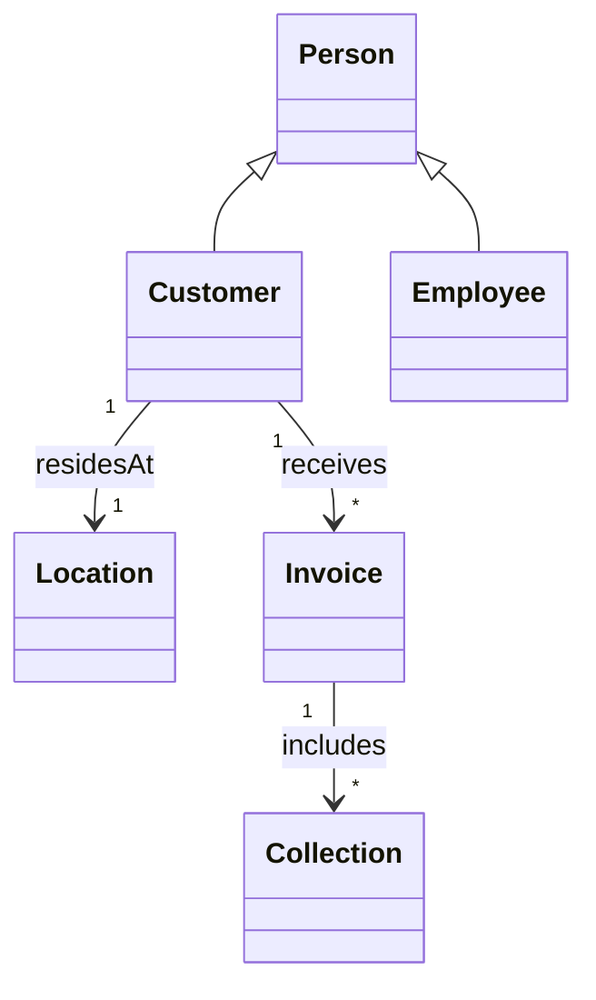

## Diagramma 2 – Programmazione della raccolta

### Descrizione

Rappresenta le entità legate alla pianificazione e gestione della raccolta dei rifiuti. Mostra come i programmi di raccolta si collegano ai clienti e alle singole operazioni di raccolta.

### Entità principali

- **Schedule**: piano di raccolta generico.
- **OneTimeSchedule**: pianificazione di raccolta singola, eredita da `Schedule`.
- **RecurringSchedule**: pianificazione ricorrente, eredita da `Schedule`.
- **WasteSchedule**: programma specifico per un tipo di rifiuto in un giorno della settimana.
- **Waste**: tipologia di rifiuto raccolto.
- **Collection**: rappresenta un’operazione di raccolta specifica.
- **Customer**: cliente associato a uno specifico programma di raccolta.

### Relazioni chiave

- `OneTimeSchedule` e `RecurringSchedule` ereditano da `Schedule`.
- Ogni `Schedule` appartiene a un singolo `Customer`.
- Ogni `WasteSchedule` è associato a un singolo `Waste`.
- Ogni `Collection` appartiene a un singolo `Schedule`.
- Ogni `Collection` raccoglie il `Waste` previsto dal `WasteSchedule`.

### UML

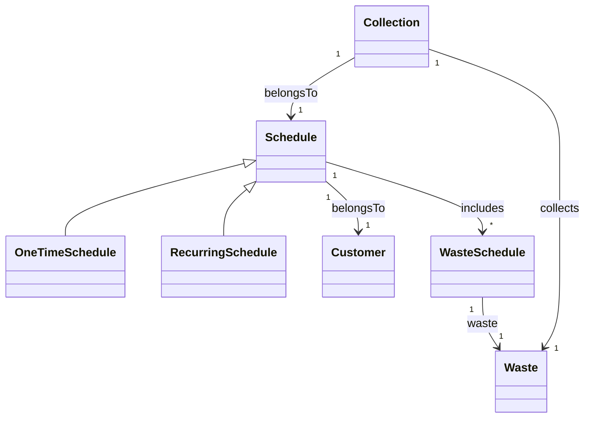

## Diagramma 3 – Logistica e Trasporto

### Descrizione

Rappresenta le entità legate alla gestione operativa della raccolta, inclusi viaggi, mezzi e operatori, mostrando come le attività di raccolta vengono organizzate sul campo.

### Entità principali

- **Trip**: viaggio operativo per effettuare le raccolte.
- **Vehicle**: veicolo utilizzato per eseguire uno o più viaggi.
- **Employee**: operatore assegnato a uno o più viaggi.
- **Collection**: raccolta specifica eseguita durante un viaggio.

### Relazioni chiave

- Ogni `Trip` utilizza un singolo `Vehicle`.
- Ogni `Trip` coinvolge uno o più `Employee` come operatori.
- Ogni `Trip` comprende una o più `Collection`.
- Ogni `Vehicle` può essere utilizzato in zero o più `Trip`.

### UML

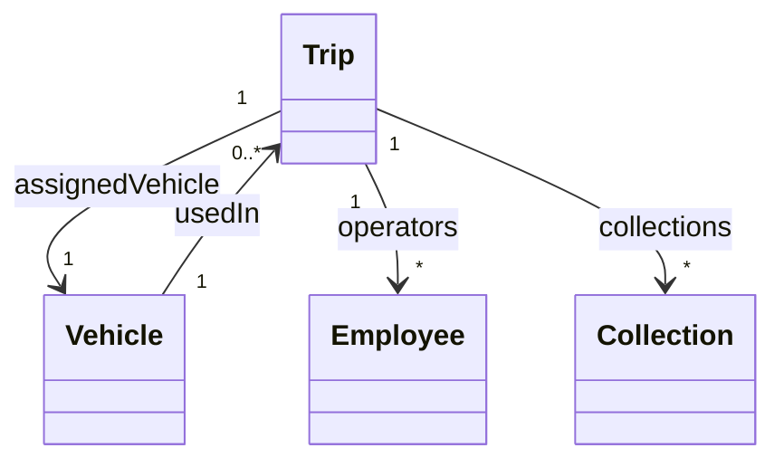

## Sintesi del modello del dominio

I tre diagrammi descrivono il dominio in maniera coerente e integrata:

- **Diagramma 1**: utenti e entità economiche (`Customer`, `Employee`, `Invoice`), collegando le raccolte agli utenti.
- **Diagramma 2**: pianificazione dei ritiri, mostrando la relazione tra `Customer`, `Schedule`, `Waste` e `WasteSchedule`.
- **Diagramma 3**: gestione operativa con `Trip`, `Vehicle` e `Employee`, collegati alle `Collection`.

I programmi di raccolta (Diagramma 2) generano le Collection attive, che vengono poi aggregate in Trip (Diagramma 3) in base a criteri operativi come area e disponibilità delle risorse, garantendo che ogni raccolta pianificata sia effettivamente eseguita.

Le criticità principali del dominio riguardano la gestione delle risorse in scenari complessi e la corretta associazione tra programmi di raccolta e tipologia di rifiuti, senza però suggerire soluzioni implementative.

# Design

L’architettura di *WasteMaster* segue un approccio **Clean Architecture / 3-layer**, che separa chiaramente **UI**, **logica applicativa** e **dominio**.

I **Controller UI** (Boundary) gestiscono esclusivamente input e output della View e delegano ogni logica ai manager.  
I **Manager applicativi** (Control) centralizzano i casi d’uso e orchestrano le entità e i repository.  
Le **Entità di dominio** (Entity) rappresentano lo stato persistente e sono manipolate solo dai manager.  
I **Repository** definiscono le interfacce per l’accesso ai dati, separate dall’implementazione concreta.

Il flusso di interazione ad alto livello è:

View → Controller UI → Manager → Repository / Entity → Controller UI → View


Questa struttura rende l’applicazione **estendibile e manutenibile**, senza che modifiche alla UI richiedano interventi sul dominio o sui manager.

---

## Architettura

### Componenti e ruoli

- **Controller UI (Boundary)**
    - Gestiscono input dell’utente e navigazione tra le viste.
    - Delegano operazioni ai manager.
    - Raccolgono risultati e aggiornano la UI.

- **Manager applicativi (Control)**
    - Incapsulano i casi d’uso principali.
    - Applicano regole e validazioni.
    - Coordinano più entità e repository.

- **Entità di dominio (Entity)**
    - Rappresentano lo stato del sistema.
    - Espongono comportamenti minimi.
    - Manipolate solo dai manager.

- **Repository**
    - Definiscono i contratti per l’accesso ai dati.
    - Permettono ai manager di leggere e scrivere dati senza conoscere i dettagli di persistenza.

### Interazioni principali

1. **Vista → Controller:** l’utente compie un’azione (creazione/aggiornamento/cancellazione).
2. **Controller → Manager:** il controller invoca il manager corrispondente.
3. **Manager → Repository / Entità:** il manager applica le regole, coordina le entità e persiste i dati.
4. **Manager → Controller → Vista:** i risultati tornano al controller che aggiorna la View.

### Schema UML architetturale

> Sono mostrati solo i ruoli principali e le relazioni, senza dettagli di campi o metodi.

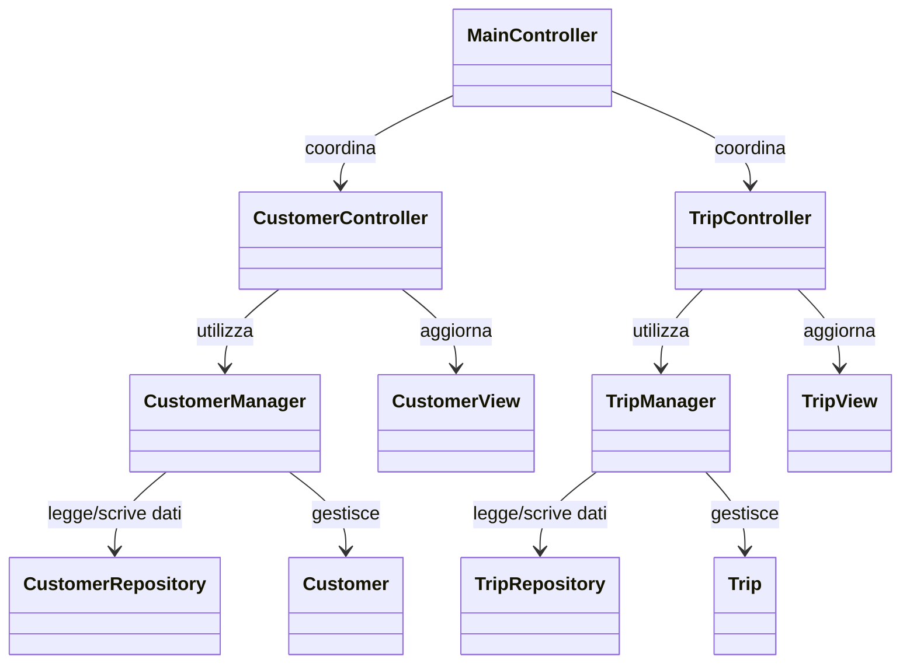

---
## Design dettagliato - Vehicle Management (Ferrari Lorenzo)

### Problema - Gestione dello stato operativo del veicolo

Ogni veicolo nel sistema *WasteMaster* deve poter cambiare stato operativo (es. da `IN_SERVICE` a `IN_MAINTENANCE`, oppure a `OUT_OF_SERVICE`) in modo consistente e centralizzato. Inizialmente, una possibile soluzione sarebbe stata quella di gestire queste transizioni direttamente nella UI o nei Controller tramite semplici `if-else`, ma ciò avrebbe causato duplicazione di logica e facile introduzione di inconsistenze tra componenti diversi.

### Soluzione

La responsabilità è stata suddivisa in due livelli distinti:

- L’entità `Vehicle` mantiene lo **stato corrente** tramite l’enum `VehicleStatus`, ed espone metodi come `updateStatus(...)` per garantire cambiamenti atomici.
- La classe `VehicleManager` funge da **domain service** e applica le regole di transizione consentite, esponendo metodi come `handleMaintenanceButton(...)` o `handleServiceButton(...)`.

Questo approccio permette di **accorpare la logica di dominio** in un unico punto, evitando comportamenti divergenti tra componenti diversi come `TripManager` o `EmployeeManager`.

### Riuso / Pattern

È stato applicato un **pattern State in forma semplificata**:

- `VehicleStatus` rappresenta gli **stati concreti** dell’entità;
- `VehicleManager` funge da **contesto** che definisce le **transizioni ammesse** tra stati (`handleMaintenanceButton`, `handleServiceButton`, ...);
- `Vehicle` esegue il **cambio di stato atomico** tramite `updateStatus(...)`.

Questo evita che le transizioni vengano replicate in UI o Controller, garantendo **coerenza del flusso di stato**.

### Schema UML

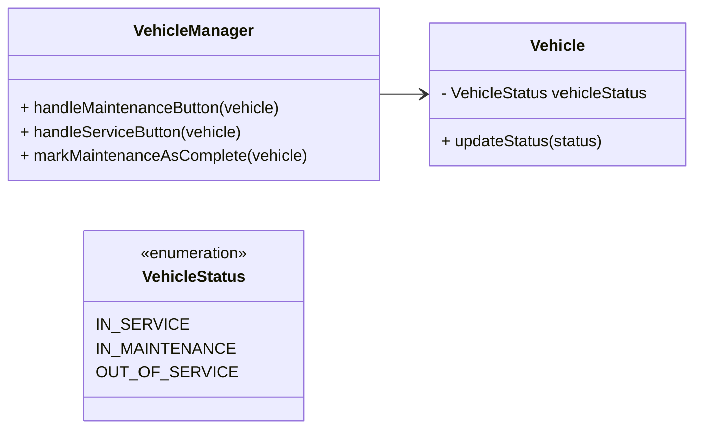
#### Diagramma di Stato - Transizioni del VehicleStatus
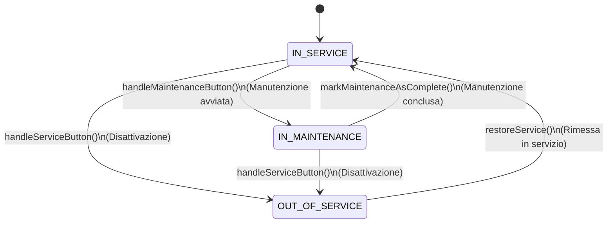
### Problema - Gestione automatica della manutenzione programmata

Ogni veicolo deve mantenere aggiornate due date: `lastMaintenanceDate` e `nextMaintenanceDate`.  
Il rischio era che queste venissero aggiornate **manualmente in più punti dell’applicazione**, con alta probabilità di **inconsistenze o dimenticanze**.

### Soluzione

La gestione è stata **accentrata nel `VehicleManager`**, che nel metodo `markMaintenanceAsComplete(vehicle)`:

- aggiorna `lastMaintenanceDate` alla **data corrente**;
- calcola automaticamente `nextMaintenanceDate` in base a una **politica predefinita** (es. `+6 mesi`).

In questo modo la logica rimane **riusabile e coerente**, e nessun altro componente dell’applicazione può modificare direttamente queste informazioni.

### Riuso / Pattern

Non è stato utilizzato un design pattern strutturato, ma la logica è stata organizzata secondo il **principio di centralizzazione delle regole di business**.  
`VehicleManager` funge da **servizio di dominio**, incaricato di applicare in modo coerente la politica di aggiornamento delle date di manutenzione, mantenendo l’entità `Vehicle` focalizzata solo sul proprio stato.

### Schema UML

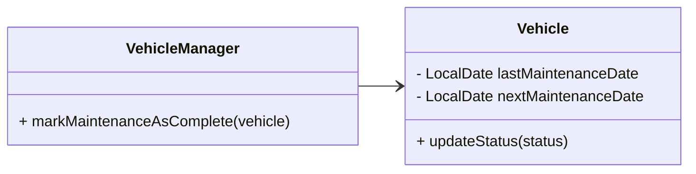
### Problema - Compatibilità tra veicoli e autisti in base alla patente

Un veicolo può essere assegnato solo ad autisti con una patente adeguata (`RequiredLicence`).  
Se la verifica fosse effettuata **manualmente in più punti dell’applicazione** (es. UI, Controller, `TripManager`), il rischio sarebbe quello di introdurre **eccezioni e incoerenze nei controlli**.

### Soluzione

La compatibilità viene calcolata dal metodo `getAllowedLicences(vehicle)` del `VehicleManager`, che confronta la `RequiredLicence` del veicolo con la `Licence` degli autisti disponibili.  
Solo gli autisti che rispettano la regola stabilita vengono restituiti per l’assegnazione.

Questa logica diventa così **configurabile e centralizzata**, ed eventualmente **estensibile in futuro** (es. aggiunta di nuove patenti o eccezioni).

### Riuso / Pattern

Non è stato adottato un design pattern formale.  
La compatibilità è implementata come **policy di matching centralizzata** in `VehicleManager.getAllowedLicences(vehicle)`, che confronta la `RequiredLicence` del veicolo con le licenze disponibili degli autisti.  
Questo approccio riduce duplicazioni e incongruenze tra componenti e rende **semplice estendere la regola** (es. nuove categorie o eccezioni) senza impattare i client.

### Schema UML

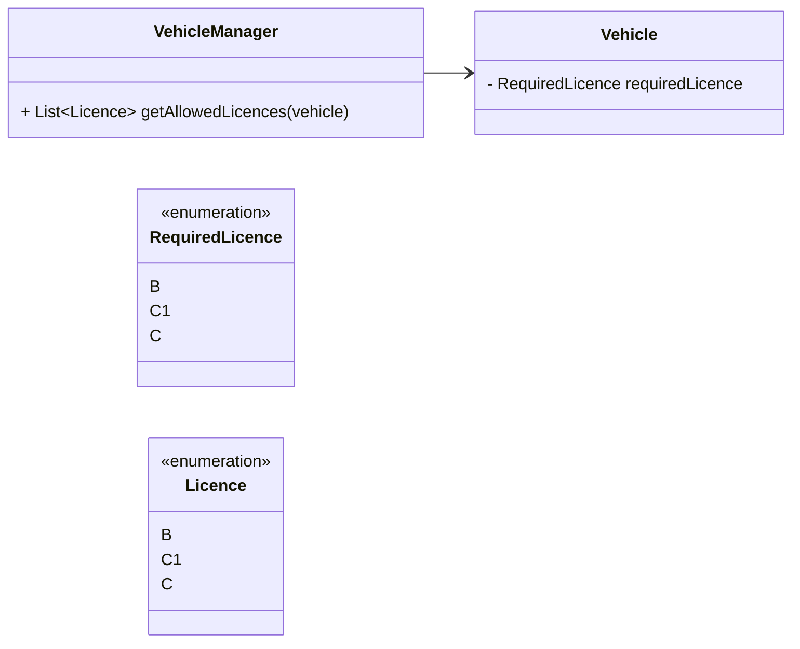
### Considerazioni finali e alternative scartate

Una possibile alternativa per tutti e tre i problemi sarebbe stata quella di **gestire le regole direttamente nei Controller o nella UI tramite codice condizionale**.  
Tale approccio è stato scartato perché:

- avrebbe comportato **duplicazione di logica** in più componenti;
- avrebbe reso **difficile aggiungere nuovi stati o patenti in futuro** (bassa estendibilità);
- avrebbe introdotto **alto rischio di inconsistenze**, ad esempio consentendo l’assegnazione di un veicolo *in manutenzione* a un `Trip`.

Con l’approccio adottato - **logica centralizzata nel dominio (Entity + Manager)** - tutte le regole risultano:

- **coerenti**,
- **estensibili**,
- **facilmente riusabili in futuro** senza impattare il resto del sistema.
---

## Design Dettagliato - Pianificazione delle Raccolte (Alex Cambrini)

### Problema affrontato

Il dominio *WasteMaster* richiede di gestire due tipologie di pianificazione delle raccolte:

- **One–Time**: una singola data richiesta dal cliente;
- **Recurring**: un ciclo (settimanale/mensile) allineato al giorno previsto dal calendario di quel rifiuto (*WasteSchedule*).

Vincoli principali:

- calcolare e **mantenere la prossima data utile** in base alla frequenza e al giorno prefissato dal *WasteSchedule*;
- **generare automaticamente la `Collection`** ogni volta che una pianificazione diventa effettiva;
- **regolare gli stati** (ACTIVE/PAUSED/CANCELLED/COMPLETED) e le transizioni consentite;
- **validare le cancellazioni** (es. One–Time cancellabile solo entro una soglia di giorni);
- evitare duplicazioni di logica tra UI e service, **centralizzando il comportamento nel dominio**.

---

### Soluzione adottata

La soluzione è stata strutturata in **Entity + Domain Service** ben separati:

1. **Gerarchia di dominio per la pianificazione**
    - `Schedule` (astratta) definisce l’interfaccia comune e il **template** per ottenere la “data di raccolta” (`getCollectionDate()`).
    - `OneTimeSchedule` fornisce la **data unica** (`pickupDate`) e la restituisce come `getCollectionDate()`.
    - `RecurringSchedule` mantiene `startDate`, `frequency (WEEKLY/MONTHLY)` e `nextCollectionDate`, che viene **calcolata e aggiornata** dai servizi.

2. **Servizi applicativi coesi**
    - `OneTimeScheduleManager`
        - valida la data (>= `CANCEL_LIMIT_DAYS`);
        - persiste lo schedule e **chiede a `CollectionManager`** di generare la relativa `Collection`.
    - `RecurringScheduleManager`
        - calcola la **prima** `nextCollectionDate` e le **successive** (allineando al giorno previsto dal `WasteSchedule`);
        - gestisce **stato e transizioni** (ACTIVE ⇄ PAUSED, ACTIVE → CANCELLED) e la **rigenerazione/annullamento** delle `Collection` associate;
        - aggiorna la `frequency` ricalcolando coerentemente la `nextCollectionDate`.
    - `CollectionManager`
        - fornisce un’API unica per **generare/aggiornare/annullare** `Collection` a partire da uno `Schedule`.

3. **Allineamento al calendario del rifiuto**
    - Il calcolo della `nextCollectionDate` usa `WasteScheduleManager` per recuperare il **giorno della settimana valido** per quel rifiuto e allineare la data richiesta (es. “ogni martedì”).

---
### Pattern utilizzati

#### Template Method (sui dati di pianificazione)
Il metodo `Schedule#getCollectionDate()` funge da **template method**:

- `OneTimeSchedule` lo implementa restituendo `pickupDate`;
- `RecurringSchedule` lo implementa restituendo `nextCollectionDate`.

Questo consente di trattare entrambi gli schedule in modo uniforme a livello di dominio.


#### Strategy (frequenza di ricorrenza)
La strategia è rappresentata da `RecurringSchedule.Frequency` (`WEEKLY`, `MONTHLY`).

Il calcolo della prossima data applica **la politica scelta** ed è facilmente estendibile (es. aggiungendo `QUARTERLY`) **senza modificare la UI né le entità**.

---

#### Factory Method / Creation Service (generazione di `Collection`)
La responsabilità di creare una nuova `Collection` è centralizzata in:

```java
CollectionManager.generateCollection(schedule)
```
Questo approccio consente di evitare:

- costruttori sparsi nel codice;
- generazioni incoerenti (ad esempio con date non ammissibili);

Poiché tutte le regole di business sono custodite all'interno del service dedicato.

---

#### State (transizioni di Schedule)

Il metodo:

```java
RecurringScheduleManager.updateStatusRecurringSchedule(...)
```

Il metodo `RecurringScheduleManager.updateStatusRecurringSchedule(...)` governa le transizioni tra gli stati:

`ACTIVE → PAUSED → CANCELLED → COMPLETED`

Durante tali cambiamenti, applica automaticamente le regole di coerenza del dominio:

- annulla la **Collection attiva** quando lo stato diventa `PAUSED` o `CANCELLED`;
- genera una **nuova Collection** quando lo stato ritorna `ACTIVE`.

In questo modo la UI non deve conoscere la logica delle transizioni, ma si limita a richiedere un cambio di stato.

---

### Validation Layer (Guard Clauses + Bean Validation)

Il progetto adotta un duplice sistema di validazione che combina dichiarazioni a livello di entità e controlli espliciti nei metodi:

| Tipo                                 | Esempi                          | Scopo                                     |
|--------------------------------------|---------------------------------|-------------------------------------------|
| `jakarta.validation`                 | `@NotNull`, `@FutureOrPresent` | Validazione dichiarativa sulle entità     |
| `ValidateUtils.requireArgNotNull(...)` | Invocata nei manager o nei service | Difesa immediata dei contratti (fail-fast) |

Questo approccio impedisce che logiche di business vengano eseguite su dati incompleti o incoerenti, garantendo robustezza del dominio.

---

### Schema UML della soluzione


### Diagramma di Stato - Schedule/RecurringSchedule
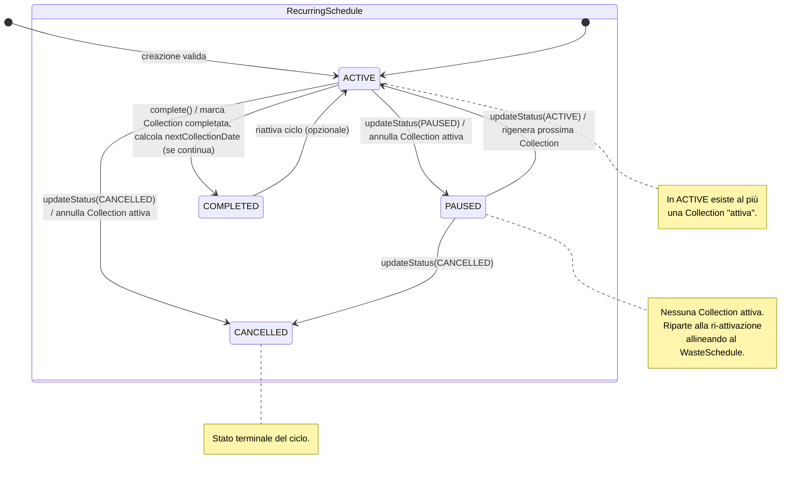
### Diagramma di Interazione - Creazione Recurring + Generazione Collection
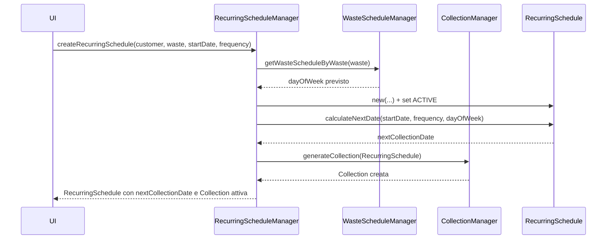
### Diagramma di Interazione - Cambio Stato Recurring (Pause/Resume/Cancel)
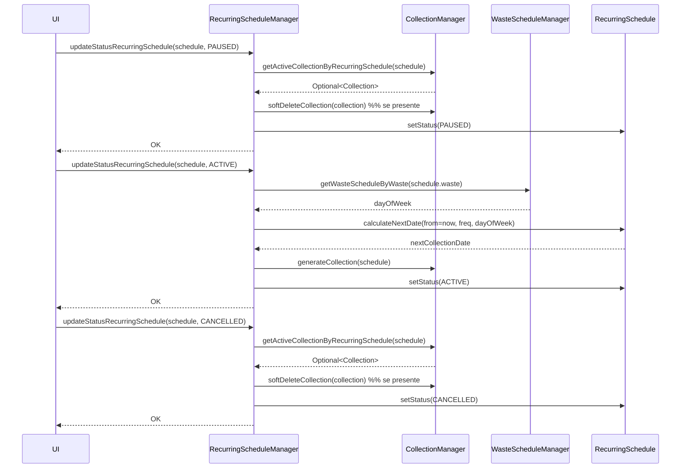

### Motivazioni e alternative scartate
- Calcolo/creazione Collection direttamente in Controller: scartata per duplicazione logica e rischio inconsistenze.
- Calcolo ricorrenze lato UI: scartata; la logica rimane nel dominio per estendibilità e testabilità.
- Allineamento al calendario del rifiuto demandato al DB: scartata; si perderebbe chiarezza del dominio.

### Design Dettagliato - Trip (Manuel Ragazzini)

### Problema affrontato

La gestione del ciclo di vita dei **viaggi di raccolta rifiuti (Trip)** richiede la coordinazione di diverse responsabilità:

- pianificazione per **CAP**,
- **assegnazione** del veicolo e degli operatori qualificati e disponibili,
- **associazione** delle Collection da eseguire,
- **cancellazione** con eventuale **notifica ai clienti**,
- **completamento** del viaggio con aggiornamento coerente delle Collection,
- eventuale **ripianificazione** per gli schedule ricorrenti.

I vincoli principali da rispettare sono:

- evitare conflitti di risorse (veicoli/operatori già impegnati);
- verificare la compatibilità tra **licenza del driver** e **veicolo assegnato**;
- mantenere **consistenza tra Trip e Collection**;
- gestire annullamenti e completamenti seguendo uno **stato macchina definito**.

---

### Soluzione adottata

La logica applicativa è stata **centralizzata nel `TripManager`**, che funge da *coordinatore del dominio*.  
Le sue responsabilità includono:

- interrogare i **repository** per verificare disponibilità e qualifiche;
- creare o aggiornare i **Trip**;
- propagare automaticamente gli effetti su **Collection** (annullamenti, completamenti, ripianificazioni);
- collaborare con `RecurringScheduleManager` e `NotificationService` quando necessario.

La **UI** invoca esclusivamente **metodi di alto livello** (es. `createTrip`, `softDeleteTrip`, `setTripAsCompleted`) senza duplicare logica applicativa.

#### API di dominio

| Categoria          | Metodi principali                                                                                     |
|-------------------|-------------------------------------------------------------------------------------------------------|
| **Creazione**      | `createTrip(postalCode, vehicle, operators, departure, expectedReturn, collections)`                  |
| **Disponibilità**  | `getAvailableVehicles(start, end)` · `getQualifiedDrivers(start, end, allowedLicences)` · `getAvailableOperatorsExcludeDriver(start, end, driver)` |
| **Cancellazione**  | `softDeleteTrip(trip)` · `softDeleteAndRescheduleNextCollection(trip)` · `cancelTripAndNotify(trip[, subject, body])` |
| **Completamento**  | `setTripAsCompleted(trip)`                                                                            |
| **Aggiornamenti**  | `updateVehicle(tripId, newVehicle)` · `updateOperators(tripId, newOperators)`                        |

---

### Pattern impiegati

- **Facade / Coordinator (TripManager)**  
  Centralizza i casi d’uso e coordina le collaborazioni tra repository, gestione delle schedule ricorrenti e sistema di notifica.  
  Riduce l’accoppiamento tra UI e dominio.

- **Repository**  
  Astrazione per query di disponibilità, ricerca di veicoli/operatori/driver e recupero dei Trip.  
  Favorisce testabilità e sostituibilità della persistenza.

- **State (TripStatus)**  
  Definisce le transizioni da `ACTIVE` a `CANCELLED` o `COMPLETED`, applicando automaticamente gli effetti sulle Collection collegate.

- **Observer-like (NotificationService)**  
  La notifica non è parte del dominio centrale: viene delegata a un’interfaccia esterna, facilmente sostituibile (es. mock vs implementazione reale).

- **Guard Clauses & Validation**  
  Verifiche *fail-fast* tramite `ValidateUtils` e controlli sugli argomenti, impedendo che vengano applicate modifiche con input incoerenti.

---

### Schema UML della soluzione
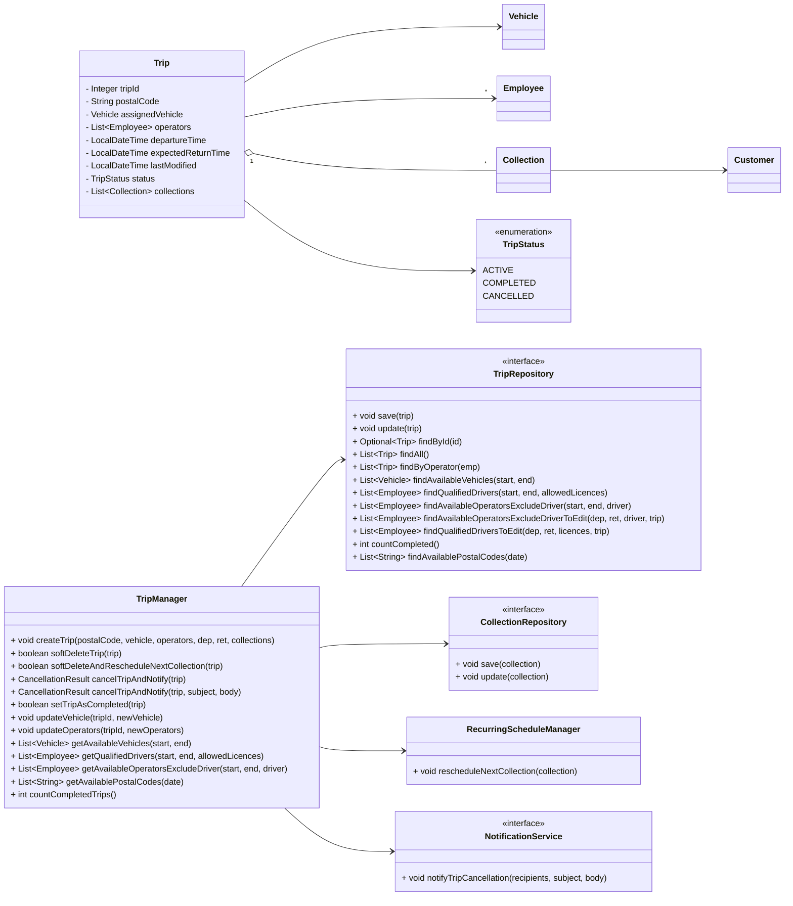
### Diagramma di Stato - TripStatus
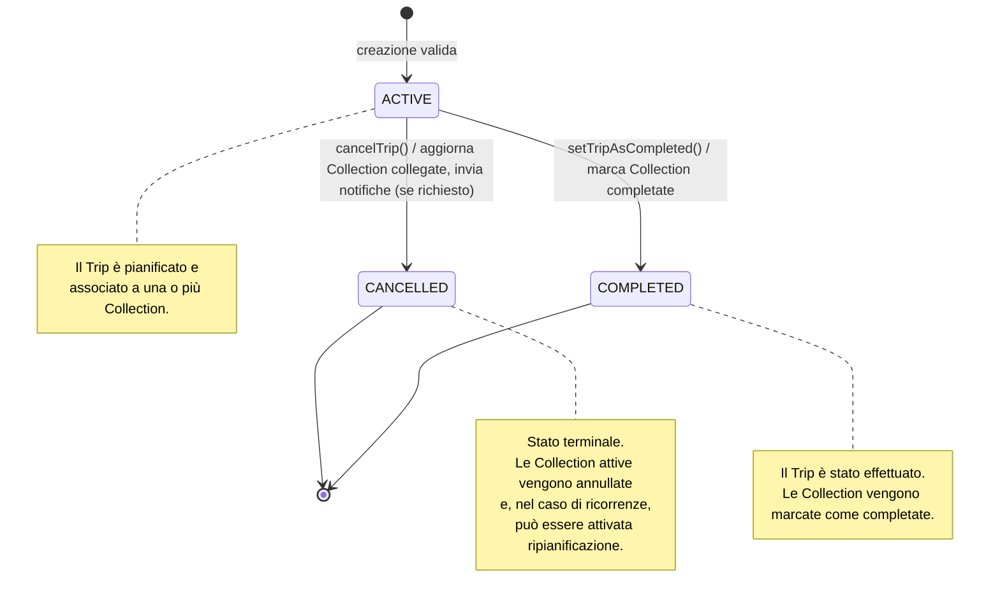
### Diagramma di Interazione - Cancellazione Trip con Notifica
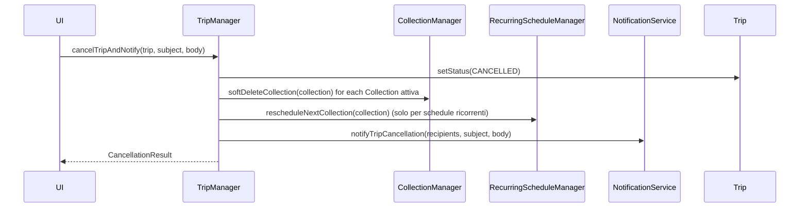
### Motivazioni e alternative scartate

- **Separazione dei ruoli**: la UI non gestisce regole applicative, ma invoca operazioni ad alto livello.
- **Coerenza dei dati**: ogni cancellazione o completamento aggiorna le Collection correlate e, se necessario, innesca la ripianificazione per schedule ricorrenti.
- **Evolvibilità**: nuove strategie di disponibilità o nuovi canali di notifica possono essere aggiunti senza impattare gli strati superiori.
- **Testabilità**: i casi d’uso sono isolabili tramite mock dei repository e dei servizi esterni.
- **Robustezza**: le guard clauses impediscono percorsi inconsistenzi (es. completare un trip senza Collection attive).

---

| Alternativa                     | Esito   | Motivazione dello scarto |
|--------------------------------|---------|---------------------------|
| Logica distribuita nei controller | Scartata | Rischio di duplicazioni e perdita di consistenza |
| Eventi di dominio asincroni per le notifiche | Rimandata | Utile in scenari più complessi; la chiamata sincrona è sufficiente e più semplice |
| Transazioni distribuite a livello di manager | Posticipata | L’attuale livello di persistenza è sufficiente; possibile evoluzione futura |

---


## Testing automatizzato

Per garantire l’affidabilità delle funzionalità principali, il progetto adotta una strategia di testing automatico basata su **JUnit 5**. I test sono organizzati per coprire le principali componenti del dominio.

### Componenti testate

- **Anagrafiche e risorse**: verifica di creazione, aggiornamento e validazione di clienti, personale, veicoli e rifiuti.
- **Pianificazione e raccolte**: test su pianificazioni, modifiche, cancellazioni e transizioni di stato di raccolte e viaggi.
- **Gestione mezzi e viaggi**: verifica delle regole di assegnazione veicoli/operatori, pianificazione viaggi e gestione delle disponibilità.
- **Fatturazione e pagamenti**: test automatici su generazione e aggiornamento delle fatture, integrazione con i pagamenti.

### Strumenti utilizzati

- **Framework di testing:**  
  - JUnit 5
- **Componenti coperti:**  
  - Entità di dominio:  
    - `VehicleTest`  
    - `CustomerTest`  
    - `WasteTest`  
    - `InvoiceTest`
  - Manager e repository:  
    - `TripManagerTest`  
    - `VehicleManagerTest`  
    - `TripDAOTest`

    
### Esempi di test automatici

```java
// Verifica validazione dati veicolo (VehicleTest)
@Test
void testValidVehicle() {
    Set<ConstraintViolation<Vehicle>> violations = ValidateUtils.VALIDATOR.validate(vehicle);
    assertTrue(violations.isEmpty());
}

// Verifica inserimento e ricerca cliente (CustomerTest)
@Test
void testPersistenceAndGetter() {
    getCustomerDAO().insert(customer);
    int customerId = customer.getCustomerId();
    Optional<Customer> foundOpt = getCustomerDAO().findById(customerId);
    assertTrue(foundOpt.isPresent());
    Customer found = foundOpt.get();
    assertEquals(customer.getName(), found.getName());
    getCustomerDAO().delete(customer);
    Optional<Customer> deletedOpt = getCustomerDAO().findById(customerId);
    assertTrue(deletedOpt.isEmpty());
}

// Test integrazione: cancellazione viaggio e ripianificazione raccolta (TripManagerTest)
@Test
void testSoftDeleteAndRescheduleNextCollection() {
    tripManager.softDeleteAndRescheduleNextCollection(trip);
    // Verifica che la Collection sia ripianificata correttamente
}

// Verifica generazione e pagamento fattura (InvoiceTest)
@Test
void testPersistence() {
    getInvoiceDAO().insert(invoice);
    Optional<Invoice> foundOpt = getInvoiceDAO().findById(invoice.getInvoiceId());
    assertTrue(foundOpt.isPresent());
    Invoice found = foundOpt.get();
    assertEquals(invoice.getAmount(), found.getAmount());
    getInvoiceDAO().delete(found);
    Optional<Invoice> deletedOpt = getInvoiceDAO().findById(found.getInvoiceId());
    assertTrue(deletedOpt.isEmpty());
}
```


## Note di sviluppo

---

### Lorenzo Ferrari

#### 1. Uso di Stream e Optional per la ricerca tra entità
**Dove:** `src/main/java/it/unibo/wastemaster/domain/repository/VehicleRepositoryImpl.java`
```java
@Override
public Optional<Vehicle> findByPlate(String plate) {
    return vehicles.stream()
        .filter(v -> v.getPlate().equalsIgnoreCase(plate))
        .findFirst();
}
```
*Implementa una ricerca null-safe, concisa ed efficiente, sfruttando costrutti funzionali avanzati.*

---

#### 2. Validazione avanzata con annotazioni Bean Validation
**Dove:** `src/main/java/it/unibo/wastemaster/domain/model/Vehicle.java`
```java
@NotNull(message = "Plate must not be null")
@Pattern(regexp = "[A-Z0-9]{7}", message = "Invalid plate format")
private String plate;
```
*Garantisce la correttezza dei dati direttamente a livello di modello.*

---

#### 3. Normalizzazione automatica dei dati in setter
**Dove:** `src/main/java/it/unibo/wastemaster/domain/model/Vehicle.java`
```java
public void setPlate(String plate) {
    if (plate != null) {
        this.plate = plate.trim().toUpperCase();
    } else {
        throw new IllegalArgumentException("Plate must not be null");
    }
}
```
*Centralizza la normalizzazione, prevenendo errori di inserimento e confronti.*

---

#### 4. Uso di Enum per stati e policy sulle licenze
**Dove:** `src/main/java/it/unibo/wastemaster/domain/model/Vehicle.java`
```java
public enum VehicleStatus {
    IN_SERVICE, IN_MAINTENANCE, OUT_OF_SERVICE
}
```
*Rende il codice robusto e facilmente estendibile nella gestione degli stati.*

---

#### 5. Gestione automatica delle date di manutenzione
**Dove:** `src/main/java/it/unibo/wastemaster/domain/service/VehicleManager.java`
```java
public void markMaintenanceAsComplete(Vehicle vehicle) {
    vehicle.setVehicleStatus(Vehicle.VehicleStatus.IN_SERVICE);
    vehicle.setLastMaintenanceDate(LocalDate.now());
    vehicle.setNextMaintenanceDate(LocalDate.now().plusYears(1));
    vehicleDAO.update(vehicle);
}
```
*Automatizza la gestione delle scadenze manutentive e lo stato del mezzo.*

---

**Codice adattato:**  
Per la validazione dati sono stati seguiti esempi dalla documentazione ufficiale di Hibernate Validator.

---

### Alex Cambrini

#### 1. Calcolo dinamico della prossima raccolta ricorrente
**Dove:** `src/main/java/it/unibo/wastemaster/domain/model/RecurringSchedule.java`
```java
public LocalDate calculateNextCollectionDate(LocalDate from, Frequency freq, DayOfWeek dayOfWeek) {
    LocalDate next = from.with(TemporalAdjusters.nextOrSame(dayOfWeek));
    return freq == Frequency.MONTHLY ? next.plusMonths(1) : next.plusWeeks(1);
}
```
*Gestisce la ricorrenza delle raccolte in modo flessibile ed estendibile.*

---

#### 2. Uso di Stream e Optional per la raccolta attiva
**Dove:** `src/main/java/it/unibo/wastemaster/domain/service/CollectionManager.java`
```java
public Optional<Collection> getActiveCollectionByRecurringSchedule(RecurringSchedule schedule) {
    return collectionDAO.findAll().stream()
        .filter(c -> c.getSchedule().equals(schedule) && c.isActive())
        .findFirst();
}
```
*Permette di individuare la raccolta attiva in modo elegante e funzionale.*

---

#### 3. Validazione parametrica delle cancellazioni
**Dove:** `src/main/java/it/unibo/wastemaster/domain/service/OneTimeScheduleManager.java`
```java
public boolean softDeleteOneTimeSchedule(OneTimeSchedule schedule) {
    if (Days.between(LocalDate.now(), schedule.getPickupDate()) >= CANCEL_LIMIT_DAYS) {
        schedule.setDeleted(true);
        repository.update(schedule);
        return true;
    }
    return false;
}
```
*Applica in modo centralizzato e sicuro le regole di business sulle cancellazioni.*

---

#### 4. Factory method per generazione di Collection
**Dove:** `src/main/java/it/unibo/wastemaster/domain/service/CollectionManager.java`
```java
public Collection generateCollection(Schedule schedule) {
    Collection collection = new Collection(schedule);
    collectionDAO.insert(collection);
    return collection;
}
```
*Centralizza e rende coerente la creazione delle Collection.*

---

#### 5. Uso di Enum per categorizzazione degli stati
**Dove:** `src/main/java/it/unibo/wastemaster/domain/model/Schedule.java`
```java
public enum ScheduleStatus {
    ACTIVE, PAUSED, CANCELLED, COMPLETED
}
```
*Rende il codice leggibile e meno soggetto a errori.*

---

**Codice adattato:**  
Per la gestione delle date ricorrenti sono stati consultati esempi di uso di `TemporalAdjusters` dalla documentazione Java.

---

### Manuel Ragazzini

#### 1. Algoritmo per la ricerca delle risorse disponibili tramite Stream
**Dove:** `src/main/java/it/unibo/wastemaster/domain/service/TripManager.java`
```java
public List<Vehicle> getAvailableVehicles(LocalDateTime from, LocalDateTime to) {
    return vehicleDAO.findAll().stream()
        .filter(v -> v.isAvailable(from, to))
        .collect(Collectors.toList());
}
```
*Permette di individuare dinamicamente i mezzi disponibili per nuove rotte.*

---

#### 2. Gestione e aggiornamento stato pagamenti
**Dove:** `src/main/java/it/unibo/wastemaster/domain/service/InvoiceManager.java`
```java
public void registerPayment(Invoice invoice, LocalDateTime paymentDate) {
    invoice.setPaymentStatus(Invoice.PaymentStatus.PAID);
    invoice.setPaymentDate(paymentDate);
    invoiceDAO.update(invoice);
}
```
*Automatizza la gestione dello stato dei pagamenti e la loro storicizzazione.*

---

#### 3. Invio automatico di email ai clienti
**Dove:** `src/main/java/it/unibo/wastemaster/infrastructure/utils/MailUtils.java`
```java
public static void sendInvoiceEmail(String to, Invoice invoice) {
    // ... setup SMTP
    EmailSender.send(to, "Nuova fattura", invoice.toString());
}
```
*Automatizza la comunicazione con il cliente per la fatturazione.*

---

#### 4. Calcolo dei CAP disponibili tramite Stream e distinct
**Dove:** `src/main/java/it/unibo/wastemaster/domain/service/TripManager.java`
```java
public List<String> getAvailablePostalCodes(LocalDate date) {
    return collectionDAO.findAll().stream()
        .filter(c -> c.getDate().equals(date))
        .map(c -> c.getCustomer().getLocation().getPostalCode())
        .distinct()
        .collect(Collectors.toList());
}
```
*Ottimizza la pianificazione delle tratte in base alle raccolte effettive.*

---

#### 5. Gestione rollback e ripianificazione in caso di annullamento viaggio
**Dove:** `src/main/java/it/unibo/wastemaster/domain/service/TripManager.java`
```java
public boolean softDeleteAndRescheduleNextCollection(Trip trip) {
    trip.setStatus(Trip.TripStatus.CANCELED);
    tripDAO.update(trip);
    recurringScheduleManager.rescheduleNextCollection(trip.getCollections().get(0));
    return true;
}
```
*Garantisce la coerenza tra annullamento viaggio e pianificazione futura.*


## Guida utente


### Avvio dell’applicazione

1. **Avvio**
   - Avvia l’applicazione tramite il file eseguibile 
   - All’avvio viene mostrata la schermata di login.

2. **Login**
   - Inserisci le tue credenziali (utente e password) fornite dall’amministratore.
   - In base al ruolo (amministratore, operatore) avrai accesso a diverse funzionalità.

---

### Funzionalità principali

#### 1. Gestione clienti e personale
- Dal menu **Anagrafiche** puoi:
  - Visualizzare, aggiungere, modificare o eliminare clienti e personale.
  - Assegnare ruoli e aggiornare informazioni di contatto.
- Per aggiungere un nuovo cliente, premi su “Nuovo cliente”, compila i dati richiesti e salva.

#### 2. Gestione mezzi e rifiuti
- Dal menu **Risorse** puoi:
  - Visualizzare la lista dei mezzi aziendali e il loro stato (in servizio, in manutenzione, fuori servizio).
  - Aggiornare dati su veicoli e pianificare la manutenzione.
  - Gestire il catalogo dei rifiuti raccolti, aggiungendo nuovi tipi o modificando esistenti.

#### 3. Pianificazione raccolte
- Dal menu **Pianificazione raccolte** puoi:
  - Inserire nuove raccolte, sia programmate (ricorrenti) che occasionali (one-time).
  - Modificare, sospendere o cancellare raccolte future.
  - Consultare il calendario delle raccolte già pianificate.

#### 4. Gestione viaggi e rotte operative
- Dal menu **Viaggi** puoi:
  - Visualizzare e pianificare i viaggi dei mezzi, associando più raccolte nello stesso viaggio.
  - Assegnare personale e mezzi disponibili.
  - Modificare le assegnazioni in caso di imprevisti.

#### 5. Monitoraggio e notifiche
- La dashboard principale mostra tutte le attività pianificate, lo stato delle raccolte (attiva, completata, annullata) e segnala eventuali criticità.
- Riceverai notifiche automatiche in caso di problemi sulle raccolte o sui pagamenti.

#### 6. Fatturazione e pagamenti
- Dal menu **Fatture** puoi:
  - Visualizzare le fatture emesse per ogni cliente.
  - Segnare come pagata una fattura o registrare un nuovo pagamento.
  - Esportare o stampare la fattura.

---

### Operazioni comuni

- **Aggiungere una raccolta:** vai su "Pianificazione raccolte" > "Nuova raccolta", inserisci cliente, tipo di rifiuto, data e salva.
- **Modificare una raccolta:** seleziona la raccolta dalla lista, premi "Modifica", aggiorna i dati e conferma.
- **Marcare come completata una raccolta:** seleziona la raccolta e clicca su "Completa".
- **Annullare un viaggio:** seleziona il viaggio e clicca su "Annulla"; le raccolte saranno ripianificate automaticamente.

---

### Note finali

- Tutte le operazioni principali sono accessibili dai menu laterali o dalla dashboard iniziale.
- In caso di errori o dati mancanti, il sistema mostra messaggi di errore chiari.
- Per sicurezza, effettua sempre il logout a fine sessione.
